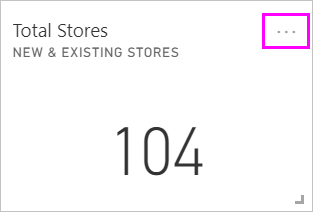
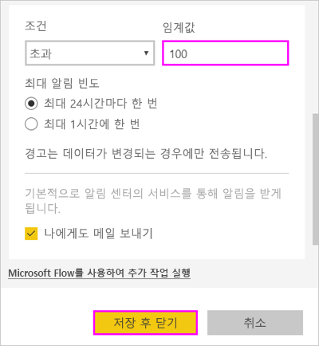
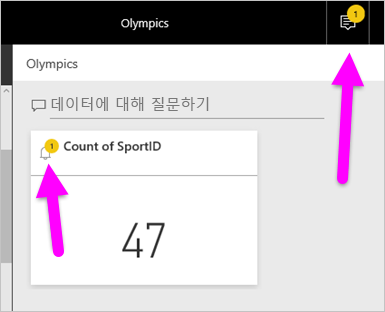
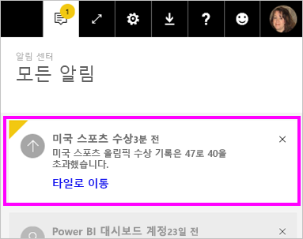
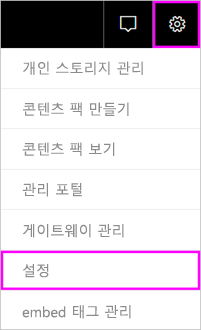

# Power BI 서비스의 데이터 경고

대시보드의 데이터가 설정해 놓은 한도를 넘어 변경되면 알리도록 경고를 설정합니다.

Power BI Pro 라이선스가 있는 경우 타일에 경고를 설정할 수 있습니다. 누군가가 [프리미엄 용량](service-premium-what-is.md)에 있는 대시보드를 공유하는 경우에도 경고를 설정할 수 있습니다. 경고는 보고서 시각적 개체에서 고정된 타일과 계기, KPI 및 카드에만 설정할 수 있습니다. 보고서에서 대시보드로 고정하는 스트리밍 데이터 세트에서 만든 시각적 개체에 경고를 설정할 수 있습니다. **타일 추가** > **사용자 지정 스트리밍 데이터**를 사용하여 대시보드에서 직접 만든 스트리밍 타일에는 경고를 설정할 수 없습니다.

대시보드를 공유하더라도 자신이 설정한 경고만 볼 수 있습니다. 데이터 경고는 플랫폼 전반에서 완전히 동기화되며 [Power BI 모바일 앱](consumer/mobile/mobile-set-data-alerts-in-the-mobile-apps.md) 및 Power BI 서비스에서 데이터 경고를 설정하고 봅니다. Power BI Desktop에서는 사용할 수 없습니다. 경고를 자동화하고 Microsoft Flow와 통합할 수도 있습니다. [Microsoft Flow 및 Power BI](service-flow-integration.md) 문서에서 직접 시도해 볼 수 있습니다.

> [!WARNING]
> 데이터 기반 경고 알림은 데이터에 관한 정보를 제공합니다. 모바일 디바이스에서 Power BI 데이터를 보는 경우 모바일 디바이스를 분실하거나 도난당하면, Power BI 서비스를 사용하여 모든 데이터 기반 경고 규칙을 끄는 것이 좋습니다.

## Power BI 서비스에서 데이터 경고 설정

Amanda가 대시보드의 타일에 몇 가지 경고를 추가하는 과정을 봅니다. 그런 다음, 비디오 아래에 있는 단계별 지침을 따라서 직접 시도해 볼 수 있습니다.

<iframe width="560" height="315" src="https://www.youtube.com/embed/JbL2-HJ8clE" frameborder="0" allowfullscreen></iframe>

이 예제는 소매점 분석 샘플 대시보드의 카드 타일을 사용합니다. 과정을 따르려면 [소매점 분석 샘플을 가져옵니다](sample-retail-analysis.md#get-the-content-pack-for-this-sample).

1. 대시보드를 시작합니다. **전체 매장** 타일에서 줄임표를 선택합니다.

   

1. 종 모양 아이콘 을 선택하여 **전체 매장**에 대한 경고를 하나 이상 추가합니다.

1. 먼저 **+경고 규칙 추가**를 선택하고 **활성** 슬라이더가 **켜기**로 설정되어 있는지 확인한 다음, 경고 제목을 입력합니다. 제목은 경고를 쉽게 인식하는 데 도움이 됩니다.

   

1. 아래로 스크롤하여 경고 세부 정보를 입력합니다.  이 예제에서는 총 매장 수가 100개를 넘으면 하루에 한 번 알려주는 경고를 만듭니다.

   

    경고는 **알림 센터**에 표시됩니다. 이 확인란을 선택하면, Power BI에서 경고에 대한 메일도 보냅니다.

1. **저장 후 닫기**를 선택합니다.

## 경고 수신

추적된 데이터가 설정해 놓은 임계값 중 하나에 도달하면 몇 가지 현상이 발생합니다. 먼저, 선택한 옵션에 따라 Power BI에서 마지막 경고 이후 1시간 이상 경과했는지 또는 24시간 이상 경과했는지를 확인합니다. 데이터가 임계값을 초과한 경우 경고를 받게 됩니다.

다음으로, Power BI에서 **알림 센터**에 경고를 보내고, 필요에 따라 메일도 보냅니다. 각 경고에는 데이터에 대한 직접 링크가 포함됩니다. 탐색하고, 공유하고, 자세한 정보를 알아볼 수 있는 관련 타일을 보려면 링크를 선택합니다.  

* 전자 메일을 보내도록 경고를 설정해 놓으면, 다음과 같은 내용을 받은 편지함에서 찾을 수 있습니다.

   

* Power BI에서 **알림 센터**에 메시지가 추가되고 해당되는 타일에 새로운 경고 아이콘이 추가됩니다.

   

* **알림 센터**에 경고 정보가 표시됩니다.

    

   > [!NOTE]
   > 경고는 새로 고친 데이터에만 적용됩니다. 데이터가 새로 고쳐지면, Power BI에서 해당 데이터에 대해 경고가 설정되어 있는지 확인됩니다. 데이터가 경고 임계값에 도달한 경우, Power BI에서 경고를 트리거합니다.

## 경고 관리

경고는 여러 가지 방법으로 관리할 수 있습니다.

* 대시보드 타일에서

* Power BI 설정 메뉴에서

* [Power BI Mobile 앱](consumer/mobile/mobile-set-data-alerts-in-the-mobile-apps.md)의 타일에서

### 대시보드 타일에서

1. 타일에 대한 경고를 변경하거나 제거하려면, 종 모양 아이콘 을 선택하여 **경고 관리** 창을 다시 엽니다.

    Power BI에서 해당 타일에 대해 설정된 경고를 표시합니다.

    

1. 경고를 수정하려면, 경고 이름 왼쪽에 있는 화살표를 선택합니다.

    

1. 경고를 삭제하려면, 경고 이름 오른쪽에 있는 휴지통을 선택합니다.

      

### Power BI 설정 메뉴에서

1. Power BI 메뉴 모음에서 기어 아이콘을 선택한 다음, **설정**을 선택합니다.

    .

1. **설정**에서 **경고**를 선택합니다.

    

1. 여기에서 경고를 켜거나 끌 수 있으며, **경고 관리** 창을 열어서 내용을 변경하거나, 경고를 삭제할 수 있습니다.

## 팁 및 문제 해결

* 날짜/시간 측정값이 있는 카드 타일에 대해서는 경고가 지원되지 않습니다.

* 경고는 숫자 데이터 형식에만 적용됩니다.

* 경고는 새로 고친 데이터에만 적용됩니다. 정적 데이터에 대해서는 적용되지 않습니다.

* KPI, 카드 또는 계기 보고서 시각적 개체를 빌드한 다음, 해당 시각적 개체를 대시보드에 고정하는 경우 스트리밍 데이터 세트에만 경고가 적용됩니다.

## 다음 단계

* [데이터 경고를 포함하는 Microsoft Flow 만들기](service-flow-integration.md)

* [모바일 디바이스에 데이터 경고 설정](consumer/mobile/mobile-set-data-alerts-in-the-mobile-apps.md)

* [Power BI란?](power-bi-overview.md)

궁금한 점이 더 있나요? [Power BI 커뮤니티에 질문합니다.](http://community.powerbi.com/)
