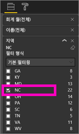

# 동료와 필터링된 Power BI 보고서 공유
다른 사람에게 대시보드 및 보고서에 대한 액세스 권한을 부여하려면 *공유*를 사용하는 것이 좋습니다. 또한 Power BI는 [보고서를 공동 작업하고 배포하는 여러 방법](service-how-to-collaborate-distribute-dashboards-reports.md)을 제공합니다.

공유에서 사용자와 해당 수신자는 [Power BI Pro 라이선스](service-features-license-type.md)가 필요하거나 콘텐츠는 [프리미엄 용량](service-premium.md)에 있어야 합니다. 

Power BI 서비스의 대부분의 위치(즐겨찾기, 최근 항목, 공유한 항목(소유자가 허용한 경우), 내 작업 영역 또는 기타 작업 영역)에서 사용자와 동일한 메일 도메인을 사용하는 동료와 보고서를 공유할 수 있습니다. 보고서를 공유할 경우 공유하는 해당 동료가 대시보드를 보고 조작할 수 있지만 편집할 수는 없습니다. [RLS(행 수준 보안)](service-admin-rls.md)를 적용하지 않는 한 다른 사용자는 사용자가 보고서에서 확인할 수 있는 동일한 데이터를 봅니다. 

필터링된 버전의 보고서를 공유하려면 어떻게 해야 할까요? 아마도 특정 도시, 판매 직원 또는 연도의 데이터만 보여 주는 보고서일 수도 있습니다. 사용자 지정 URL을 만들어 보세요. 받는 사람이 처음 열 때 보고서가 필터링됩니다. URL을 수정하여 필터를 제거할 수 있습니다.

## 보고서 필터링 및 공유

1. [편집용 보기](consumer/end-user-reading-view.md)에서 보고서를 열고, 필터를 적용하고, 보고서를 저장합니다.
   
   이 예에서는 [소매점 분석 샘플](sample-tutorial-connect-to-the-samples.md)을 필터링하여 **지역**이 **NC**인 값만 보여 줍니다.
   
   
2. 보고서 페이지의 URL 끝에 다음과 같이 추가합니다.
   
   ?filter=*tablename*/*fieldname* eq *value*
   
    필드는 **문자열** 형식이어야 합니다. *tablename* 또는 *fieldname* 값은 공백을 포함할 수 없습니다.
   
   이 예에서 테이블 이름은 **Store**, 필드 이름은 **Territory**, 그리고 필터링하려는 값은 **NC**입니다.
   
    ?filter=Store/Territory eq 'NC'
   
   
   
   브라우저에서 슬래시, 공백 및 아포스트로피를 나타내는 특수 문자를 추가하여 다음과 같이 처리합니다.
   
   app.powerbi.com/groups/me/reports/010ae9ad-a9ab-4904-a7a1-xxxxxxxxxxxx/ReportSection2?filter=Store%252FTerritory%20eq%20%27NC%27

3. [보고서를 공유](service-share-dashboards.md)하되, **받는 사람에게 이메일 알림 보내기** 확인란을 선택 취소합니다. 

    

4. 이전에 만든 필터를 사용하여 링크를 보냅니다.

## 다음 단계
* 의견이 있으신가요? 제안 사항이 있으시면 [Power BI 커뮤니티 사이트](https://community.powerbi.com/)를 방문하세요.
* [대시보드 및 보고서를 공동 작업 및 공유하는 방법](service-how-to-collaborate-distribute-dashboards-reports.md)
* [대시보드 공유](service-share-dashboards.md)
* 궁금한 점이 더 있나요? [Power BI 커뮤니티를 이용](http://community.powerbi.com/)하세요.

