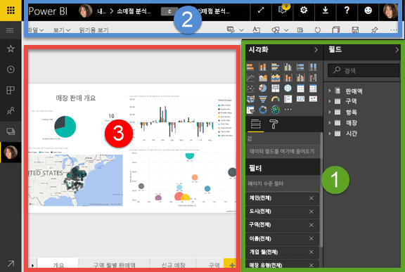
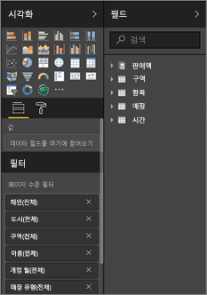
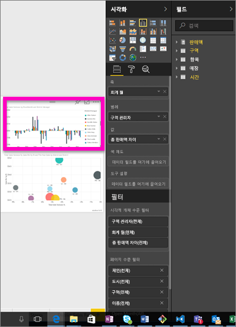
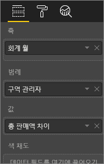
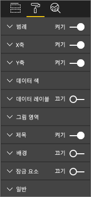
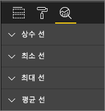
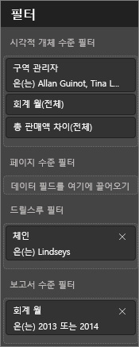

# 보고서 편집기... 둘러보기
## Power BI 서비스 및 Power BI Desktop의 보고서 편집
Power BI 서비스의 보고서 편집기와 Power BI Desktop의 보고서 편집기는 매우 유사합니다. 비디오에서는 Power BI Desktop의 보고서 편집기를 보여주고 이 문서에서는 Power BI 서비스의 보고서 편집기를 보여줍니다. 

## 보고서 ‘작성자’와 보고서 ‘소비자’ 간의 차이
보고서를 작성하고 편집하는 기능은 보고서 소유자(‘작성자’)로 제한됩니다. 사용자와 공유되는 보고서를 ‘소비’하는 경우, Power BI 서비스 [읽기용 보기](service-reading-view-and-editing-view.md)에서만 보고서를 열고 조작할 수 있지만, 보고서 작성자에게 제공되는 강력하고 다양한 기능은 사용할 수 없습니다.  

보고서 읽기용 보기에 대해 자세히 알아보려면 [Power BI 서비스의 읽기용 보기 및 편집용 보기](service-reading-view-and-editing-view.md)를 참조하세요. 

<iframe width="560" height="315" src="https://www.youtube.com/embed/IkJda4O7oGs" frameborder="0" allowfullscreen></iframe>

Power BI 서비스에서 *보고서 편집기*는 [편집용 보기](service-reading-view-and-editing-view.md)로만 제공됩니다. 편집용 보기에서 보고서를 열려면 보고서 소유자 또는 작성자여야 합니다.

Power BI 보고서 편집기는 다음 3개 섹션으로 구성됩니다.   

1. **필드**, **시각화** 및 **필터** 창 
2. 위쪽 탐색 모음    
3. 보고서 캔버스     

## 1. 보고서 편집기 창

먼저 보고서를 열면 시각화, 필터 및 필드 등, 3개 창을 볼 수 있습니다. 왼쪽에 있는 시각화 및 필터 창은 보이는 모습, 즉 유형, 색, 필터링, 서식 등을 제어합니다.  오른쪽에 있는 필드 창은 시각화에서 사용되는 기본 데이터를 관리합니다. 

보고서 편집기에 표시되는 콘텐츠는 보고서 캔버스에서 선택하는 항목에 따라 달라집니다.  예를 들어 개별 시각적 개체를 선택하는 경우 다음과 같이 표시됩니다. 

|  |  |
| --- | --- |
|  |<ul><li>시각화 창의 맨 위에서는 사용 중인 시각적 개체의 형식을 식별합니다. 묶은 세로 막대형 차트를 예로 들 수 있습니다.  </li> <li>시각화 창의 맨 아래에는(아래로 스크롤해야 함) 시각적 개체에서 사용되는 필드가 표시됩니다. 이 차트는 회계 월, 지역 관리자 및 총 판매액 분산을 사용 중입니다.   </li><li>필터 창(아래로 스크롤해야 함)에는 적용된 필터가 표시됩니다.   </li><li>필드 창에는 사용할 수 있는 테이블이 나열되고 테이블의 이름을 확장하면 해당 테이블을 구성하는 필드가 나타납니다. 노란색 글꼴은 해당 테이블에서 최소 하나의 필드가 시각화에 사용되고 있음을 나타냅니다.  </li><li> 서식 창을 표시하려면 선택한 시각화에서 페인트 롤러 아이콘을 선택합니다.  </li><li>Analystics 창을 표시하려면 돋보기 아이콘을 선택합니다.</ul> |
|  | |

## 시각화 창(위에서 아래 방향)

여기서 시각화 유형을 선택합니다. 작은 사진을 *템플릿*이라고 합니다. 위 그림에서는 묶은 가로 막대형 차트를 선택했습니다. 먼저 시각화 유형을 선택하지 않았지만 필드를 선택하여 시각화를 구성하기 시작한 경우, Power BI가 사용자를 위한 시각화 유형을 선택합니다. Power BI의 선택을 그대로 사용하거나 다른 템플릿을 선택하여 유형을 변경할 수 있습니다. 데이터를 가장 잘 표시하는 시각화 유형을 찾기 위해 필요한 만큼 전환합니다.

### 시각적 개체에서 사용되는 필드 관리

이 창에 표시되는 버킷(때때로 *끌기*라고 함)은 선택한 시각화의 유형에 따라 달라집니다.  예를 들어 가로 막대형 차트를 선택한 경우 축, 값 및 범례에 대한 버킷이 표시됩니다. 필드를 선택하거나 캔버스로 끌어오면 Power BI는 버킷 중 하나에 해당 필드를 추가합니다.  필드 목록의 필드를 직접 버킷으로 끌어갈 수도 있습니다.  일부 버킷은 특정 형식의 데이터로 제한됩니다.  예를 들어 **값** 은 숫자가 아닌 필드를 허용하지 않습니다. 따라서 **employeename** 필드를 **값** 버킷으로 끌면 Power BI에서 해당 필드를 **count of employeename**로 변경합니다.

### 필드 제거
시각화에서 필드를 제거하려면 필드 이름 오른쪽의 **X**를 선택합니다.

자세한 내용은 [Power BI 보고서에 시각화 추가](power-bi-report-add-visualizations-i.md)를 참조하세요.

### 시각적 개체 서식 지정
페인트 롤러 아이콘을 선택하여 서식 창을 엽니다. 선택한 시각화의 유형에 따라 사용할 수 있는 옵션이 달라집니다.

매우 다양한 서식 지정이 가능합니다.  자세히 알아보려면 직접 살펴보거나 다음 문서를 참조하세요.

* [시각화 제목, 배경 및 범례 사용자 지정](power-bi-visualization-customize-title-background-and-legend.md)
* [색 서식 지정](service-getting-started-with-color-formatting-and-axis-properties.md)
* [X축 및 Y축 속성 사용자 지정](power-bi-visualization-customize-x-axis-and-y-axis.md)

### 시각화에 분석 추가
분석 창을 표시하려면 돋보기 아이콘을 선택합니다. 선택한 시각화의 유형에 따라 사용할 수 있는 옵션이 달라집니다.

    
Power BI 서비스의 분석 창에서 시각적 개체에 동적 참조 줄을 추가하고, 중요한 추세 또는 통찰력에 대한 포커스를 제공할 수 있습니다. 자세한 내용은 [Power BI 서비스의 분석 창](service-analytics-pane.md) 또는 [Power BI Desktop의 분석 창](desktop-analytics-pane.md)을 참조하세요.

- - -
## 필터 창
필터 창을 사용하여 페이지, 보고서, 드릴스루 및 시각적 수준에서 보고서에 대한 지속 필터를 보고 설정하고 수정할 수 있습니다. 예, 시각적 개체의 요소를 선택하거나 슬라이서 같은 도구를 사용하여 보고서 페이지 및 시각적 개체에서 임시 필터링을 수행할 수 있습니다. 그러나 필터 창을 사용하면 필터의 상태가 보고서에 저장됩니다. 

필터 창에는 다른 강력한 기능 하나가 있습니다. 즉, ***보고서에서 비주얼 중 하나에서 사용되는 알렉스가 아닌 필드*** 를 사용하여 필터링하는 기능입니다. 설명해 보겠습니다. 보고서 페이지를 만들 때 Power BI는 시각화에 사용하는 모든 필드를 필터 창의 시각적 수준 필터 영역에 자동으로 추가합니다.  그러나 현재 시각화에 사용되지 않는 필드를 사용하여 시각적 개체, 페이지, 드릴스루 또는 보고서 필터를 설정하려면 필터 버킷 중 하나로 끌어오면 됩니다.   

자세한 내용은 [보고서에 필터 추가](power-bi-report-add-filter.md)를 참조하세요.

- - -
## 필드 창
필드 창은 데이터에 있는 테이블과 필드를 표시하며 시각화를 만드는 데 사용할 수 있습니다.

|  |  |
| --- | --- |
|  |<ul><li>필드를 페이지로 끌어 새 시각화를 시작합니다.  필드를 기존 시각화로 끌어 필드를 해당 시각화에 추가할 수도 있습니다.  </li> <li>필드 옆에 있는 확인 표시를 추가하면 Power BI가 해당 필드를 활성(또는 새) 시각화에 추가합니다. 또한 해당 필드에 배치할 버킷도 결정됩니다.  예를 들어 필드가 범례, 축 또는 값에서 사용된다면? Power BI가 최적 사항을 제안하며 필요한 경우 사용자가 버킷에서 해당 항목을 움직일 수 있습니다.   </li><li>어떤 방법을 사용하든 선택한 각 필드가 보고서 편집기의 시각화 창에 추가됩니다.</li></ul> |

**참고**: Power BI Desktop을 사용하는 경우에도 필드 표시/숨기기, 계산 추가 등의 옵션이 있습니다.

### 필드 아이콘의 의미
* **∑ 집계** 집계는 합계 또는 평균을 구할 숫자 값입니다. 집계는 데이터(보고서의 기반이 되는 데이터 모델에 정의됨)와 함께 가져옵니다.
  자세한 내용은 [Power BI 보고서의 집계](service-aggregates.md)를 참조하세요.
* **계산된 측정값(계산된 필드라고도 함)**  
   각 계산 필드에는 하드 코드된 고유한 수식이 있습니다. 계산은 변경할 수 없습니다. 예를 들어 합계인 경우 합계만 될 수 있습니다. 자세한 내용은 [측정값 이해](desktop-measures.md)를 참조하세요.
*  **고유한 필드**  
   이 아이콘이 있는 필드는 Excel에서 가져온 것이며 중복된 값이 있는 경우에도 모든 값을 표시하도록 설정됩니다. 예를 들어 데이터에 'John Smith'라는 사람에 대한 레코드가 두 개 있는 경우 각 레코드는 고유한 것으로 처리되며 합계가 계산되지 않습니다.  
* ** 지리 필드**  
   위치 필드는 지도 시각화를 만드는 데 사용할 수 있습니다. 
* ** 계층 구조**  
   계층 구조를 구성하는 필드를 표시하는 화살표를 선택합니다. 

- - -
## 2. 위쪽 탐색 모음
위쪽 탐색 모음에서 사용할 수 있는 작업에는 여러 가지가 있으며, 항상 새로운 작업이 추가됩니다. 특정 작업에 대한 내용은 Power BI 설명서의 목차 또는 Search 상자를 사용하십시오.

## 3. 보고서 캔버스
보고서 캔버스는 작업이 표시되는 위치입니다. 필드, 필터 및 시각화 창을 사용하여 시각 효과를 만들 경우 해당 항목이 보고서 캔버스에 구성되어 표시됩니다. 캔버스 아래의 각 탭은 보고서의 페이지를 나타냅니다. 해당 페이지를 열려면 탭을 선택합니다. 

## 다음 단계:
[보고서 만들기](service-report-create-new.md)

[Power BI 서비스](service-reports.md), [Power BI Desktop](desktop-report-view.md) 및 [Power BI Mobile](mobile-apps-view-phone-report.md)의 보고서에 대해 자세히 알아보세요.

[Power BI - 기본 개념](service-basic-concepts.md)

궁금한 점이 더 있나요? [Power BI 커뮤니티를 이용하세요.](http://community.powerbi.com/)

