# 자습서: Power BI에서 Machine Learning Studio 모델 호출(미리 보기)

이 자습서에서는 **Azure Machine Learning Studio** 모델의 인사이트를 Power BI에 통합하는 연습을 합니다. 이 자습서는 Power BI 사용자에게 Azure ML 모델에 액세스 권한을 부여하고, 데이터 흐름을 만들고, Azure ML 모델의 인사이트를 데이터 흐름에 적용하는 데 도움이 되는 지침을 포함하고 있습니다. Azure ML 모델을 처음 만드는 데 도움이 되는 빠른 시작 가이드도 참조합니다.

이 자습서에서 설명하는 단계는 다음과 같습니다.

> [!div class="checklist"]
> * Azure Machine Learning 모델 만들기 및 게시
> * 모델을 사용할 Power BI 사용자에게 액세스 권한 부여
> * 데이터 흐름 만들기
> * Azure ML 모델의 인사이트를 데이터 흐름에 적용

## Azure ML 모델 만들기 및 게시

[연습 1단계: Machine Learning Studio 작업 영역 만들기](https://docs.microsoft.com/azure/machine-learning/studio/walkthrough-1-create-ml-workspace)의 지침에 따라 **Machine Learning** 작업 영역을 만듭니다.

이미 있는 Azure ML 모델 또는 데이터 세트와 해당 단계를 함께 사용할 수 있습니다. 게시된 모델이 없는 경우 자동차 가격 예측에 대한 Azure ML 모델을 설정하는 [Azure Machine Learning Studio에서 첫 번째 데이터 과학 실험 만들기](https://docs.microsoft.com/azure/machine-learning/studio/create-experiment)를 참조하여 몇 분 만에 모델을 만들 수 있습니다.

[Azure Machine Learning Studio 웹 서비스 배포](https://docs.microsoft.com/azure/machine-learning/studio/publish-a-machine-learning-web-service)의 단계에 따라 Azure ML 모델을 웹 서비스로 게시합니다.

## Power BI 사용자에게 액세스 권한 부여

Power BI에서 Azure ML 모델에 액세스하려면 Azure 구독 및 리소스 그룹에 대한 **읽기** 액세스 권한과 Machine Learning Studio 모델용 Azure Machine Learning Studio 웹 서비스에 대한 **읽기** 액세스 권한이 있어야 합니다.  Azure Machine Learning Service 모델의 경우 Machine Learning Service 작업 영역에 대한 **읽기** 액세스 권한이 필요합니다.

다음 단계에서는 모델이 게시된 Azure 구독 및 리소스 그룹에 대한 공동 관리자라고 가정하겠습니다.

[Azure Portal](https://portal.azure.com)에 로그인하여 **구독** 페이지로 이동합니다. 이 페이지는 왼쪽 탐색 메뉴에 있는 **모든 서비스** 목록을 사용하여 찾을 수 있습니다.

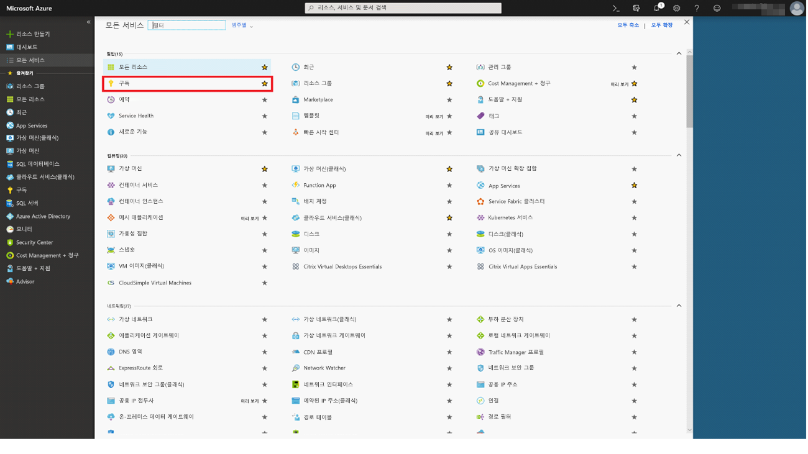

모델을 게시하는 데 사용한 Azure 구독을 선택하고 **액세스 제어(IAM)** 를 선택합니다. 다음으로, **역할 할당 추가**, **읽기 권한자** 역할, Power BI 사용자를 차례로 선택합니다. 완료되면 **저장**을 선택합니다. 아래 이미지에서는 해당 선택 내용을 보여 줍니다.

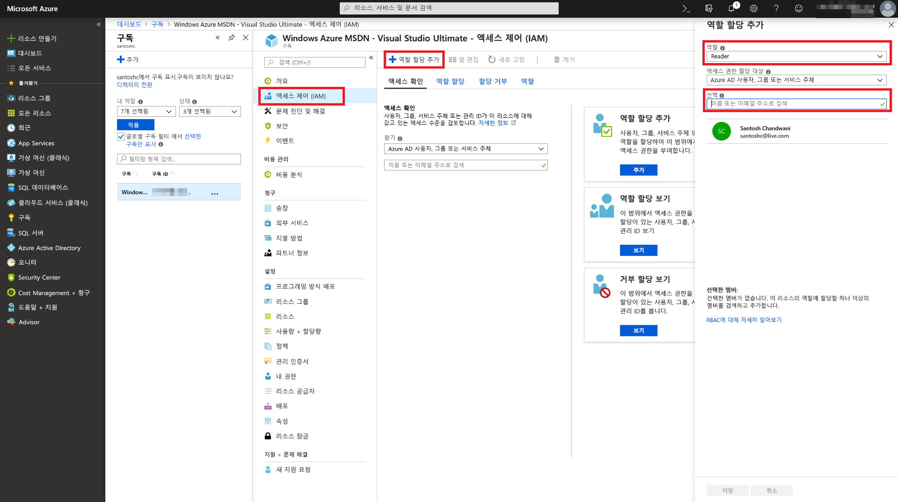

그런 다음, 위의 단계를 반복하여 Azure ML 모델이 배포된 특정 Machine Learning 웹 서비스의 Power BI 사용자에게 **기여자** 역할 액세스 권한을 부여합니다.

## 데이터 흐름 만들기

### 데이터 흐름 만들기에 사용할 데이터 가져오기

이전 단계에서 Azure ML 모델에 액세스 권한을 부여한 사용자 자격 증명을 사용하여 Power BI 서비스에 로그인합니다.

이 단계에서는 Azure ML 모델을 사용하여 점수를 매길 데이터가 CSV 형식으로 있다고 가정합니다.  **자동차 가격 책정 실험**을 사용하여 Machine Learning Studio에서 모델을 만든 경우 아래 링크의 데이터 세트를 공유합니다.

* [Azure Learning Studio 샘플 모델](https://raw.githubusercontent.com/santoshc1/PowerBI‑AI‑samples/master/Tutorial\_MLStudio\_model\_integration/Automobile%20price%20data%20\_Raw\_.csv)

### 데이터 흐름 만들기

데이터 흐름에 엔터티를 만들려면 Power BI 서비스에 로그인하고, 사용하도록 설정된 AI 미리 보기가 있는 전용 용량의 작업 영역으로 이동합니다.

작업 영역이 아직 없는 경우 만들 수 있습니다. 왼쪽 메뉴에서 **작업 영역**을 선택하고 하단 패널에서 **앱 작업 영역 만들기**를 선택합니다.  작업 영역 세부 정보를 입력하는 패널이 열립니다. 작업 영역 이름을 입력하고 **저장**을 선택합니다.

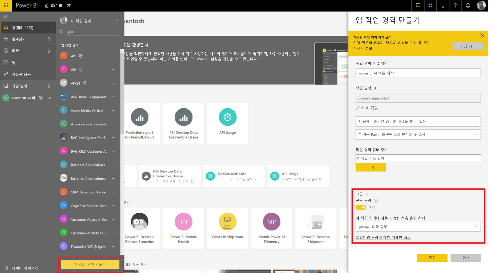

작업 영역을 만든 후에는 시작 화면 오른쪽 하단의 **건너뛰기**를 선택할 수 있습니다.

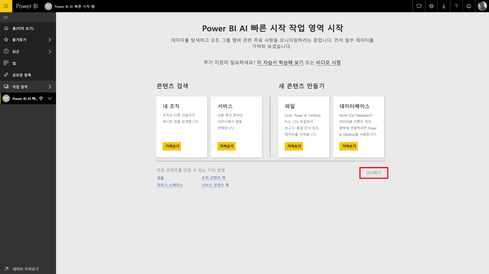

**데이터 흐름(미리 보기)** 탭을 선택하고, 작업 영역 오른쪽 상단의 **만들기** 단추를 선택하고, **데이터 흐름**을 선택합니다.

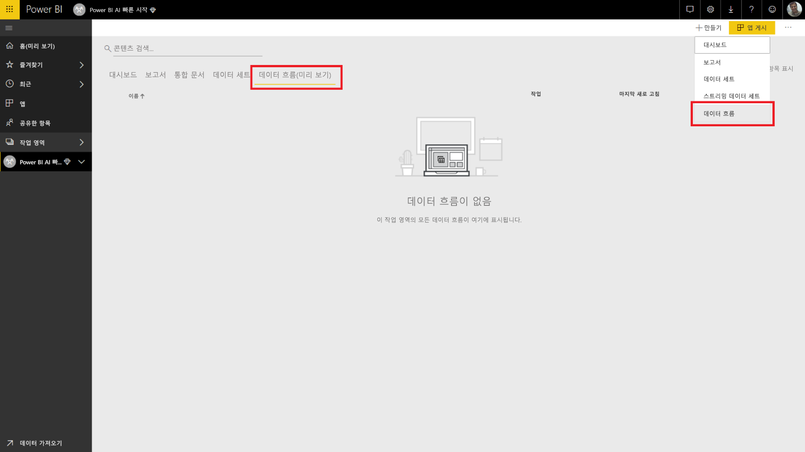

**새 엔터티 추가**를 선택하면 브라우저에 **파워 쿼리 편집기**가 실행됩니다.

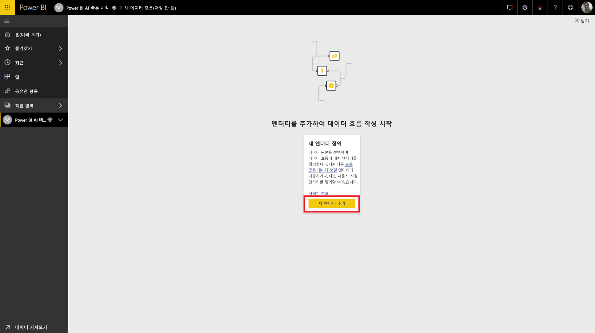

**Text/CSV 파일**을 데이터 원본으로 선택합니다.

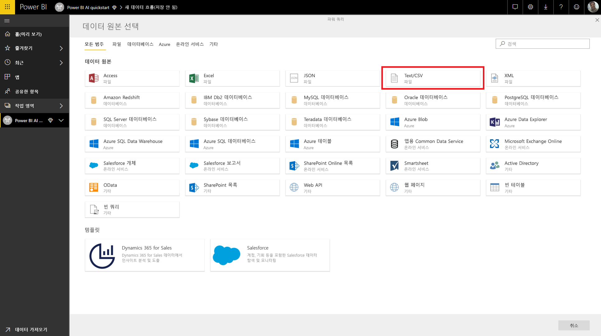

다음 화면에는 데이터 원본에 연결할지 묻는 메시지가 표시됩니다. Azure ML 모델을 만드는 데 사용한 데이터에 대한 링크를 붙여넣습니다. _자동차 가격 책정_ 데이터를 사용한 경우 다음 링크를 **파일 경로 또는 URL** 상자에 붙여넣고 **다음**을 누릅니다.

`https://raw.githubusercontent.com/santoshc1/PowerBI‑AI‑samples/master/Tutorial\_MLStudio\_model\_integration/Automobile%20price%20data%20\_Raw\_.csv`

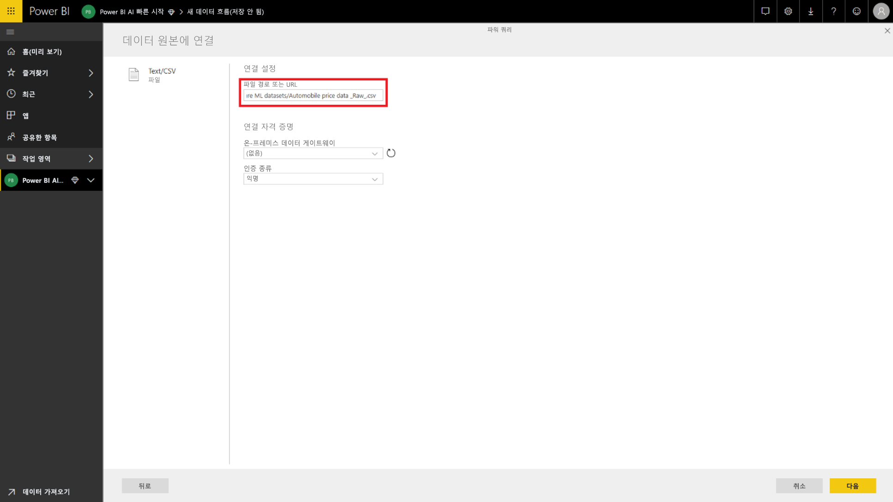

파워 쿼리 편집기는 CSV 파일의 데이터에 대한 미리 보기를 보여 줍니다. 명령 리본에서 **Transform Table**(테이블 변환)을 선택하고 **첫 행을 로 사용**을 선택합니다.  오른쪽의 **Applied steps**(적용 단계) 창에 _승격된 헤더_ 쿼리 단계가 추가됩니다. 오른쪽 창을 사용하여 쿼리 이름을 _자동차 가격 책정_ 같은 친근한 이름으로 바꿀 수도 있습니다.

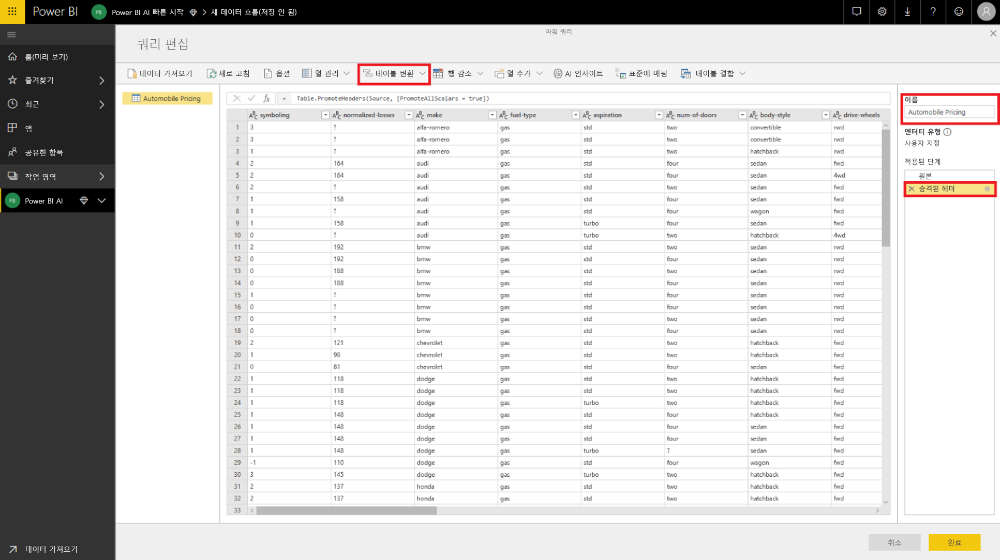

원본 데이터 세트에 ‘?’로 설정된 알 수 없는 값이 있습니다.  이러한 값을 정리하도록 ‘?’를 ‘0’으로 바꿔 간단하게 나중에 오류가 발생하는 것을 방지할 수 있습니다.  이 작업을 수행하려면 열 헤더에서 해당 이름을 클릭하여 *normalized-losses*, *bore*, *stroke*, *compression-ratio*, *horsepower*, *peak-rpm* 및 *price* 열을 선택하고, 'Transform columns'(열 변환)를 클릭하고, '값 바꾸기'를 선택합니다.  ‘?’를 ‘0’으로 바꿉니다.

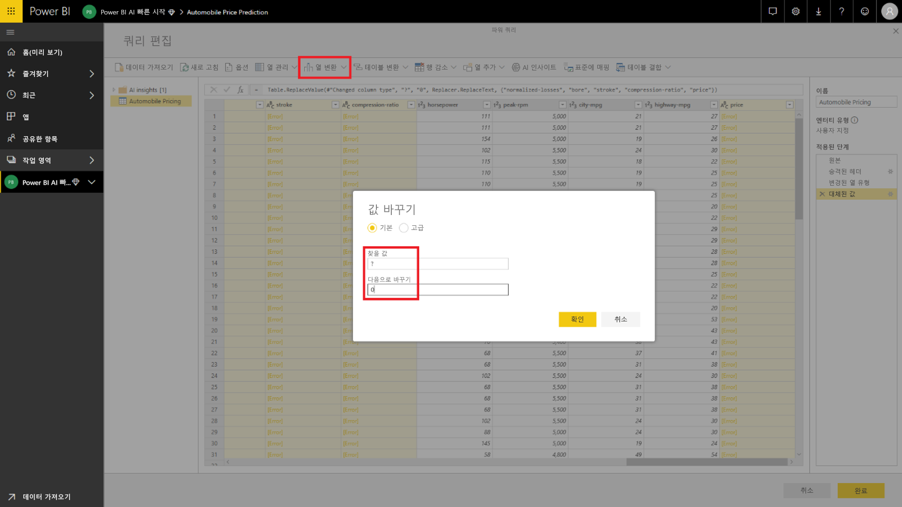

Text/CSV 원본의 테이블에 있는 모든 열은 텍스트 열로 처리됩니다.  그런 다음, 숫자 열을 올바른 데이터 형식으로 변경해야 합니다.  이 작업은 파워 쿼리에서 열 헤더의 데이터 형식 기호를 클릭하여 수행할 수 있습니다.  해당 열을 다음 형식으로 변경합니다.

- **정수**: symboling, normalized-losses, curb-weight, engine-size, horsepower, peak-rpm, city-mpg, highway-mpg, price
- **10진수**: wheel-base, length, width, height, bore, stroke, compression-ratio

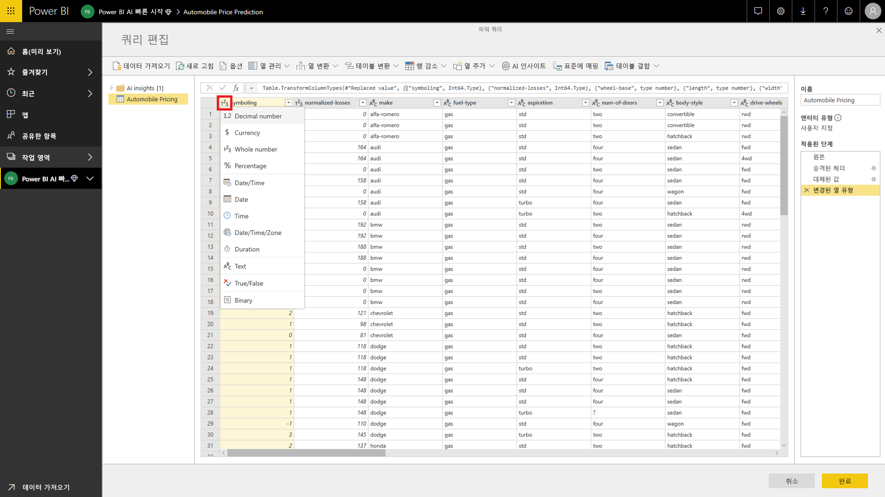

**완료**를 선택하여 파워 쿼리 편집기를 닫습니다. 그러면 추가한 _자동차 가격 책정_ 데이터가 포함된 엔터티 목록이 표시됩니다. 오른쪽 위 모서리의 **저장**을 선택하고, 데이터 흐름의 이름을 입력하고, **저장**을 선택합니다.

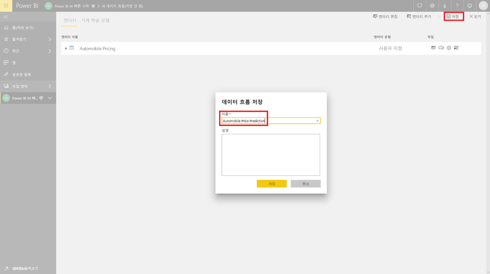

### 데이터 흐름 새로 고침

데이터 흐름을 저장하면 데이터 흐름이 저장되었다는 알림이 표시됩니다. **지금 새로 고침**을 선택하여 원본에서 데이터 흐름으로 데이터를 수집합니다.

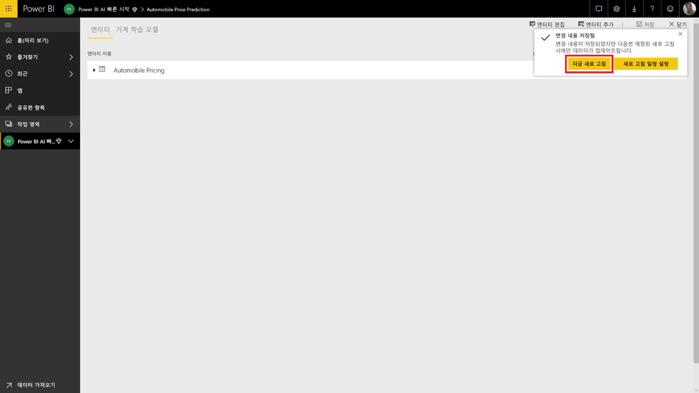

오른쪽 위 모서리의 **닫기**를 선택하고 데이터 흐름 새로 고침이 완료될 때까지 기다립니다.

**작업** 명령을 사용하여 데이터 흐름을 새로 고칠 수도 있습니다. 새로 고침이 완료되면 데이터 흐름에 타임스탬프가 표시됩니다.

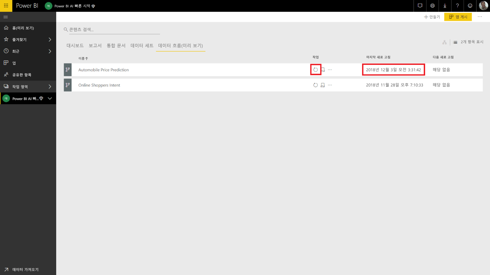

## Azure ML 모델의 인사이트 적용

_자동차 가격 예측_에 대한 Azure ML 모델에 액세스하려면 예측 가격을 추가할 _자동차 가격 책정_ 엔터티를 편집합니다.

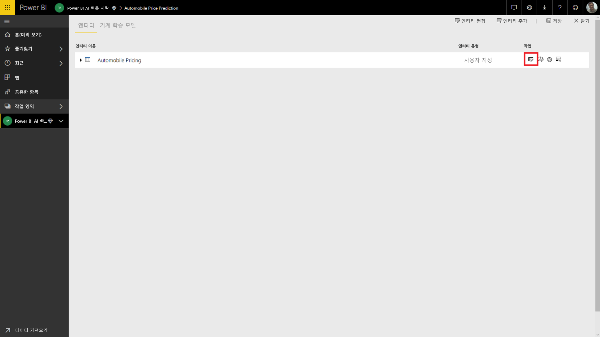

**편집** 아이콘을 선택하면 데이터 흐름의 엔터티에 대한 파워 쿼리 편집기가 열립니다.

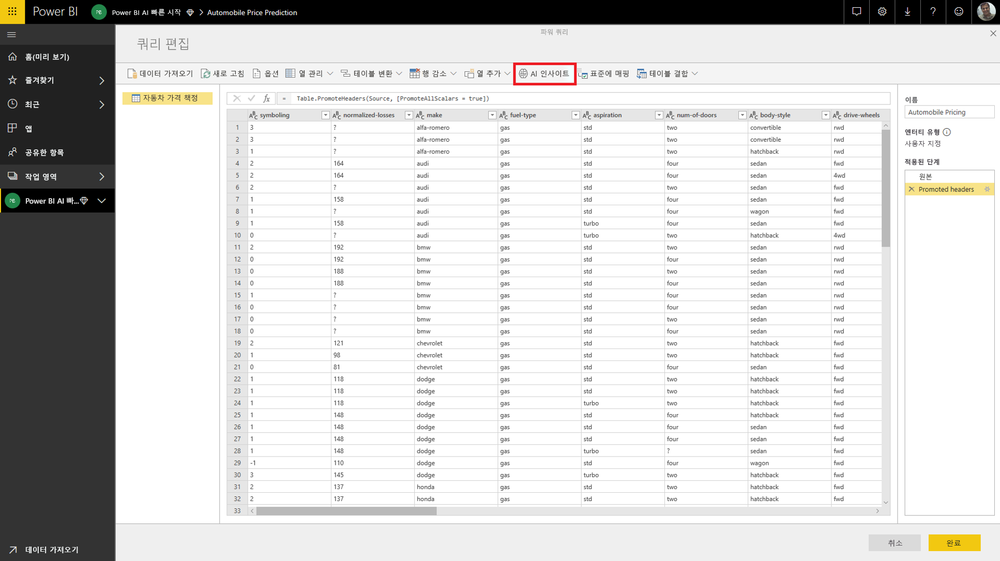

리본에서 **AI 인사이트** 단추를 선택하고 왼쪽 탐색 메뉴의 **Azure Machine Learning 모델** 폴더를 선택합니다. 

액세스 권한이 부여된 Azure ML 모델이 *AzureML* 접두사가 포함된 파워 쿼리 함수로 나열됩니다.  _AutomobilePricePrediction_ 모델에 해당하는 함수를 클릭하면 이 모델의 웹 서비스용 매개 변수가 함수 매개 변수로 나열됩니다.

Azure ML 모델을 호출하려면 선택한 엔터티의 열을 드롭다운에서 입력으로 지정합니다. 입력 대화 상자 왼쪽으로 열 아이콘을 전환하여 입력으로 사용할 상수 값을 지정할 수도 있습니다. 열 이름이 함수 매개 변수 이름 중 하나와 일치하면 해당 열이 자동으로 입력으로 제안됩니다.  열 이름이 일치하지 않으면 드롭다운에서 선택할 수 있습니다.

_자동차 가격 예측_ 모델의 경우 입력 매개 변수는 다음과 같습니다.

- make
- body-style
- wheel-base
- engine-size
- horsepower
- peak-rpm
- highway-mpg

여기서는 모델 학습에 사용된 원래 데이터 세트와 테이블이 일치하므로 모든 매개 변수에 올바른 열이 이미 선택되어 있습니다.

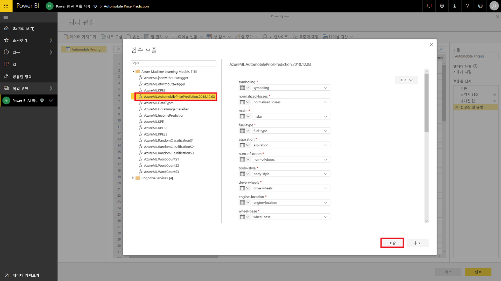

Azure ML 모델 출력 미리 보기를 엔터티 테이블에 새 열로 표시하려면 **호출**을 선택합니다. 모델 호출을 쿼리의 적용 단계로 표시할 수도 있습니다.

모델 출력은 출력 열에 레코드로 표시됩니다. 이 열을 확장하여 별도의 열에 개별 출력 매개 변수를 생성할 수 있습니다. 여기서는 자동차 예측 가격이 포함된 _점수가 매겨진 레이블_에만 관심이 있습니다.  따라서 나머지를 선택 취소하고 **확인**을 선택합니다.

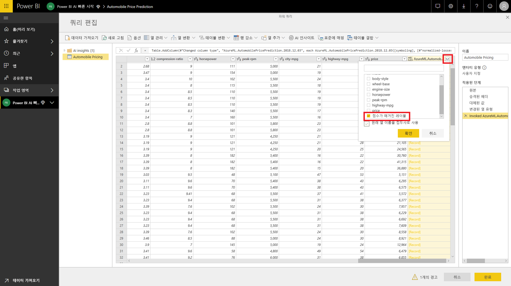

그러면 ‘점수가 매겨진 레이블’ 열에 Azure ML 모델의 가격 예측이 표시됩니다.

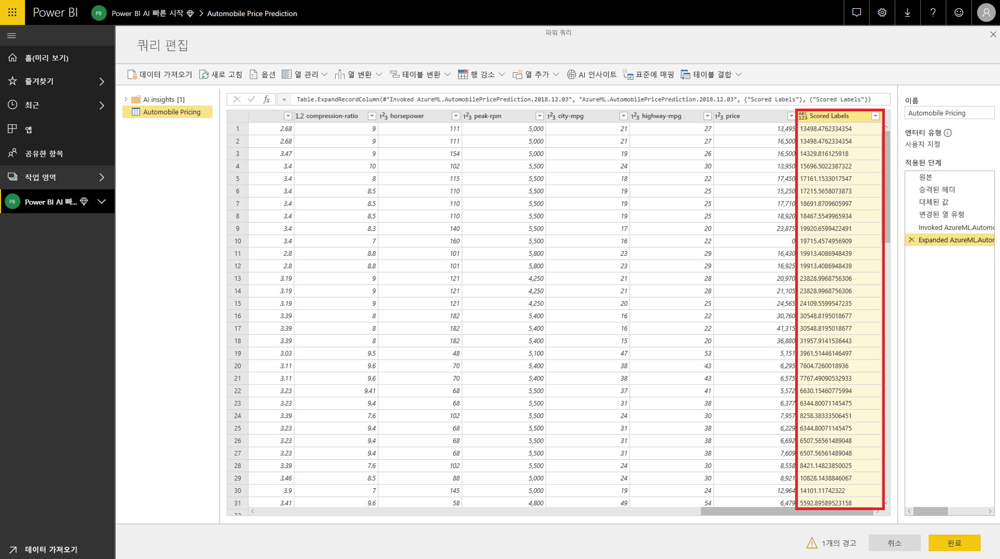

데이터 흐름을 저장하면 엔터티 테이블의 모든 새 행 또는 업데이트된 행에 대해 데이터 흐름을 새로 고치는 경우 자동으로 Azure ML 모델이 호출됩니다.

## 리소스 정리

이 문서를 사용하여 만든 Azure 리소스가 더 이상 필요하지 않은 경우 요금이 발생하지 않도록 삭제하세요.  데이터 흐름도 더 이상 필요하지 않으면 삭제할 수 있습니다.

## 다음 단계

이 자습서에서는 다음 단계에 따라 간단한 데이터 세트로 Azure Machine Learning Studio를 사용하여 간단한 실험을 만들었습니다.

- Azure Machine Learning 모델 만들기 및 게시
- 모델을 사용할 Power BI 사용자에게 액세스 권한 부여
- 데이터 흐름 만들기
- Azure ML 모델의 인사이트를 데이터 흐름에 적용

Power BI에서 Azure Machine Learning을 통합하는 작업에 대한 자세한 내용을 보려면 [Power BI에서 Azure Machine Learning 통합(미리 보기)](service-machine-learning-integration.md)을 참조하세요.
