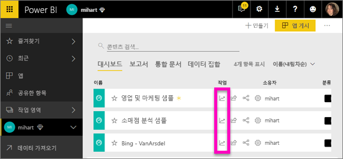
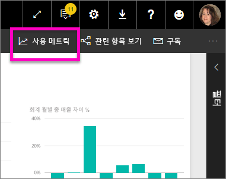
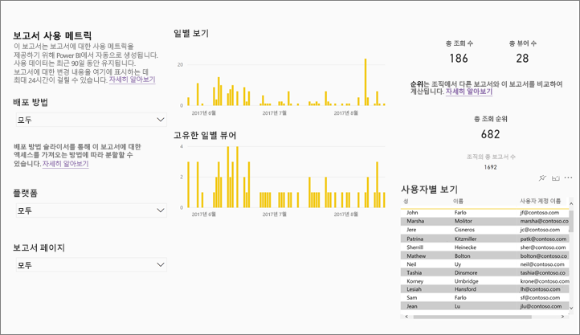
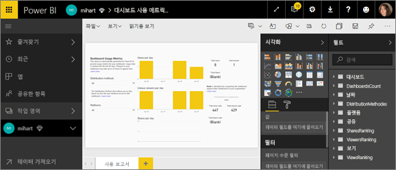
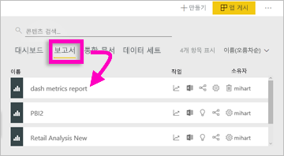
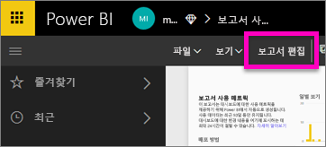
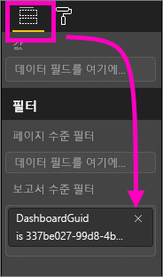
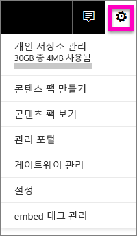
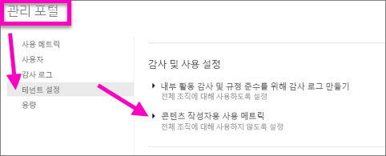
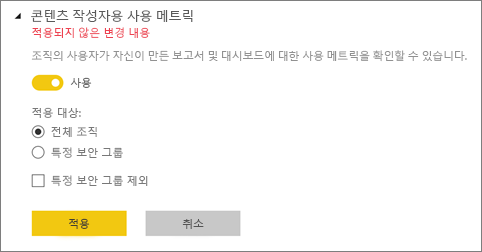

# 대시보드 및 보고서의 사용 메트릭
대시보드 및 보고서를 만드는 경우 사용량 메트릭은 해당 영향을 이해하도록 돕습니다. 대시보드 사용량 메트릭 또는 보고서 사용 메트릭을 실행하면 해당 대시보드 및 보고서가 조직 내에서 어떻게 사용되고 있는지, 무엇이 누구에 의해 어떠한 목적으로 사용되고 있는지를 파악할 수 있습니다.  

> [!NOTE]
> 사용 메트릭은 SharePoint Online에 포함된 보고서의 사용을 추적합니다. 또한 "사용자 소유 자격 증명" 및 "앱 소유 자격 증명" 흐름 모두를 통해 대시보드 및 보고서를 모두 추적합니다. 사용 메트릭은 [웹에 게시](service-publish-to-web.md)를 통해 포함된 보고서의 사용을 추적하지 않습니다.

이러한 사용 메트릭 보고서는 읽기 전용입니다. 하지만 “다른 이름으로 저장”을 사용하면 사용 메트릭 보고서를 개인 설정할 수 있습니다. 그러면 새 데이터 집합이 만들어지고 읽기 전용 보고서에서 편집할 수 있는 모든 기능을 갖춘 Power BI 보고서로 변환됩니다. 개인 설정된 보고서는 선택한 대시보드 또는 보고서에 대한 메트릭을 포함할 뿐만 아니라, 기본 필터를 제거하면 선택한 작업 영역의 모든 대시보드 또는 모든 보고서에 대한 사용 메트릭에 액세스할 수 있습니다.

## 사용 메트릭이 중요한 이유는 무엇입니까?
콘텐츠가 사용되는 방식을 알고 있으면 영향을 보여 주고 활동의 우선 순위를 정하는 데 도움이 됩니다. 사용 메트릭은 보고서 중 하나가 조직의 거대한 세그먼트에 의해 매일 사용되는 것을 보여 주고 사용자가 만든 대시보드를 전혀 보고 있지 않는 것을 보여 줄 수 있습니다. 이러한 유형의 피드백은 작업 활동 안내에 유용합니다.

사용 메트릭 보고서는 Power BI 서비스에서만 실행할 수 있습니다.  단, 사용 메트릭 보고서를 저장하거나 대시보드에 고정하는 경우 모바일 장치에서 해당 보고서를 열고 상호 작용할 수 있습니다.

### 필수 조건
- 사용 메트릭 기능은 무료 및 Pro 모두에서 모든 사용자의 사용 정보를 캡처합니다. 단, Pro 라이선스는 사용 메트릭 데이터를 실행하여 액세스해야 합니다.
- 사용 메트릭은 선택한 작업 영역의 대시보드 또는 보고서에 제공됩니다. 특정 대시보드 또는 보고서에 대한 사용 메트릭에 액세스하려면 다음이 있어야 합니다.    
    • 해당 대시보드 또는 보고서에 대한 편집 권한   
    • Pro 라이선스

## 사용 메트릭 보고서 정보

**사용 메트릭** 또는  아이콘을 선택하면 Power BI에서는 최근 90일 동안 해당 콘텐츠에 대한 사용 메트릭을 사용하여 미리 작성된 보고서를 생성합니다.  보고서는 이미 익숙한 Power BI 보고서와 매우 비슷해 보이지만 대화형이 아닌 정보 제공을 위해 설계되었습니다. 최종 사용자가 액세스를 수신하는 방법(웹 또는 모바일 앱 등을 통해 액세스했는지 여부)에 따라 조각화할 수 있게 됩니다. 대시보드 및 보고서를 확대하면 사용 메트릭 보고서도 확대되며 매일 새 데이터로 업데이트됩니다.  

사용 메트릭 보고서는 **최근**, **작업 영역**, **즐겨찾기** 또는 기타 내용 목록에 나타나지 않습니다. 앱에 추가할 수 없습니다. 사용 메트릭 보고서에서 타일을 대시보드에 고정하는 경우 해당 대시보드를 앱 또는 콘텐츠 팩에 추가할 수 없습니다.

보고서 데이터를 자세히 살펴보거나 데이터 집합에 대한 자신만의 보고서를 작성하려면 **다른 이름으로 저장**을 사용합니다([완전한 기능의 Power BI 보고서로 사용 메트릭 저장](#Save-the-Usage-Metrics-report-as-a-full-featured-Power-BI-report-(personalize)) 참조).

## 대시보드 또는 보고서에 대한 사용 메트릭 보고서 열기
1. 대시보드 또는 보고서를 포함하는 작업 영역에서 시작합니다.
2. 작업 영역 콘텐츠 목록 또는 대시보드나 보고서 자체에서 **사용 메트릭** 에 대한 아이콘을 선택합니다.
   
    
   
    
3. 처음에 이를 수행하면 Power BI에서 사용 메트릭 보고서를 만들고 준비되면 사용자에게 알려줍니다.
   
        
4. 결과를 열려면 **사용 메트릭 보기**를 선택합니다.
   
    사용 메트릭은 Power BI 대시보드 및 보고서를 배포 및 유지 관리하는 데 강력한 협력 기능이 될 것입니다. 보고서 중 가장 유용한 페이지와 단계적으로 중지해야 하는 페이지를 알고 싶으세요? **보고서 페이지**별로 조각화하여 살펴보세요. 대시보드에 대한 모바일 레이아웃을 작성해야 하는지 궁금하세요? **플랫폼**별로 조각화하여 모바일 앱 및 웹 브라우저를 통해 콘텐츠에 액세스하는 사용자 수를 알아보세요.

5. 필요에 따라 시각화를 마우스로 가리키고 핀 고정 아이콘을 선택하여 시각화를 대시보드에 추가할 수 있습니다. 또는 상단의 메뉴 모음에서 **라이브 페이지 고정**을 선택하여 전체 페이지를 대시보드에 추가할 수 있습니다. 대시보드에서 사용 메트릭을 좀 더 간편하게 모니터링하거나 다른 사용자와 공유할 수 있습니다.
   
   > **참고**: 사용 메트릭 보고서에서 타일을 대시보드에 고정하는 경우 해당 대시보드를 앱 또는 콘텐츠 팩에 추가할 수 없습니다.
   > 
   > 

  

## 보고되는 메트릭은 무엇인가요?
| 메트릭 | 대시보드 | 보고서 | 설명 |
| --- | --- | --- | --- |
| 배포 방법 슬라이서 |예 |예 |사용자가 콘텐츠에 액세스하는 방법입니다. 다음과 같이 3가지 방법이 있습니다. 사용자는 [앱 작업 영역](service-the-new-power-bi-experience.md)의 구성원이 되거나, [콘텐츠를 공유](service-share-dashboards.md)하거나, 콘텐츠 팩/앱을 설치하여 대시보드 또는 보고서를 액세스할 수 있습니다.  앱을 통한 보기는 “콘텐츠 팩”으로 개수됩니다. |
| 플랫폼 슬라이서 |예 |예 |대시보드 또는 보고서가 Power BI 서비스(powerbi.com) 또는 모바일 장치를 통해 액세스되었나요? 모바일은 iOS, Android 및 Windows 앱을 모두 포함합니다. |
| 보고서 페이지 슬라이서 |아니요 |예 |보고서에 두 개 이상의 페이지가 있는 경우 표시된 페이지에서 보고서를 분할합니다. “비어 있음” 목록 옵션이 표시되면 보고서 페이지가 최근에 추가되거나(24시간 이내에 새 페이지의 실제 이름이 슬라이서 목록에 표시됨) 보고서 페이지가 삭제된 것입니다. “비어 있음”은 이러한 상황을 캡처합니다. |
| 일별 보기 |예 |예 |일별 보기의 총 수 - 보기는 보고서 페이지 또는 대시보드를 로드하는 사용자로 정의됩니다. |
| 고유한 일별 뷰어 |예 |예 |대시보드 또는 보고서를 보는 *다른* 사용자의 수(AAD 사용자 계정에 기반)입니다. |
| 사용자별 보기 |예 |예 |개별 사용자로 분류한 지난 90일 동안 보기의 수입니다. |
| 일별 공유 |예 |아니요 |다른 사용자 또는 그룹과 대시보드를 공유한 횟수입니다. |
| 총 조회 수 |예 |예 |지난 90일 동안의 조회 수입니다. |
| 총 뷰어 수 |예 |예 |지난 90일 동안의 고유한 뷰어 수입니다. |
| 총 공유 |예 |아니요 |지난 90일 동안 대시보드 또는 보고서를 공유한 횟수입니다. |
| 조직의 총 수 |예 |예 |전체 조직에서 지난 90일 동안 한 번 이상 조회한 모든 대시보드 또는 보고서 수입니다.  순위를 계산하는 데 사용합니다. |
| 순위: 총 조회 수 |예 |예 |지난 90일 동안 조직에 있는 모든 대시보드 또는 보고서 총 조회 수의 경우 이 대시보드 또는 보고서 순위를 집계합니다. |
| 순위: 총 공유 |예 |아니요 |지난 90일 동안 조직에 있는 모든 대시보드 총 공유의 경우 이 대시보드 또는 보고서 순위를 집계합니다. |

### 대시보드 사용 메트릭 보고서

### 보고서 사용 메트릭 보고서

## 완전한 기능을 갖춘 Power BI 보고서로 사용 메트릭 보고서 저장(개인 설정)

**다른 이름으로 저장**을 사용하여 사용 메트릭 보고서를 사용자 지정하고 공유할 수 있는 완전한 기능을 갖춘 Power BI 보고서로 변환합니다. 개인 설정된 복사본을 만들면 기본 데이터 집합에 대한 모든 액세스 권한을 얻게 되어 사용 메트릭 보고서를 사용자 특정 요구에 맞게 사용자 지정할 수 있습니다. Power BI Desktop을 사용하여 [Power BI 서비스 기능에 라이브 연결](https://powerbi.microsoft.com/blog/connecting-to-datasets-in-the-power-bi-service-from-desktop)을 통한 사용자 지정 사용 메트릭 보고서를 작성할 수도 있습니다.

기본 데이터 집합에 작업 영역의 모든 대시보드 또는 보고서에 대한 사용 정보가 포함되는 것이 가장 좋습니다. 그러면 또 다른 가능성이 열립니다. 예를 들어 사용에 따라 작업 영역에서 모든 대시보드를 비교하는 보고서를 만들 수 있습니다. 또는 해당 앱 내에 배포된 모든 콘텐츠의 사용량을 집계하여 Power BI 앱에 대한 사용 메트릭 대시보드를 만들 수도 있습니다.  아래 [페이지 수준 필터 제거](#remove-the-filter-to-see-all-the-usage-metrics-data-in-the-workspace)를 참조하세요.

### “다른 이름으로 저장”을 사용하는 경우 무엇이 만들어집니까?
Power BI에서 완전한 기능을 갖춘 보고서를 만드는 경우 지난 90일 동안 액세스되었던 **현재 작업 영역에 포함된 모든 대시보드 및 모든 보고서로 구성된** 새 데이터 집합도 만들게 됩니다. 예를 들어 “매출”이라는 작업 영역이 있는데, 여기에는 세 개의 대시보드 및 두 개의 보고서가 포함되어 있고 “북동부” 대시보드에 사용 메트릭 보고서를 만들었다고 가정합니다. 그리고 **다른 이름으로 저장**을 사용하여 개인 설정을 수행하고 모든 기능을 갖춘 보고서로 변환합니다. 해당 새 보고서에 대한 데이터 집합은 *“북동부”라는 대시보드 하나에 대한 사용 메트릭뿐 아니라* “매출” 작업 영역에 있는 모든 세 대시보드에 대한 사용 메트릭을 포함합니다. 기본적으로 보고서는 “북동부” 대시보드에 대한 데이터를 표시하고 [필터를 삭제](#remove-the-filter-to-see-all-the-usage-metrics-data-in-the-workspace)해야 모든 세 대시보드에 대한 데이터를 표시할 수 있습니다.

### “다른 이름으로 저장”을 사용하여 사용 보고서의 복사본 만들기
“다른 이름으로 저장”(개인 설정)을 사용하여 복사본을 만들 때 Power BI는 읽기 전용의 미리 작성된 보고서를 완전한 기능을 갖춘 보고서로 변환합니다.  얼핏 보기에 완전히 같아 보입니다. 그러나 이제 편집용 보기로 보고서를 열고, 새 시각화, 필터 및 페이지를 추가하고 기존 시각화를 수정하거나 삭제하는 등 많은 작업을 수행할 수 있습니다. Power BI는 현재 작업 영역에 완전히 새로운 보고서와 데이터 집합을 저장합니다. 아래 예에서는 현재 작업 영역이 **mihart**입니다.

1. 미리 작성된 사용 메트릭 보고서에서 **파일 > 다른 이름으로 저장**을 선택합니다. Power BI에서는 사용 메트릭 보고서를 완전한 기능을 갖춘 Power BI 보고서로 변환합니다. *개인 설정된* 사용 메트릭 보고서라고도 합니다. 개인 설정된 사용 현황 보고서 및 데이터 집합은 **mihart*라고 하는 현재 작업 영역에 저장됩니다.
   
    
2. 편집용 보기에서 보고서를 열고 [다른 Power BI 보고서와 마찬가지로 상호 작용](service-interact-with-a-report-in-editing-view.md)합니다. 예를 들어 새 페이지를 추가하고, 새 시각화를 빌드하고, 필터를 추가하고, 글꼴 및 색 등 서식을 지정합니다.
   
    
3. 또는 새 데이터 집합을 시작하고 보고서를 처음부터 작성합니다.
   
    
4. 새 보고서는 현재 작업 영역(mihart)에 저장되고 **최근** 콘텐츠 목록에도 추가됩니다.
   
    

### 필터를 제거하여 작업 영역의 ***모든*** 사용 현황 메트릭 데이터를 봅니다.
작업 영역의 모든 대시보드 또는 모든 보고서에 대한 메트릭을 보려면 필터를 제거해야 합니다. 기본적으로 개인 설정된 보고서는 해당 보고서를 만드는 데 사용된 대시보드 또는 보고서에 대한 메트릭만 표시하도록 필터링되어 있습니다.

예를 들어 “유럽 매출”이라는 대시보드를 사용하여 이 새로운 개인 설정된 보고서를 만든 경우 “유럽 매출” 대시보드의 사용 데이터만 표시됩니다. 필터를 제거하고 해당 작업 영역 내 모든 대시보드의 데이터를 활성화하려면 다음을 수행합니다.

1. 개인 설정된 보고서를 편집용 보기로 엽니다.
   
    
2. 필터 창에서 **보고서 수준 필터** 버킷으로 이동하여 “x”를 선택하여 필터를 제거합니다.
   
    
   
    이제 개인 설정된 보고서에 전체 작업 영역에 대한 메트릭이 표시됩니다.

## Power BI 관리자에 대한 사용 메트릭의 관리 제어
사용 메트릭 보고서는 Power BI 또는 Office 365 관리자에서 켜거나 끌 수 있는 기능입니다. 관리자는 사용자가 사용 메트릭에 대한 액세스를 갖는지 세부적으로 제어합니다. 기본적으로 조직의 모든 사용자에 대해 적용됩니다.

1. Power BI 서비스의 오른쪽 맨 위 모퉁이에 있는 기어 아이콘을 선택하고 **관리자 포털**을 선택하여 관리자 포털을 엽니다.
   
    
2. 관리 포털에서 **테넌트 설정** 및 **콘텐츠 작성자의 사용 메트릭**을 선택합니다.
   
    
3. 사용 메트릭을 설정(또는 설정 해제)하고 **적용**을 선택합니다.
   
    

전체 조직에 대한 사용 메트릭을 비활성화하면 관리자는 **기존 사용 메트릭 콘텐츠 모두 삭제** 옵션을 사용하여 사용 메트릭 보고서 및 데이터 집합을 통해 빌드한 기존 보고서 및 대시보드 타일을 모두 삭제할 수 있습니다. 이 옵션은 이미 사용 메트릭을 사용 중일 수도 있는 조직의 모든 사용자에게서 사용 메트릭 데이터에 대한 모든 액세스를 제거합니다. 기존 사용 메트릭 콘텐츠 삭제는 되돌릴 수 없으므로 조심해야 합니다.

## 고려 사항 및 제한 사항
Q: 대시보드 또는 보고서에서 사용 메트릭을 실행할 수 없습니다.    
A: 소유하거나 편집할 수 있는 권한이 있는 콘텐츠에 대한 사용 메트릭만을 볼 수 있습니다.

Q: 포함된 대시보드 및 보고서에서 사용 메트릭을 캡처하나요?     
A: 사용 메트릭은 [사용자 소유 데이터](developer/integrate-report.md) 흐름, [앱 소유 데이터](developer/embed-sample-for-customers.md) 흐름 및 [웹에 게시](service-publish-to-web.md) 흐름을 포함한 포함된 대시보드 및 보고서에 대한 사용 캡처를 지원하지 않습니다. 이 경우 기존 웹 분석 플랫폼을 사용하여 호스팅 앱 또는 포털에 대한 사용량을 추적하는 것이 좋습니다.

Q: 모든 콘텐츠에서 사용 메트릭을 전혀 실행할 수 없습니다.    
A1: 관리자는 조직에 대해 이 기능을 해제할 수 있습니다.  이 경우에 해당하는지 관리자에게 문의합니다.    
A2: 사용 메트릭은 Power BI Pro 기능입니다.

Q: 최신 상태의 데이터가 아닌 것 같습니다. 예를 들어 배포 방법이 표시되지 않거나 보고서 페이지가 누락되었습니다.   
A: 데이터를 업데이트하는 데 최대 24시간이 걸릴 수 있습니다.

Q: 작업 영역에 4개 보고서가 있지만 사용 메트릭 보고서에는 3개만 표시됩니다.    
A: 사용 메트릭 보고서는 지난 90일 동안 액세스되었던 보고서(또는 대시보드)만 포함합니다.  보고서(또는 대시보드)가 표시되지 않으면 90일 전에 사용되었을 가능성이 있습니다.

## 다음 단계
[대시보드를 즐겨찾기에 추가](service-dashboard-favorite.md)

궁금한 점이 더 있나요? [Power BI 커뮤니티를 이용하세요.](http://community.powerbi.com/)

