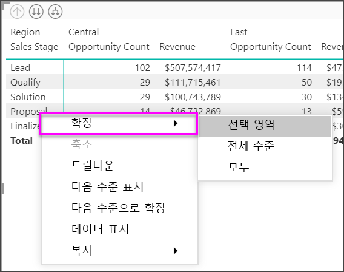
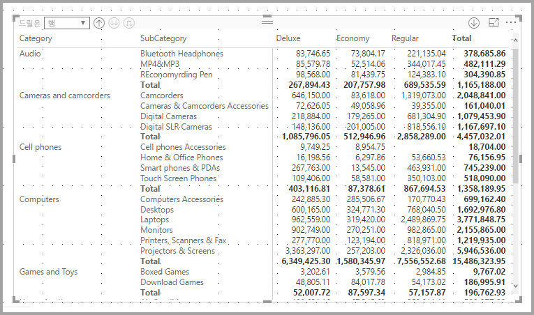
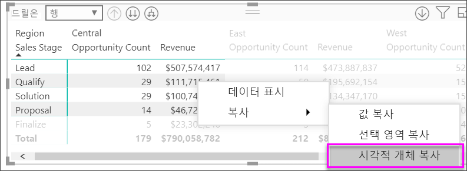

# Power BI에서 행렬 시각화 만들기

[!INCLUDE [power-bi-visuals-desktop-banner](../includes/power-bi-visuals-desktop-banner.md)]

행렬 시각적 개체는 테이블과 유사합니다.  테이블이 두 개의 차원을 지원하며 데이터가 플랫입니다. 다시 말해서, 중복된 값이 표시되며, 집계되지 않습니다. 행렬을 사용하면 여러 차원에 걸쳐(계단형 레이아웃 지원) 데이터를 유의미하게 표시하기가 더 쉽습니다. 행렬이 자동으로 데이터를 집계하고 드릴다운을 활성화합니다. 

**Power BI Desktop** 보고서에서 행렬 시각적 개체를 만들고 보고서 페이지에 있는 다른 시각적 개체를 사용하여 행렬 내에서 요소를 상호 강조 표시할 수 있습니다. 예를 들어 행, 열 및 개별 셀과 상호 강조 표시를 선택할 수 있습니다. 개별 셀 및 여러 셀 선택을 복사하여 다른 애플리케이션에 붙여넣을 수도 있습니다. 

행렬과 관련된 여러 가지 기능을 이 문서의 다음 섹션에서 살펴보겠습니다.

## Power BI에서 총계를 계산하는 방법 이해

행렬 시각적 개체 사용 방법으로 진행하기 전에 Power BI에서 테이블과 행렬의 총계 및 소계 값을 계산하는 방법을 알아야 합니다. 총계 및 소계 행의 경우, Power BI에서 측정값은 기본 데이터의 모든 행에서 계산됩니다. 표시되는 행의 값을 단순히 더하는 것이 아닙니다. 즉, 예상보다 총계 행에 여러 값이 있을 수 있습니다.

다음 행렬 시각적 개체를 살펴보세요. 

이 예에서 오른쪽 맨 끝의 행렬 시각적 개체의 각 행에서 각 영업 직원/날짜 조합에 대한 ‘금액’을 보여 줍니다.  그러나 영업 직원은 여러 날짜에 대해 표시되기 때문에 숫자는 두 번 이상 나타날 수 있습니다. 그러므로 기본 데이터의 정확한 총계와 표시되는 값의 단순한 더하기는 같지 않습니다. 더하는 값이 일대다 관계의 ‘일’ 쪽인 경우 일반적인 패턴입니다.

총계 및 소계를 살펴볼 때는 이 값이 기본 데이터를 기반으로 한다는 점을 기억하세요. 표시되는 값만 기반으로 하지는 않습니다.

<!-- use Nov blog post video

## Expanding and collapsing row headers
There are two ways you can expand row headers. The first is through the right-click menu. You’ll see options to expand the specific row header you clicked on, the entire level or everything down to the very last level of the hierarchy. You have similar options for collapsing row headers as well.

You can also add +/- buttons to the row headers through the formatting pane under the row headers card. By default, the icons will match the formatting of the row header, but you can customize the icons’ color and size separately if you want. 
Once the icons are turned on, they work similarly to the icons from PivotTables in Excel.

The expansion state of the matrix will save with your report. It can be pinned to dashboards as well, but consumers will need to open up the report to change the state. Conditional formatting will only apply to the inner most visible level of the hierarchy. Note that this expand/collapse experience is not currently supported when connecting to AS servers older than 2016 or MD servers.

Watch the following video to learn more about expand/collapse in the matrix:

-->
## 행렬 시각적 개체로 드릴다운 사용
행렬 시각적 개체를 사용하면 이전에는 사용할 수 없었던 모든 종류의 흥미로운 드릴다운 작업을 수행할 수 있습니다. 행, 열을 사용하여 개별 섹션 및 셀까지 드릴다운하는 기능이 포함됩니다. 각 기능의 작동 방법을 살펴보겠습니다.

### 행 머리글 드릴다운

시각화 창에서 **필드** 의 **행** 섹션에 여러 개의 필드를 추가하는 경우 행렬 시각적 개체의 행에서 드릴다운을 사용하도록 설정합니다. 계층 구조를 만드는 작업과 비슷합니다. 그러면 해당 계층 구조를 통해 드릴다운(및 백업)하고 각 수준에서 데이터를 분석할 수 있습니다.

다음 이미지에서 **행** 섹션은 ‘판매 단계’ 및 ‘기회 크기’를 포함하여 파악할 수 있는 행에서 그룹(또는 계층 구조)을 만듭니다.  

시각적 개체에 **행** 섹션에서 만든 그룹이 있는 경우 시각적 개체 자체는 시각적 개체의 왼쪽 위 모퉁이에 있는 *드릴* 및 *확장* 아이콘을 표시합니다.

다른 시각적 개체의 드릴 및 확장 동작과 비슷하게, 해당 단추를 선택하면 계층 구조를 통해 드릴다운(또는 백업)할 수 있습니다. 이 예제에서는 한 수준 드릴다운 아이콘(쇠스랑)이 선택된 다음 이미지와 같이 ‘판매 단계’에서 ‘기회 크기’로 드릴다운할 수 있습니다.  

해당 아이콘을 사용하는 것 외에도 해당 행 머리글을 선택하고 나타나는 메뉴에서 선택하여 드릴다운할 수 있습니다.

나타나는 메뉴에 몇 가지 옵션이 있고 서로 다른 결과가 생성됩니다.

**드릴다운**을 선택하면 ‘해당’ 행 수준의 행렬을 확장합니다. 선택한 행 머리글을 제외하고 다른 모든 행 머리글을 ‘제외’합니다.   다음 이미지에서는 **제안** > **드릴다운**이 선택되었습니다. 기타 최상위 행이 행렬에 더 이상 표시되지 않는지 확인합니다. 이 드릴 방법은 유용한 기능이며, 상호 강조 표시 섹션에서 특히 유용합니다.

**드릴업** 아이콘을 선택하여 이전 최상위 보기로 돌아갑니다. **제안** > **다음 수준 표시**를 선택하는 경우 더 높은 수준의 계층 구조 분류 없이 모든 다음 수준 항목을 오름차순으로 나열합니다(이 경우에 ‘기회 크기’ 필드). 

왼쪽 위 모서리에 있는 **드릴업** 아이콘을 선택하여 행렬에 모든 최상위 수준 범주를 표시한 후 **제안** > **다음 수준으로 확장**을 선택하여 계층 구조의 ‘판매 단계’ 및 ‘기회 크기’ 두 수준에 대해 모든 값을 표시합니다.  

**확장** 메뉴 항목을 사용하여 표시를 추가로 제어할 수도 있습니다.  예를 들어 **제안** > **확장** > **선택 영역**을 선택합니다. Power BI에서 ‘제안’의 각 ‘판매 단계’ 및 모든 ‘기회 크기’ 옵션에 대해 하나의 요약 행을 표시합니다.   

### 열 머리글 드릴다운
행을 드릴다운하는 기능과 유사하게, 열을 드릴다운할 수도 있습니다. 다음 이미지에서는 **열** 필드 웰에 두 개의 필드가 있어서, 이 문서의 앞부분에서 행에 사용한 것과 비슷한 계층 구조가 생성됨을 확인할 수 있습니다. **열** 필드 웰에는 ‘지역’ 및 ‘세그먼트’가 있습니다.   두 번째 필드가 **열**에 추가되는 즉시 시각적 개체에 새 드롭다운 메뉴가 표시되며, 현재 이 메뉴에는 **행**이 표시됩니다.

열을 드릴다운하려면 행렬의 왼쪽 위 모서리에 있는 ‘드릴온’ 메뉴에서 **열**을 선택합니다.  ‘동부’ 지역을 선택하고 **드릴다운**을 선택합니다. 

**드릴다운**을 선택하면 ‘지역 > 동부’에 대한 열 계층 구조의 다음 수준이 표시되고 이 경우에는 ‘기회 수’입니다.   다른 지역은 숨겨집니다.

메뉴 항목의 나머지는 열에서 행과 동일한 방식으로 작동합니다(이전 섹션인 **행 머리글 드릴다운** 참조). 행에서 수행한 대로 열에서 **다음 수준 표시** 및 **다음 수준으로 확장**을 수행할 수 있습니다.

> [!NOTE]
> 행렬 시각적 개체의 왼쪽 위에 있는 드릴다운 및 드릴업 아이콘은 행에만 적용됩니다. 열을 드릴다운하려면 오른쪽 클릭 메뉴를 사용해야 합니다.

## 행렬 시각적 개체를 사용한 계단형 레이아웃

행렬 시각적 개체는 각 부모 아래의 계층 구조에 하위 범주를 자동으로 들여쓰는데, 이를 계단형 레이아웃이라고 합니다.

행렬 시각적 개체의 원래 버전에서 하위 범주는 완전히 다른 열에 표시되고 시각적 개체에서 훨씬 더 많은 공간을 사용합니다. 다음 이미지는 원래 행렬 시각적 개체의 표를 보여 줍니다. 이 경우 하위 범주가 완전히 별도의 열에 있습니다.

다음 이미지에서는 계단형 레이아웃이 작동 중인 행렬 시각적 개체가 표시되어 있습니다. 범주 *컴퓨터* 에서는 하위 범주(컴퓨터 악세사리, 데스크톱, 랩톱, 모니터 등)를 약간 들여쓰고 더 간결한 시각적 개체를 제공합니다.

계단형 레이아웃 설정을 쉽게 수정할 수 있습니다. 행렬 시각적 개체를 선택하면 **시각화** 창의 **서식** 섹션(페인트 롤러 아이콘)에서 행 머리글 섹션이 펼쳐집니다. 계단형 레이아웃 토글(켜기 또는 끄기) 및 계단형 레이아웃 들여쓰기(들여쓰기 크기를 픽셀 단위로 지정)라는 두 가지 옵션이 있습니다.

계단형 레이아웃을 사용하지 않는 경우 Power BI에서는 상위 범주 아래에서 들여쓰기하지 않고 다른 열에 하위 범주를 표시합니다.

## 행렬 시각적 개체에서 부분합

행과 열 모두의 경우 행렬 시각적 개체에서 부분합을 켜거나 끌 수 있습니다. 다음 이미지에서 행 소계가 **켜기**로 설정된 것을 확인할 수 있습니다.

시각화 창의 서식 섹션에서 **소계** 카드를 확장하고 행 소계 슬라이더를 **끄기**로 설정합니다. 이렇게 하면 소계가 표시되지 않습니다.

열 부분합에 동일한 프로세스가 적용됩니다.

## 행렬 시각적 개체를 사용한 상호 강조 표시

행렬 시각적 개체를 사용하여 크로스 강조 표시를 위한 기준으로 행렬의 모든 요소를 선택할 수 있습니다. 행렬에서 열을 선택하면 Power BI에서 보고서 페이지에 있는 다른 시각적 개체처럼 해당 열을 강조 표시합니다. 이 유형의 상호 강조 표시는 다른 시각적 개체 및 데이터 요소 선택 항목의 공통 기능이므로 행렬 시각적 개체도 동일한 기능을 제공합니다.

또한 Ctrl+클릭은 크로스 강조 표시에서도 작동합니다. 예를 들어, 다음 이미지의 경우 행렬 시각적 개체에서 하위 범주 컬렉션을 선택했습니다. 시각적 개체에서 선택하지 않은 항목이 회색으로 표시되고, 행렬 시각적 개체에서 선택한 항목이 페이지의 다른 시각적 개체에 반영되는 방법을 살펴보세요.

## 다른 애플리케이션에서 사용하기 위해 Power BI의 값 복사

행렬 또는 테이블에 다른 애플리케이션(예: Dynamics CRM, Excel) 및 다른 Power BI 보고서에서 사용하려는 콘텐츠가 있을 수 있습니다. Power BI를 마우스 오른쪽 단추로 클릭하면 단일 셀이나 여러 셀 선택을 클립보드에 복사한 후에 다른 애플리케이션에 붙여넣을 수 있습니다.

* 단일 셀의 값을 복사하려면 셀을 선택하고 마우스 오른쪽 단추를 클릭한 후 **값 복사**를 선택합니다. 클립보드에 서식 없는 셀 값이 있으면 이제 다른 애플리케이션에 이 값을 붙여넣을 수 있습니다.

    

* 두 개 이상의 셀을 복사하려면 셀 범위를 선택하거나 Ctrl 키를 사용하여 하나 이상의 셀을 선택합니다. 

    

* 복사본에는 열 및 행 머리글이 포함됩니다.

    

* 선택한 셀만 포함하는 시각적 개체의 복사본을 만들려면 CTRL 키를 사용하여 셀을 하나 이상 선택하고 마우스 오른쪽 단추를 클릭한 다음 **시각적 개체 복사**를 선택합니다.

    

* 복사는 다른 행렬 시각화이지만 복사된 데이터만 포함합니다.

    

## 행렬 시각적 개체에서 음영 및 글꼴 색
행렬 시각적 개체를 사용하여 행렬 내에서 셀의 배경에 조건부 서식(색 및 음영과 데이터 막대)을 적용할 수 있고 텍스트와 값 자체에 조건부 서식을 적용할 수 있습니다.

조건부 서식을 적용하려면 행렬 시각적 개체를 선택하고 **서식** 창을 엽니다. **조건부 서식** 카드를 확장하고 **배경색**, **글꼴 색**, 또는 **데이터 막대**에서 슬라이더를 **켜기**로 밉니다. 이 옵션 중 하나를 켜면 ‘고급 컨트롤’에 대한 링크가 표시되며, 여기서 색 서식 지정의 색과 값을 사용자 지정할 수 있습니다. 
  
  

‘고급 컨트롤’을 선택하면 조정할 수 있는 대화 상자가 표시됩니다.  이 예는 **데이터 막대**의 대화 상자를 표시합니다.

## 다음 단계

[Power BI용 Power Apps 시각적 개체](power-bi-visualization-powerapp.md)

[Power BI의 시각화 유형](power-bi-visualization-types-for-reports-and-q-and-a.md)