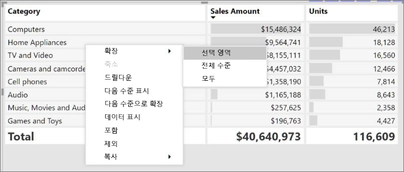
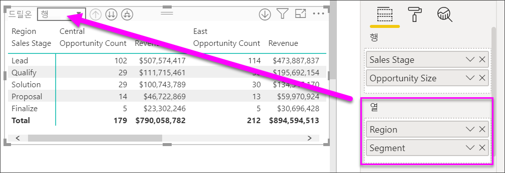
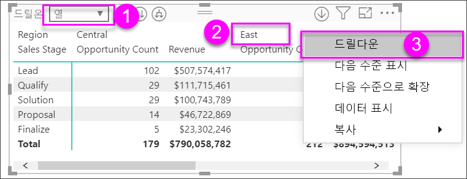
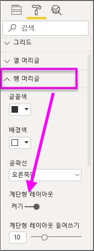
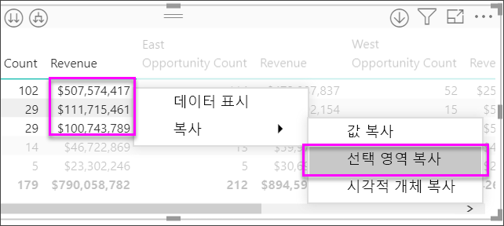
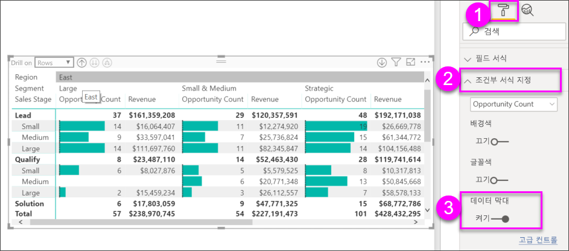

# Power BI에서 행렬 시각적 개체 사용
합니다 **매트릭스** visual 비슷합니다는 **테이블**합니다.  테이블 2 차원을 지원 하 고 플랫 데이터 인, 의미 중복 값이 표시 되 고 집계 되지 않습니다. 행렬을 보다 쉽게 여러 차원에서 데이터를 의미 있게 표시 하려면--단계별된 레이아웃을 지원 합니다. 자동으로 행렬 데이터를 집계 하 고 드릴 다운 수 있습니다. 

행렬 시각적 개체를 만들 수 있습니다 **Power BI Desktop** 하 고 **Power BI 서비스** 보고서 및 보고서 페이지에서 다른 시각적 개체를 사용 하 여 행렬 내에서 교차 강조 표시 요소입니다. 예를 들어, 행, 열 및 개별 셀을 선택 하 수 교차 강조 표시 합니다. 또한 개별 셀 및 다중 셀 선택 영역 복사 및 수 다른 응용 프로그램에 붙여 넣는 합니다. 

행렬과 관련된 여러 가지 기능을 이 문서의 다음 섹션에서 살펴보겠습니다.

## Power BI에서 총계를 계산하는 방법 이해

**행렬** 시각적 개체 사용 방법으로 진행하기 전에 Power BI에서 테이블과 행렬의 총계 및 소계 값을 계산하는 방법을 이해해야 합니다. 총계 및 소계 행의 경우, 측정값은 기본 데이터의 모든 행에서 계산됩니다. 표시되는 행의 값을 단순히 더하는 것이 ‘아닙니다’.  즉, 예상보다 총계 행에 여러 값이 있을 수 있습니다. 

다음 행렬 시각적 개체를 살펴보세요. 

이 예제에서는 행렬 오른쪽에 있는 시각적 개체의 각 행이 표시는 *크기* 각 영업 직원/날짜 조합에 대 한 합니다. 그러나 영업 직원은 여러 날짜에 대해 표시되기 때문에 숫자는 두 번 이상 나타날 수 있습니다. 그러므로 기본 데이터의 정확한 총계와 표시되는 값의 단순한 더하기는 같지 않습니다. 더하는 값이 일대다 관계의 ‘일’ 쪽인 경우 일반적인 패턴입니다.

총계와 소계를 검토할 때, 이러한 값은 표시되는 값이 아니라 기본 데이터를 기준으로 함을 기억하세요. 

<!-- use Nov blog post video

## Expanding and collapsing row headers
There are two ways you can expand row headers. The first is through the right-click menu. You’ll see options to expand the specific row header you clicked on, the entire level or everything down to the very last level of the hierarchy. You have similar options for collapsing row headers as well.

You can also add +/- buttons to the row headers through the formatting pane under the row headers card. By default, the icons will match the formatting of the row header, but you can customize the icons’ color and size separately if you want. 
Once the icons are turned on, they work similarly to the icons from PivotTables in Excel.

The expansion state of the matrix will save with your report. It can be pinned to dashboards as well, but consumers will need to open up the report to change the state. Conditional formatting will only apply to the inner most visible level of the hierarchy. Note that this expand/collapse experience is not currently supported when connecting to AS servers older than 2016 or MD servers.

Watch the following video to learn more about expand/collapse in the matrix:

-->
## 행렬 시각적 개체를 사용 하 여 드릴 다운 사용
행렬 시각적 개체를 사용 하 여 모든 종류의 흥미로운 드릴 다운 하기 전에 사용할 수 없었던 하는 작업을 수행할 수 있습니다. 행, 열을 사용하여 개별 섹션 및 셀까지 드릴다운하는 기능이 포함됩니다. 각 기능의 작동 방법을 살펴보겠습니다.

### 행 머리글 드릴다운
**시각화** 창에서 **필드**의 **행** 섹션에 여러 개의 필드를 추가하는 경우 행렬 시각적 개체의 행에서 드릴다운을 사용하도록 설정합니다. 계층 구조를 만드는 작업과 비슷합니다. 그러면 해당 계층 구조를 통해 드릴다운(및 백업)하고 각 수준에서 데이터를 분석할 수 있습니다.

다음 이미지에는 **행** 단원에 포함 되어 *Sales stage* 및 *기회 크기별*, 하 여 파악할 수 있는 행의 그룹화 (또는 계층)을 만드는.

시각적 개체에 **행** 섹션에서 만든 그룹이 있는 경우 시각적 개체 자체는 시각적 개체의 왼쪽 위 모퉁이에 있는 *드릴* 및 *확장* 아이콘을 표시합니다.

다른 시각적 개체의 드릴 및 확장 동작과 비슷하게, 해당 단추를 선택하면 계층 구조를 통해 드릴다운(또는 백업)할 수 있습니다. 이 경우 드릴 다운할 수 있습니다에서 *Sales stage* 하 *기회 크기별*드릴 다운 수준 아이콘 (쇠 스 랑 합니다)가 선택 된 다음 이미지에서 보여준 것 처럼 합니다.

해당 아이콘을 사용 하는 것 외에도 해당 행 헤더 중 하나를 선택할 수 있으며 나타나는 메뉴에서 선택 하 여 드릴 다운할 수 있습니다.

나타나는 메뉴에 몇 가지 옵션이 있고 서로 다른 결과가 생성됩니다.

선택 **드릴 다운** 행렬을 확장 합니다 *하는* 수준 행 *제외 하 고* 선택 된 행 머리글을 제외 하 고 다른 모든 행 머리글입니다. 다음 그림과에서 **제안** > **드릴 다운** 선택 되었습니다. 기타 최상위 행이 행렬에 더 이상 표시되지 않는지 확인합니다. 이 드릴 방법은 유용한 기능이며, **상호 강조 표시** 섹션에서 특히 유용합니다.

선택 된 **드릴업** 하 여 이전 최상위 보기로 돌아가려면 아이콘입니다. 선택 하는 경우 **제안** > **다음 수준 표시**는 오름차순 목록은 모든 다음 수준 항목을 가져옵니다 (이 경우에 *기회 크기별* 필드), 없이 더 높은 수준의 계층 분류 합니다.

선택 된 **드릴업** 모든 최상위 범주 표시를 다음 선택 하 여 행렬을 왼쪽 위 모퉁이에서 아이콘 **제안** > **다음 수준으로 확장**를 계층의 수준 모두에 대 한 모든 값을 보려면 *Sales stage* 하 고 *기회 크기별*합니다.

사용할 수도 있습니다는 **확장** 메뉴 항목을 추가로 표시를 제어 합니다.  예를 들어 선택할 **제안** > **확장** > **선택**합니다. 각각에 대해 하나의 합계 행을 표시 하는 power BI *Sales stage* 모든 합니다 *기회 크기별* 에 대 한 옵션 *제안*합니다.

### 열 머리글 드릴다운
비슷하게 행에서 드릴 다운할 수 있습니다도 드릴 다운 수 있습니다 **열**합니다. 다음 이미지에서는 두 개의 필드에는 **열** 필드 집합에 행이이 문서의 앞부분에서 사용한 것와 비슷한 계층 구조를 만들면 됩니다. 에 **열** 필드를 갖게 *지역* 하 고 *세그먼트*. 두 번째 필드에 추가 된 즉시 **열**, 시각적 개체에 표시 된 새 드롭다운 메뉴에서 현재 표시 **행**합니다.

선택 열에 드릴 다운 **열** 에서 합니다 *드릴* 행렬의 왼쪽된 위 모퉁이에 있는 메뉴. 선택 된 *동부* 지역 선택 **드릴 다운**합니다.

선택 하면 **드릴 다운**에 대 한 열 계층 구조의 다음 수준 *지역 > 동부* 이 경우에 표시 *Opportunity count*합니다. 다른 지역 표시 되지만 회색으로 표시 됩니다.

메뉴 항목의 나머지 행에 대해 수행 하는 동일한 방식으로 열에 작동 합니다. (이전 섹션을 참조 하세요 **행 헤더의 드릴 다운**). 할 수 있습니다 **다음 수준 표시** 하 고 **다음 수준으로 확장** 행 수와 같은 방법으로 열을 사용 하 여 합니다.

> [!NOTE]
> 행렬 시각적 개체의 왼쪽 위에 있는 드릴다운 및 드릴업 아이콘은 행에만 적용됩니다. 열을 드릴다운하려면 오른쪽 클릭 메뉴를 사용해야 합니다.
> 
> 

## 행렬 시각적 개체를 사용한 계단형 레이아웃
**행렬** 시각적 개체는 각 부모 아래의 계층 구조에 하위 범주를 자동으로 들여쓰는데, 이를 **계단형 레이아웃**이라고 합니다.

행렬 시각적 개체의 ‘원래’ 버전에서 하위 범주는 완전히 다른 열에 표시되고 시각적 개체에서 훨씬 더 많은 공간을 사용합니다.  다음 이미지는 원래 **행렬** 시각적 개체의 표를 보여 줍니다. 이 경우 하위 범주가 완전히 별도의 열에 있습니다.

다음 이미지에서는 **계단형 레이아웃**이 작동 중인 **행렬** 시각적 개체가 표시되어 있습니다. 범주 *컴퓨터* 에서는 하위 범주(컴퓨터 악세사리, 데스크톱, 랩톱, 모니터 등)를 약간 들여쓰고 더 간결한 시각적 개체를 제공합니다.

계단형 레이아웃 설정을 쉽게 수정할 수 있습니다. **행렬** 시각적 개체를 선택하면 **시각화** 창의 **서식** 섹션(페인트 롤러 아이콘)에서 **행 머리글** 섹션이 펼쳐집니다. **계단형 레이아웃** 토글(켜기 또는 끄기) 및 **계단형 레이아웃 들여쓰기**(들여쓰기 크기를 픽셀 단위로 지정)라는 두 가지 옵션이 있습니다.

**계단형 레이아웃**을 사용하지 않는 경우 하위 범주는 상위 범주 아래에서 들여쓰기하지 않고 다른 열에 표시됩니다.

## 행렬 시각적 개체에서 부분합
행과 열 모두의 경우 행렬 시각적 개체에서 부분합을 켜거나 끌 수 있습니다. 다음 이미지에서 행 부분합이 **켜기**로 설정된 것을 확인할 수 있습니다.

**시각화** 창의 **서식** 섹션에서 **소계** 카드를 확장하고 **행 소계** 슬라이더를 **끄기**로 설정합니다. 이렇게 하면 소계가 표시되지 않습니다.

열 부분합에 동일한 프로세스가 적용됩니다.

## 행렬 시각적 개체를 사용한 상호 강조 표시
**행렬** 시각적 개체를 사용하여 크로스 강조 표시를 위한 기준으로 행렬의 모든 요소를 선택할 수 있습니다. **행렬**에서 열을 선택하면 보고서 페이지에 있는 다른 시각적 개체처럼 해당 열이 강조 표시됩니다. 이 유형의 상호 강조 표시는 다른 시각적 개체 및 데이터 요소 선택 항목의 공통 기능이므로 **행렬** 시각적 개체도 동일한 기능을 제공합니다.

또한 Ctrl+클릭은 크로스 강조 표시에서도 작동합니다. 예를 들어, 다음 이미지의 경우 **행렬** 시각적 개체에서 하위 범주 컬렉션을 선택했습니다. 시각적 개체에서 선택하지 않은 항목이 회색으로 표시되고, **행렬** 시각적 개체에서 선택한 항목이 페이지의 다른 시각적 개체에 반영되는 방법을 살펴보세요.

## 다른 애플리케이션에서 사용하기 위해 Power BI의 값 복사

행렬 또는 테이블에는 Dynamics CRM, Excel 같은 다른 애플리케이션에서 사용하려는 콘텐츠가 포함되거나 다른 Power BI 보고서가 포함될 수도 있습니다. Power BI를 마우스 오른쪽 단추로 클릭하면 단일 셀이나 여러 셀 선택을 클립보드에 복사하여 다른 애플리케이션에 붙여넣을 수 있습니다.

* 단일 셀의 값을 복사하려면 셀을 선택하고 마우스 오른쪽 단추를 클릭한 후 **값 복사**를 선택합니다. 클립보드에 서식 없는 셀 값이 있으면 이제 다른 애플리케이션에 이 값을 붙여넣을 수 있습니다.

    

* 두 개 이상의 셀을 복사하려면 셀 범위를 선택하거나 Ctrl 키를 사용하여 하나 이상의 셀을 선택합니다. 복사본에는 열 및 행 머리글이 포함됩니다.

    

## 매트릭스 시각적 개체에서 음영 및 글꼴 색
행렬 시각적 개체를 사용 하 여 적용할 수 있습니다 **조건부 서식** (색 및 음영 및 데이터 막대) 텍스트와 값 자체에 조건부 서식을 적용할 수 고 행렬 내에 있는 셀의 배경에 합니다.

조건부 서식을 적용할 visual 열고 행렬을 선택 합니다 **형식** 창입니다. 확장을 **조건부 서식** 카드 한 **배경색**, **글꼴색**, 또는 **데이터 막대**를 슬라이더를설정**에서**합니다. 에 대 한 링크를 표시 하 다음이 옵션 중 하나를 켜면 *고급 컨트롤*는 사용자 지정할 수는 색 및 색 서식 지정에 대 한 값입니다.
  
  

선택 *고급 컨트롤* 조정할 수 있는 대화 상자를 표시 합니다. 이 예제에 대 한 대화 상자를 보여 줍니다 **데이터 막대**합니다.

## 다음 단계

[Power BI의 분산형 및 거품형 차트](power-bi-visualization-scatter.md)

[Power BI의 시각화 유형](power-bi-visualization-types-for-reports-and-q-and-a.md)