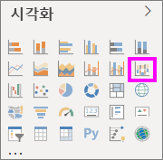
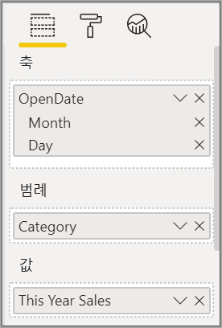
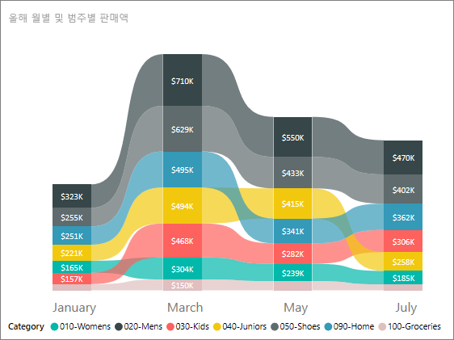

# Power BI에서 리본 차트 사용

[!INCLUDE [power-bi-visuals-desktop-banner](../includes/power-bi-visuals-desktop-banner.md)]

리본 차트를 사용하여 데이터를 시각화하고, 가장 높은 순위(가장 큰 값)를 가진 데이터 범주를 신속하게 검색할 수 있습니다. 리본 차트는 각 기간에 가장 높은 범위(값)가 항상 위쪽에 표시되어 순위 변경 내용을 효과적으로 표시합니다. 

## 필수 조건

이 자습서는 [소매점 분석 샘플 PBIX 파일](http://download.microsoft.com/download/9/6/D/96DDC2FF-2568-491D-AAFA-AFDD6F763AE3/Retail%20Analysis%20Sample%20PBIX.pbix)을 사용합니다.

1. 메뉴 모음의 왼쪽 위 섹션에서 **파일** > **열기**를 선택합니다.
   
2. **소매점 분석 샘플 PBIX 파일**을 찾습니다.

1. **소매점 분석 샘플 PBIX 파일**을 보고서 보기 으로 엽니다.

1. 선택  탭을 선택합니다.

## 리본 차트 만들기

1. 리본 차트를 만들려면 **시각화** 패널에서 **리본 차트**를 선택합니다.

    

    리본 차트는 리본을 사용하여 시각화된 시간 연속체에 데이터의 범주를 연결하므로 차트의 x-축(일반적으로 타임라인)의 범위에서 지정된 범주 순위가 지정되는 방법을 표시할 수 있습니다.

2. **축**, **범례** 및 **값**에 대한 필드를 선택합니다.  이 예에서는 다음을 선택했습니다. **매장** > **OpenDate**, **항목** > **범주** 및 **판매액** > **올해 판매액** > **값**.  

    

    데이터 세트는 1년 동안의 데이터만 포함하므로 **축**에서도 **연도** 및 **분기** 필드를 제거했습니다.

3. 리본 차트는 모든 달의 순위를 보여줍니다. 시간 경과에 따라 순위가 어떻게 변하는지 확인합니다. 예를 들어 홈 범주는 2월에서 3월까지 2일에서 5일로 이동합니다.

    

## 리본 차트 서식 지정
리본 차트를 만들 경우 **시각화** 창의 **서식** 섹션에서 사용할 수 있는 서식 지정 옵션이 있습니다. 리본 차트에 대한 서식 지정 옵션은 리본에 지정된 추가 서식 지정 옵션을 포함하는 누적 세로 막대형 차트의 해당 옵션과 유사합니다.

리본 차트의 이러한 서식 옵션을 통해 조정 작업을 수행할 수 있습니다.

* **간격**을 통해 리본 간에 표시되는 공간을 조정할 수 있습니다. 번호는 열 최대 높이의 백분율입니다.
* **계열 색 일치**를 사용하면 계열 색과 리본 메뉴의 색을 일치시킬 수 있습니다. **끄기**로 설정하면 리본이 회색으로 표시됩니다.
* **투명도**는 기본값이 30으로 설정된 투명도 리본을 지정합니다.
* **테두리**를 통해 리본의 위쪽 및 아래쪽에 어두운 테두리를 배치할 수 있습니다. 테두리는 기본적으로 꺼져 있습니다.

리본 차트에는 y축 레이블이 없으므로 데이터 레이블을 추가하는 것이 좋습니다. 서식 창에서 **데이터 레이블**을 선택합니다. 

데이터 레이블의 서식 지정 옵션을 설정합니다. 이 예제에서는 텍스트 색을 흰색으로, 표시 단위를 수천으로 설정했습니다.

## 다음 단계

[Power BI의 분산형 차트 및 거품형 차트](power-bi-visualization-scatter.md)

[Power BI의 시각화 유형](power-bi-visualization-types-for-reports-and-q-and-a.md)
