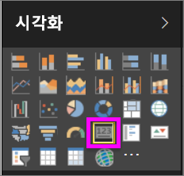
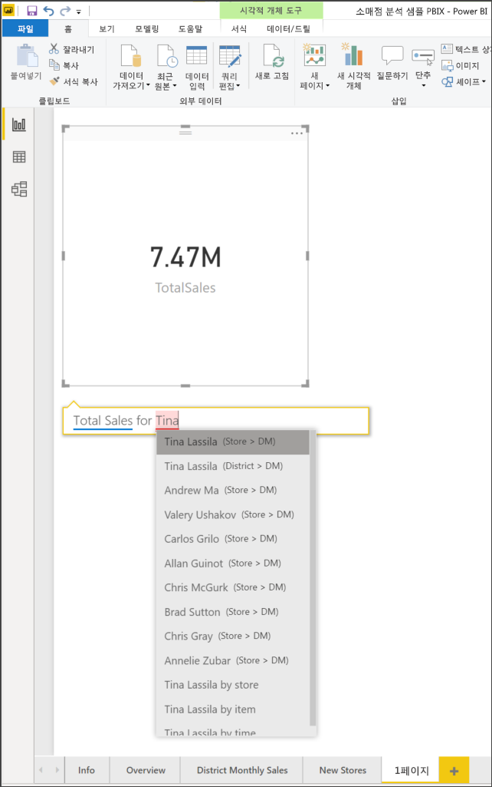
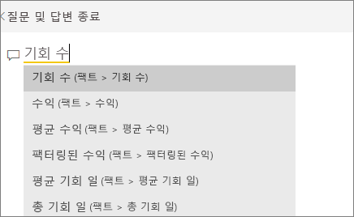
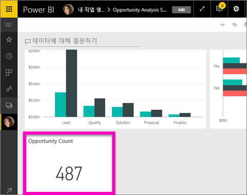

# 카드 시각화
Power BI 대시보드 또는 보고서에서 총 매출, 연간 시장 점유율, 총 영업 기회와 같이 한 가지 가장 중요한 숫자만 추적하려는 경우가 있습니다. 이 시각화 유형을 *카드*라고 합니다. 거의 모든 네이티브 Power BI 시각화와 마찬가지로 카드도 보고서 편집기 또는 질문과 대답을 사용하여 만들 수 있습니다.

## 보고서 편집기를 사용하여 카드 만들기
이 지침은 소매 분석 샘플을 사용합니다. 이를 수행하려면 Power BI 서비스(app.powerbi.com) 또는 Power BI Desktop에 대한 [샘플을 다운로드](../sample-datasets.md)합니다.   

1. 빈 보고서 페이지에서 시작하고 **매장** \> **오픈 매장 수** 필드를 선택합니다. Power BI 서비스를 사용하는 경우 [편집용 보기](../service-interact-with-a-report-in-editing-view.md)에서 보고서를 열어야 합니다.

    Power BI에서 하나의 숫자가 포함된 열 차트를 만듭니다.

   
2. 시각화 창에서 카드 아이콘을 선택합니다.

   
6. 시각화를 대시보드에 추가하려면 카드를 마우스로 가리키고 고정 아이콘 을 선택합니다.

   
7. 기존 대시보드 또는 새 대시보드에 타일을 고정합니다.

   * 기존 대시보드: 드롭다운에서 대시보드의 이름을 선택합니다.
   * 새 대시보드: 새 대시보드의 이름을 입력합니다.
8. **고정**을 선택합니다.

   오른쪽 위에 나타나는 성공 메시지를 통해 시각화가 타일로 대시보드에 추가되었음을 알 수 있습니다.

   
9. **대시보드로 이동**을 선택합니다. 여기에서 고정된 시각화를 [편집 및 이동](../service-dashboard-edit-tile.md)할 수 있습니다.

## 질문 및 답변 질문 상자에서 카드 만들기
질문 및 답변 질문 상자는 카드를 만드는 가장 쉬운 방법입니다. 질문 및 답변 질문 상자는 Power BI 서비스의 대시보드 또는 보고서와 데스크톱 보고서 보기에서 사용할 수 있습니다. 다음 단계에서는 Power BI 서비스 대시보드에서 카드를 만드는 방법을 설명합니다. Power BI Desktop에서 질문 및 답변을 사용하여 카드를 만들려면 Desktop 보고서의 질문 및 답변 미리 보기에 대한 [다음 지침을 따릅니다](https://powerbi.microsoft.com/en-us/blog/power-bi-desktop-december-feature-summary/#QandA).

1. [대시보드](../service-dashboards.md)를 만들고 [데이터를 가져옵니다](../service-get-data.md). 이 예에서는 [기회 분석 샘플](../sample-opportunity-analysis.md)을 사용합니다.

1. 대시보드 맨 위에 있는 질문 상자에서 알고 싶은 내용을 입력하기 시작합니다. 

   

> [!TIP]
> Power BI 서비스 보고서의 편집용 보기에서 상단 메뉴 모음에 있는 **질문하기**를 선택합니다. Power BI Desktop 보고서에서 보고서의 빈 공간을 찾아 두 번 클릭하여 질문 상자를 엽니다.

3. 예를 들어 질문 상자에 "영업 기회 수"를 입력합니다.

   

   질문 상자는 제안 기능과 설명을 통해 질문 과정을 도와주며, 마지막으로 총 수를 표시합니다.  
4. 상단 오른쪽 모서리에서 고정 아이콘 을 선택하여 카드를 대시보드에 추가합니다.

   
5. 기존 대시보드 또는 새 대시보드에 카드를 타일로 고정합니다.

   * 기존 대시보드: 드롭다운에서 대시보드의 이름을 선택합니다. 현재 작업 영역에 있는 대시보드만 선택할 수 있습니다.
   * 새 대시보드: 새 대시보드의 이름을 입력합니다. 그러면 현재 작업 영역에 추가됩니다.
6. **고정**을 선택합니다.

   상단 오른쪽에 나타나는 성공 메시지를 통해 시각화가 타일로 대시보드에 추가되었음을 알 수 있습니다.  

   
7. **대시보드로 이동**을 선택하여 새 타일을 볼 수 있습니다. 여기에서 대시보드의 [타일 이름을 바꾸고, 크기를 조정하고, 하이퍼링크를 추가하고, 타일의 위치를 변경하는 등](../service-dashboard-edit-tile.md)의 작업을 할 수 있습니다.

   

## 고려 사항 및 문제 해결
- 질문 상자가 전혀 표시되지 않으면 시스템 또는 테넌트 관리자에게 문의합니다.    
- Desktop을 사용하는 경우 보고서에서 빈 공간을 두 번 클릭했을 때 질문 및 답변이 열리지 않으면 활성화가 필요할 수 있습니다.  **파일 > 옵션 및 설정 > 옵션 > 미리 보기 기능 > 질문 및 답변**을 선택하고 Desktop을 다시 시작합니다.

## 카드 서식 지정
레이블, 텍스트, 색상 등을 변경하는 다양한 옵션이 있습니다. 옵션을 알아보는 가장 좋은 방법은 카드를 만든 다음, 서식 창을 살펴보는 것입니다. 다음은 사용 가능한 서식 옵션 중 몇 가지입니다. 

1. 먼저 페인트 롤러 아이콘을 선택하여 서식 창을 엽니다. 

    
2. **데이터 레이블**을 확장하고 색, 크기 및 글꼴 패밀리를 변경합니다. 수천 개의 매장이 있는 경우 **표시 단위**를 사용하여 천 단위까지 매장 수를 표시하고 소수 자릿수도 제어할 수 있습니다. 예를 들어 125,832.00 대신 125.8K로 표시합니다.

3.  **범주 레이블**을 확장하고 색과 크기를 변경합니다.

    

4. **배경**을 확장하고 슬라이더를 켜기로 이동합니다.  이제 배경색과 투명도를 변경할 수 있습니다.

    

5. 카드가 원하는 대로 정확하게 표시될 때까지 서식 옵션을 계속 살펴봅니다. 

    

## 다음 단계
[Power BI의 콤보 차트](power-bi-visualization-combo-chart.md)

[Power BI의 시각화 유형](power-bi-visualization-types-for-reports-and-q-and-a.md)
