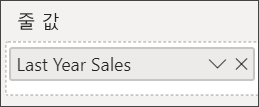

# Power BI의 콤보 차트

Power BI 콤보 차트는 꺾은선형 차트와 세로 막대형 차트를 결합한 단일 시각화 요소입니다. 두 개의 차트를 하나로 결합하면 데이터를 더 빠르게 비교할 수 있습니다.

콤보 차트에는 하나 또는 두 개의 Y축이 있을 수 있습니다.

## 콤보 차트를 사용하는 경우

다음과 같은 경우 콤보 차트를 사용하는 것이 좋습니다.

* X축이 동일한 꺾은선형 차트와 세로 막대형 차트가 있는 경우

* 여러 값 범위와 여러 측정값을 비교하려는 경우

* 두 측정값 간의 상관 관계를 하나의 시각화에 보여 주려는 경우

* 하나의 측정값이 다른 측정값으로 정의된 목표를 충족하는지 확인하려는 경우

* 캔버스 공간을 절약하려는 경우

## 필수 조건

콤보 차트는 Power BI 서비스 및 Power BI Desktop에서 사용할 수 있습니다. 이 자습서에서는 Power BI 서비스를 사용하여 콤보 차트를 만듭니다. Power BI에 로그인하기 위한 사용자 자격 증명이 있는지 확인합니다.

Will이 판매 및 샘플 마케팅을 사용하여 콤보 차트를 만드는 과정을 시청합니다.

<iframe width="560" height="315" src="https://www.youtube.com/embed/lnv66cTZ5ho?list=PL1N57mwBHtN0JFoKSR0n-tBkUJHeMP2cP" frameborder="0" allowfullscreen></iframe>  

## 기본, 단일 축, 콤보 차트 만들기

과정을 따르려면 Power BI 서비스를 열고 **Retail Analysis Sample**에 연결합니다. 고유한 콤보 차트를 만들려면 Power BI 서비스에 로그인하고 **데이터 가져오기** > **샘플** > **소매점 분석 샘플** > **연결**을 선택합니다. **Retail Analysis Sample** 대시보드가 표시됩니다.

1. “Retail Analysis Sample” 대시보드에서 **Total Stores** 타일을 선택하여 **Store Sales Overview** 보고서를 엽니다.

1. **보고서 편집** 을 선택하여 편집 보기에서 보고서를 엽니다.

1. 페이지 아래쪽에서 **+** 를 선택하여 새 보고서 페이지를 추가합니다.

1. 올해의 판매액 및 매상 총이익을 월별로 표시하는 세로 막대형 차트를 만듭니다.

    1. 필드 창에서 **Sales** \> **This Year Sales** > **Value**를 선택합니다.

    1. **Sales** \> **Gross Margin This Year**을 **값** 영역에 끌어다 놓습니다.

    1. **Time** \> **FiscalMonth**를 선택하여 **축** 영역에 추가합니다.

        

1. 시각화의 오른쪽 위 모서리에 있는 줄임표를 선택하고 **정렬 기준 > FiscalMonth**를 선택합니다. 정렬 순서를 변경하려면 줄임표를 다시 선택하고 **오름차순 정렬** 또는 **내림차순 정렬**을 선택합니다.

1. 세로 막대형 차트를 콤보 차트로 변환합니다. 사용 가능한 두 가지 콤보 차트는 다음과 같습니다: **꺾은선형 및 누적 세로 막대형** 및 **꺾은선형 및 묶은 세로 막대형**. 세로 막대형 차트를 선택한 상태로 **시각화** 창에서 **꺾은선형 및 묶은 세로 막대형 차트**를 선택합니다.

    

1. **필드** 창에서 **Sales** > **Last Year Sales**를 **꺽은선형 값** 영역으로 끌어서 놓습니다.

    

    콤보 차트가 다음과 같이 표시됩니다.

    

## 두 개의 축이 있는 콤보 차트 만들기

이 작업에서는 총 수익과 매출을 비교하겠습니다.

1. **월별** **Gross Margin Last Year(%)** 을 추적하는 새로운 꺾은선형 차트를 만듭니다. **월별** 및 **오름차순** 기준으로 정렬하려면 줄임표를 선택합니다.

    

     1월에는 GM%가 35%였고, 4월에 45% 고점에 도달했으며, 7월에 감소하고, 8월에 다시 고점에 도달했습니다. 작년과 금년의 매출 패턴이 유사할까요?

1. **This Year Sales** > **Value** 및 **Last Year Sales**를 꺾은선형 차트에 추가합니다. **Gross Margin Last Year %** 의 눈금은 **Sales**의 눈금보다 훨씬 더 작습니다. 비교하기가 어렵습니다.

    

1. 보다 쉽게 읽고 해석 가능한 시각적 개체를 만들려면 꺾은선형 차트를 꺾은선형 및 누적 세로 막대형 차트로 변환합니다.

    

1. **Gross Margin Last Year(%)**을 **세로 막대 값**에서 **꺾은선형 값**으로 끌어다 놓습니다.

    

    Power BI는 두 개의 축을 만들기 때문에 서비스에서 데이터 세트의 크기를 다르게 조정할 수 있습니다. 왼쪽은 판매액(달러)을 측정하고, 오른쪽은 백분율을 측정합니다. 그리고 질문에 대한 답변이 보입니다. 즉, 유사한 패턴이 확인됩니다.

## 축에 제목 추가

1. 페인트 롤러 아이콘  서식 창을 열려면.

1. 아래쪽 화살표를 선택하여 **Y축** 옵션을 확장합니다.

1. **Y축(열)** 의 경우 다음 옵션을 선택합니다.

    | 설정 | 값 |
    | ------- | ----- |
    | 위치 | **왼쪽**을 선택합니다. |
    | 단위 표시 | **백만**을 선택합니다. |
    | 제목 | 슬라이더를 **설정**으로 이동합니다. |
    | 스타일 | **제목만 표시**를 선택합니다. |
    | 보조 표시 | 슬라이더를 **설정**으로 이동합니다.  이렇게 하면 콤보 차트에서 꺾은선형 차트 부분의 서식을 지정할 수 있는 옵션이 표시됩니다. |

1. **Y축(선)** 의 경우 다음 옵션을 선택합니다.

    | 설정 | 값 |
    | ------- | ----- |
    | 위치 | **오른쪽**을 선택합니다. |
    | 제목 | 슬라이더를 **설정**으로 이동합니다. |
    | 스타일 | **제목만 표시**를 선택합니다. |

    이제 콤보 차트에 제목과 함께 이중 축이 표시됩니다.

    

1. 차트의 가독성을 높일 수 있도록 필요에 따라 텍스트 글꼴, 크기 및 색을 변경하고 기타 서식 옵션을 설정합니다.

여기서 다음과 같은 작업을 수행할 수 있습니다.

* [대시보드 타일로 콤보 차트를 추가합니다](../service-dashboard-tiles.md).

* [보고서를 저장합니다](../service-report-save.md).

* [장애가 있는 사용자가 보고서에 액세스할 수 있도록 만듭니다](../desktop-accessibility.md).

## 교차 강조 표시 및 교차 필터링

콤보 차트에서 특정 열 또는 선을 강조 표시하면 보고서 페이지의 다른 시각화가 교차 강조 표시 및 교차 필터링됩니다. 이 기본 동작을 변경하려면 [시각적 상호 작용](../service-reports-visual-interactions.md)을 사용합니다.

## 다음 단계

[Power BI의 도넛형 차트](power-bi-visualization-doughnut-charts.md)

[Power BI의 시각화 유형](power-bi-visualization-types-for-reports-and-q-and-a.md)
