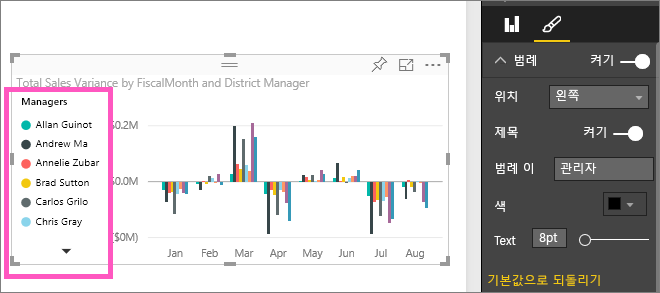

# 시각화 제목, 범례 및 배경 사용자 지정

이 자습서에서는 시각화를 사용자 지정하는 몇 가지 방법을 알아봅니다. 시각화를 사용자 지정하는 많은 옵션이 있습니다. 모든 옵션에 대해 자세히 알아볼 가장 좋은 방법은 **서식** 창을 탐색하는 것입니다(페인트 롤러 아이콘 선택). 시작하기 위해 이 문서는 시각화 제목, 범례 및 배경을 사용자 지정하는 방법을 보여 줍니다.

시각화 중 일부는 사용자 지정할 수 없습니다. 자세한 내용은 시각화 [전체 목록](#visualization-types-that-you-can-customize)을 참조하세요.

동영상을 빨리 감아 4:50 지점에서 시각화를 사용자 지정하는 방법 데모를 확인할 수 있습니다.

<iframe width="560" height="315" src="https://www.youtube.com/embed/IkJda4O7oGs" frameborder="0" allowfullscreen></iframe>

이제, 고유한 데이터를 사용하여 아래에 있는 지침을 따라서 직접 시도해 볼 수 있습니다.

## 필수 조건

- Power BI 서비스 또는 Power BI Desktop

- 소매점 분석 샘플 보고서

## 보고서의 시각화 제목 사용자 지정

과정을 따르려면 [Power BI 서비스](https://app.powerbi.com)에 로그인하고 [보고서 편집](../service-interact-with-a-report-in-editing-view.md)에서 [소매점 분석 샘플](../sample-datasets.md) 보고서를 엽니다.

> [!NOTE]
> 시각화를 대시보드에 고정하면 대시보드 타일이 됩니다. 타일 자체를 [새 제목 및 부제, 하이퍼링크로 사용자 지정하고 크기를 조정](../service-dashboard-edit-tile.md)할 수도 있습니다.

1. **소매점 분석 샘플** 보고서의 **새 상점** 페이지로 이동합니다.

1. **개업 월별 및 체인별 오픈 매장 수** 묶은 세로 막대형 차트를 선택합니다.

1. **시각화** 창에서 페인트 롤러 아이콘을 선택하여 서식 옵션을 표시합니다.

1. **제목**을 선택하여 해당 섹션을 확장합니다.

   

1. **제목** 슬라이더를 **켜기**로 이동합니다.

   

1. 제목을 변경하려면 **제목 텍스트** 필드에 ‘월별 개업 매장 수’를 입력합니다. 

1. **글꼴 색**을 주황색으로 변경하고 **배경색**을 노란색으로 변경합니다.

    1. 드롭다운을 선택하고 **테마 색**, **최근에 사용한 색**또는 **사용자 지정 색**에서 색을 선택합니다.

        

    1. 색 창을 닫으려면 드롭다운을 선택합니다.

       변경한 내용을 저장합니다.

       모든 변경 내용을 되돌려야 하는 경우 색 창에서 **기본값으로 되돌리기**를 선택하여 기본 색으로 다시 돌아갈 수 있습니다.

1. 텍스트 크기를 **12pt**로 늘립니다.

1. 차트 제목에 대한 마지막으로 사용자 지정 작업은 시각화의 가운데에 정렬하는 것입니다.

    

자습서의 이 시점에서 묶은 세로 막대형 차트 제목은 다음과 같습니다.

변경 내용을 저장하고 다음 섹션으로 이동합니다.

모든 변경 내용을 되돌려야 하는 경우 **제목** 사용자 지정 창 맨 아래에 있는 **기본값으로 되돌리기**를 선택합니다.

## 시각화 배경 사용자 지정

동일한 묶은 세로 막대형 차트를 선택한 상태로 **배경** 옵션을 확장합니다.

1. **배경** 슬라이더를 **켜기**로 이동합니다.

1. 드롭다운을 선택하고 회색을 선택합니다.

1. **투명도**를 **74%** 로 변경합니다.

자습서의 이 시점에서 묶은 세로 막대형 차트 배경은 다음과 같습니다.

변경 내용을 저장하고 다음 섹션으로 이동합니다.

모든 변경 내용을 되돌려야 하는 경우 **배경** 사용자 지정 창 맨 아래에 있는 **기본값으로 되돌리기**를 선택합니다.

## 시각화 범례 사용자 지정

1. **Overview** 보고서 페이지를 열고 **회계 월 및 구역 관리자별 총판매액 차이** 차트를 선택합니다.

1. **시각화** 탭에서 페인트 롤러 아이콘을 선택하여 서식 창을 엽니다.

1. **범례** 옵션을 확장합니다.

      

1. **범례** 슬라이더를 **켜기**로 이동합니다.

1. 범례를 시각화의 왼쪽으로 이동합니다.

1. **제목**을 **켜기**로 전환하여 범례 제목을 추가합니다.

1. **범례 이름** 필드에 ‘관리자’를 입력합니다. 

자습서의 이 시점에서 묶은 세로 막대형 차트 범례는 다음과 같습니다.

변경 내용을 저장하고 다음 섹션으로 이동합니다.

모든 변경 내용을 되돌려야 하는 경우 **범례** 사용자 지정 창 맨 아래에 있는 **기본값으로 되돌리기**를 선택합니다.

## 사용자 지정할 수 있는 시각화 유형

다음은 각 항목에 사용할 수 있는 시각화 및 사용자 지정 옵션의 목록입니다.

| 시각화 | 제목 | 배경 | 범례 |
|:--- |:--- |:--- |:--- |
| 영역 | 예 | 예 |예 |
| 막대형 | 예 | 예 |예 |
| 카드 | 예 | 예 |해당 없음 |
| 여러 행 카드 | 예 | 예 | 해당 없음 |
| 열 | 예 | 예 | 예 |
| 콤보 | 예 | 예 | 예 |
| 도넛 | 예 | 예 | 예 |
| 등치 지역도 | 예 | 예 | 예 |
| 깔때기형 | 예 | 예 | 해당 없음 |
| 계기 | 예 | 예 | 해당 없음 |
| KPI | 예 | 예 | 해당 없음 |
| 선 | 예 | 예 | 예 |
| 맵 | 예 | 예 | 예 |
| Matrix | 예 | 예 | 해당 없음 |
| 원형 | 예 | 예 | 예 |
| 분산형 | 예 | 예 | 예 |
| 슬라이서 | 예 | 예 | 해당 없음 |
| 테이블 | 예 | 예 | 해당 없음 |
| 텍스트 상자 | 아니요 | 예 | 해당 없음 |
| 트리맵 | 예 | 예 | 예 |
| 폭포 | 예 | 예 | 예 |

## 다음 단계

- [X축 및 Y축 속성 사용자 지정](power-bi-visualization-customize-x-axis-and-y-axis.md)

- [색 서식 지정 및 축 속성 시작](service-getting-started-with-color-formatting-and-axis-properties.md)

- [Power BI 서비스 소비자를 위한 기본 개념](../consumer/end-user-basic-concepts.md)

궁금한 점이 더 있나요? [Power BI 커뮤니티를 이용하세요.](https://community.powerbi.com/)
