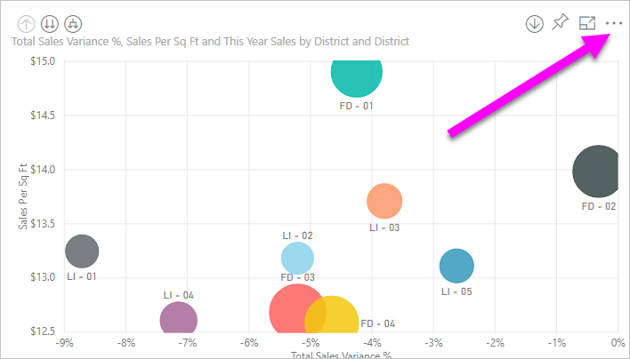
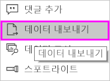
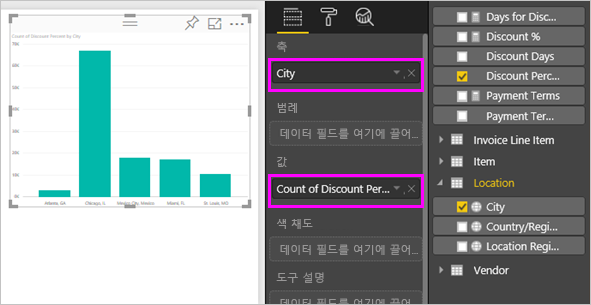
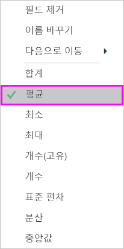
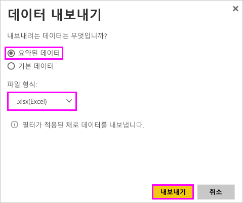
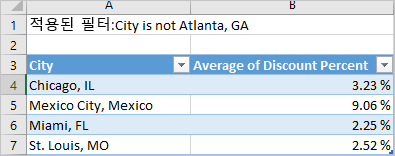
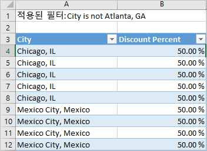
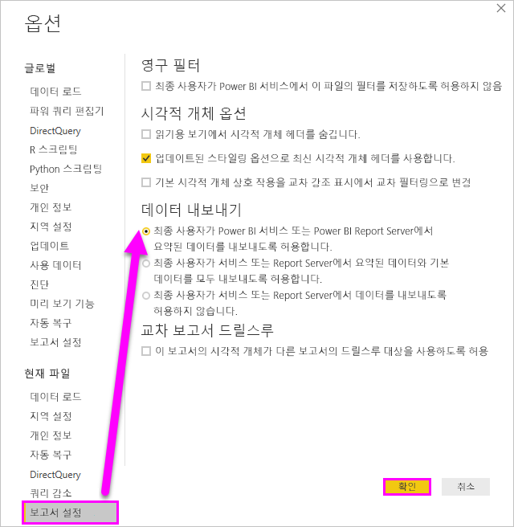

# 시각화에서 데이터 내보내기

Power BI가 시각화를 만드는 데 사용하는 데이터를 보려는 경우 [Power BI에서 해당 데이터를 표시할 수 있습니다](service-reports-show-data.md). 해당 데이터를 Excel *.xlsx* 또는 *.csv* 파일로 내보낼 수도 있습니다. 데이터를 내보내는 옵션에는 Pro 또는 Premium 라이선스가 필요하며 데이터 세트 및 보고서에 대한 편집 권한이 필요합니다.

Will이 보고서의 시각화 중 하나에서 데이터를 내보내고 *.xlsx* 파일로 저장하고 Excel에서 여는 것을 시청합니다. 그런 다음, 비디오 아래에 있는 단계별 지침을 따라서 직접 시도해 볼 수 있습니다.

<iframe width="560" height="315" src="https://www.youtube.com/embed/KjheMTGjDXw" frameborder="0" allowfullscreen></iframe>

## Power BI 대시보드에서 데이터 내보내기

1. 시각화의 오른쪽 위 모서리에 있는 줄임표를 선택합니다.

    

1. **데이터 내보내기** 아이콘을 선택합니다.

    

1. Power BI는 데이터를 *.csv* 파일로 내보냅니다. 시각화를 필터링한 경우 앱은 다운로드된 데이터를 필터링합니다.

1. 브라우저가 파일을 저장할 것인지 묻습니다.  저장한 후 Excel에서 *.csv* 파일을 엽니다.

    

## 보고서에서 데이터 내보내기

과정을 따르려면 편집용 보기에서 [조달 분석 샘플 보고서](../sample-procurement.md)를 엽니다. 빈 보고서 페이지를 새로 추가합니다. 그런 다음 집계와 시각화 수준 필터를 추가하려면 다음 단계를 따릅니다.

1. 새로운 **누적 세로 막대형 차트**를 만듭니다.

1. **필드** 창에서 **Location > City** 및 **Invoice > Discount Percent**를 선택합니다.  **Discount Percent**를 **값** 영역으로 이동해야 할 수 있습니다.

    

1. **할인율**에 대한 집계를 **개수**에서 **평균**으로 변경합니다. **값** 영역에서 **Discount Percent**(**Count of Discount Percent**로 표시될 수 있음)의 오른쪽에 있는 화살표를 선택하고 **평균**을 선택합니다.

    

1. **City**에 필터를 추가하고 모든 도시를 선택한 후 **Atlanta**를 제거합니다.

    

   이제 데이터를 내보내기 위한 옵션을 모두 사용할 준비가 되었습니다.

1. 시각화의 오른쪽 위 모서리에 있는 줄임표를 선택합니다. **데이터 내보내기**를 선택합니다.

    

    Power BI 온라인에서 시각화에 집계가 있는 경우(한 예로, **개수**를 ‘평균’, ‘합계’ 또는 ‘최소’로 변경한 경우) 다음 두 가지 옵션이 있습니다.   

    - **요약된 데이터**

    - **기본 데이터**

    Power BI Desktop에서는 **요약된 데이터**에 대한 옵션만 사용할 수 있습니다. 집계 이해를 위한 도움은 [Power BI의 집계](../service-aggregates.md)를 참조하세요.

1. **데이터 내보내기**에서 **요약된 데이터**를 선택하고, *.xlsx* 또는 *.csv*를 선택한 다음, **내보내기**를 선택합니다. Power BI 데이터를 내보냅니다.

    

    시각화에 필터를 적용한 경우 내보낸 데이터는 필터링된 상태로 내보냅니다. **내보내기**를 선택하면 브라우저에서 파일을 저장할 것인지 묻는 메시지를 표시 합니다. 저장한 후 Excel에서 파일을 엽니다.
    
    시각적 개체의 현재 드릴 수준에 사용되는 데이터뿐 아니라 계층 구조에 사용되는 모든 데이터를 내보냅니다. 예를 들어 시각화가 최상위 수준에서 드릴다운되지 않은 경우 내보낸 데이터에는 현재 드릴된 수준에서 시각적 개체를 만드는 데 사용된 데이터뿐 아니라 계층 구조의 모든 데이터가 포함됩니다.

    **요약된 데이터**: 해당 시각적 개체에 표시되는 내용에 대한 데이터를 내보내려면 이 옵션을 선택합니다.  이 형식의 내보내기에서는 시각적 개체를 만들도록 선택한 데이터(열 및 측정값)만을 보여줍니다.  시각적 개체에 집계가 있는 경우 집계된 데이터를 내보냅니다. 예를 들어 4개의 막대를 보여 주는 막대형 차트가 있는 경우 4개의 데이터 행을 얻게 됩니다. 요약된 데이터는 *.xlsx* 및 *.csv*로 사용할 수 있습니다.

    이 예에서 Excel 내보내기는 도시별로 하나의 합계를 보여 줍니다. Atlanta를 필터링했기 때문에 결과에는 포함되지 않습니다. 스프레드시트의 첫 번째 행에는 Power BI에서 데이터를 추출할 때 사용한 필터가 표시됩니다.

    

1. 이제 **기본 데이터**, *.xlsx* 및 **내보내기**를 차례로 선택합니다. Power BI 데이터를 내보냅니다. 

    > [!NOTE]
    > 보고서 설정에 따라 기본 데이터를 내보내는 옵션이 없을 수도 있습니다.

    시각화에 필터를 적용한 경우 내보낸 데이터는 필터링된 상태로 내보냅니다. **내보내기**를 선택하면 브라우저에서 파일을 저장할 것인지 묻는 메시지를 표시 합니다. 저장한 후 Excel에서 파일을 엽니다.
    
    시각적 개체의 현재 드릴 수준에 사용되는 데이터뿐 아니라 계층 구조에 사용되는 모든 데이터를 내보냅니다. 예를 들어 시각화가 최상위 수준에서 드릴다운되지 않은 경우 내보낸 데이터에는 현재 드릴된 수준에서 시각적 개체를 만드는 데 사용된 데이터뿐 아니라 계층 구조의 모든 데이터가 포함됩니다.

    >[!WARNING]
    >기본 데이터 내보내기를 사용하면 사용자가 모든 세부 데이터 즉, 데이터의 모든 열을 확인할 수 있습니다. Power BI 서비스 관리자는 조직에 대해 이 기능을 끌 수 있습니다. 데이터 세트 소유자인 경우 Desktop 또는 Power BI 서비스에서 **필드** 목록에 표시되지 않도록 전용 열을 **숨김**으로 설정할 수 있습니다.

    **기본 데이터**: 모델의 시각적 개체 ***및*** 추가 데이터에서 데이터를 확인하려면 이 옵션을 선택합니다(자세한 내용은 아래 차트 참조). 시각화에 집계가 있으면 *기본 데이터*를 선택하여 집계를 제거합니다. **내보내기**를 선택하면 Power BI가 데이터를 *.xlsx* 파일로 내보내고 브라우저에는 파일을 저장할지 묻는 메시지가 표시됩니다. 저장한 후 Excel에서 파일을 엽니다.

    이 예제에서 Excel 내보내기는 데이터 세트의 모든 단일 도시 행에 대해 한 행 및 해당 단일 항목에 대한 할인율을 보여 줍니다. Power BI는 데이터를 평면화합니다. 데이터를 집계하지는 않습니다. 스프레드시트의 첫 번째 행에는 Power BI에서 데이터를 추출할 때 사용한 필터가 표시됩니다.  

    

## 기본 데이터 세부 정보 내보내기

**기본 데이터**를 선택하면 표시되는 내용은 달라질 수 있습니다. 이 세부 정보를 이해하려면 관리자 또는 IT 부서의 지원을 받아야 할 수 있습니다. Power BI Desktop 또는 서비스의 보고 보기에서 ‘측정값’은 계산기 아이콘 과 함께 **필드** 목록에 표시됩니다.  Power BI Desktop은 측정값을 만듭니다. Power BI 서비스는 측정값을 만들지 않습니다.

| 시각적 개체 포함 | 내보내기에서 표시되는 내용  |
|---------------- | ---------------------------|
| 집계 | *첫 번째* 집계 및 해당 집계에 대한 전체 테이블에서 숨겨지지 않은 데이터 |
| 집계 | 관련된 데이터 - 시각적 개체가 집계를 포함하는 데이터 테이블에 관련된 다른 데이터 테이블의 데이터를 사용하는 경우(관계가 : 1 또는 1:1인 경우)  \* |
| 측정값 | 시각적 개체의 모든 측정값 ‘및’ 시각적 개체에서 사용되는 측정값을 포함하는 데이터 테이블의 모든 측정값  |
| 측정값 | 해당 측정값을 포함하는 테이블에서 숨겨지지 않은 모든 데이터(관계가 \*:1 또는 1:1인 경우) |
| 측정값 | \*:1 또는 1:1의 체인을 통한 측정값을 포함하는 테이블에 관련된 모든 테이블의 모든 데이터 |
| 측정값만 해당 | 모든 관련된 테이블에서 숨겨지지 않은 모든 열(측정값을 확장하기 위해) |
| 측정값만 해당 | 모델 측정값의 중복 행에 대한 요약된 데이터 |

### 내보내기 옵션 설정

Power BI 보고서 디자이너는 소비자가 사용할 수 있는 데이터 내보내기 옵션의 유형을 제어합니다. 선택 항목은 다음과 같습니다.

- 최종 사용자가 Power BI 서비스 또는 Power BI Report Server에서 요약된 데이터를 내보내도록 허용합니다.

- 최종 사용자가 서비스 또는 Report Server에서 요약된 데이터와 기본 데이터를 모두 내보내도록 허용합니다.

- 최종 사용자가 서비스 또는 Report Server에서 데이터를 내보내도록 허용하지 않습니다.

    > [!IMPORTANT]
    > 보고서 디자이너는 이전 보고서를 다시 방문하여 필요에 따라 내보내기 옵션을 수동으로 재설정하는 것이 좋습니다.

이 옵션을 설정하려면 다음을 수행합니다.

1. Power BI Desktop에서 시작합니다.

1. 왼쪽 위 모서리에서 **파일** > **옵션 및 설정** > **옵션**을 선택합니다.

1. **현재 파일**에서 **보고서 설정**을 선택합니다.

    

1. **데이터 내보내기** 섹션에서 선택합니다.

Power BI 서비스에서 이 설정을 업데이트할 수도 있습니다.

Power BI 관리 포털 설정이 데이터 내보내기에 대한 보고서 설정과 충돌하는 경우 관리 설정이 데이터 내보내기 설정을 재정의한다는 점에 유의해야 합니다.

## 제한 사항 및 고려 사항
이 제한 사항과 고려 사항은 Power BI Pro 및 프리미엄을 포함한 Power BI 서비스 및 Power BI Desktop에 적용됩니다.

- 시각적 개체에서 데이터를 내보내려면 [기본 데이터 세트에 대한 빌드 권한](https://docs.microsoft.com/power-bi/service-datasets-build-permissions#build-permissions-for-shared-datasets)이 있어야 합니다.

-  **Power BI Desktop** 및 **Power BI 서비스**가 **가져오기 모드 보고서**에서 *.csv* 파일로 내보낼 수 있는 최대 행 수는 30,000개입니다.

- 애플리케이션이 **가져오기 모드 보고서**에서 *.xlsx* 파일로 내보낼 수 있는 최대 행 수는 150,000개입니다.

- 다음과 같은 경우 ‘기본 데이터’를 사용한 내보내기가 작동하지 않습니다. 

  - 데이터 원본이 Analysis Services 라이브 연결입니다.

  - 버전이 2016 이전 버전입니다.

  - 모델의 테이블에 고유 키가 없습니다.
    
  -  관리자 또는 보고서 디자이너가 이 기능을 사용하지 않도록 설정한 경우입니다.

- 시각화 Power BI에 대한 ‘데이터가 없는 항목 표시’ 옵션을 사용하도록 설정한 경우 ‘기본 데이터’를 사용한 내보내기가 작동하지 않습니다.  

- DirectQuery를 사용하는 경우 Power BI에서 내보낼 수 있는 데이터의 최대 크기는 압축되지 않은 16MB 데이터입니다. 의도하지 않게 최대 행 수보다 적게 내보낼 수도 있습니다. 다음과 같은 경우에 해당할 수 있습니다.

    - 많은 열이 있는 경우

    - 압축하기 어려운 데이터가 있는 경우

    - 파일 크기를 늘리고 Power BI가 내보낼 수 있는 행 수를 줄이는 다른 요소가 사용되고 있는 경우

- 시각화가 두 개 이상 데이터 테이블의 데이터를 사용하고 데이터 모델에 해당 테이블에 대한 관계가 없는 경우 Power BI는 첫 번째 테이블의 데이터만 내보냅니다.

- 현재 사용자 지정 시각적 개체 및 R 시각적 개체는 지원되지 않습니다.

- 내부 사용자와 공유된 대시보드를 사용하는 조직 외부의 사용자는 데이터 내보내기를 사용할 수 없습니다.

- Power BI에서 필드를 두 번 클릭하고 새 이름을 입력하여 필드(열)의 이름을 바꿀 수 있습니다. Power BI는 ‘새 이름을 별칭’으로 참조합니다.  Power BI 보고서가 중복 필드 이름으로 끝나지만 Excel이 중복을 허용하지 않을 수 있습니다. 따라서 Power BI가 데이터를 Excel로 내보낼 때 필드 별칭은 원래 필드(열) 이름으로 되돌립니다.  

- *.csv* 파일에 유니코드 문자가 있는 경우 Excel의 텍스트가 제대로 표시되지 않을 수 있습니다. 유니코드 문자의 예로 통화 기호 및 외국어 단어가 있습니다. 메모장에서 파일을 열면 유니코드가 올바르게 표시됩니다. Excel에서 파일을 열려면 *.csv*를 가져오면 문제가 해결됩니다. 파일을 Excel로 가져오려면 다음을 수행합니다.

  1. Excel을 엽니다.

  1. **데이터** 탭으로 이동합니다.
  
  1. **외부 데이터 가져오기** > **텍스트에서**를 선택합니다.
  
  1. 파일이 저장된 로컬 폴더로 이동하고 *.csv*를 선택합니다.

- Power BI 관리자는 데이터 내보내기를 사용하지 않도록 설정할 수 있습니다.

궁금한 점이 더 있나요? [Power BI 커뮤니티에 질문합니다.](http://community.powerbi.com/)
