# 주요 영향 요인 시각화
주요 영향 요인 시각적 개체는 관심 있는 메트릭을 구동하는 요소를 이해하도록 도와줍니다. 데이터를 분석하고 중요한 요소의 순위를 정하며 이를 주요 요인으로 표시합니다. 예를 들어 직원 전직률(변동)에 영향을 미치는 요인을 알아내는 데 관심이 있습니다. 한 가지 요소는 고용 계약 기간일 수도 있고 또 다른 요소는 직원 연령일 수도 있습니다. 
 
## 주요 영향 요인을 사용하는 시기는? 
주요 영향 시각적 개체는 다음과 같은 경우에 선택하는 것이 좋습니다. 
- 분석 중인 메트릭에 영향을 주는 요인을 확인하는 경우

- 이러한 요인의 상대적 중요도를 대비하는 경우 예를 들어 단기 계약은 장기 계약보다 변동에 더 큰 영향을 주나요? 

## 주요 영향 요인 요구 사항 
분석 중인 메트릭은 범주별 필드여야 합니다.    

## 주요 요인 시각적 개체의 기능

    

1. ***탭*** - 보기 간에 전환할 탭을 선택합니다. 주요 영향 요인은 선택한 메트릭 값에 대한 상위 기여자를 보여줍니다. 상위 세그먼트는 선택한 메트릭 값에 기여하는 상위 세그먼트를 보여줍니다. *세그먼트*는 값의 조합으로 구성되어 있습니다.  예를 들어, 한 세그먼트는 적어도 20년 동안 고객이었고 서부 지역에 거주하는 소비자일 수 있습니다. 

2. ***드롭다운*** - 조사 중인 메트릭의 값입니다. 이 예제에서는 메트릭 **등급**을 검토하고 있으며 선택한 값은 **낮음**입니다.    

3. ***재작성*** - 왼쪽 창의 시각적 개체를 해석할 수 있도록 도와줍니다. 

4. ***왼쪽 창*** - 왼쪽 창에는 하나의 시각적 개체를 포함합니다.  이 경우 왼쪽 창에는 상위 주요 영향 요인의 목록이 표시됩니다.

5. ***재작성*** - 오른쪽 창의 시각적 개체를 해석할 수 있도록 도와줍니다.

6. ***오른쪽 창*** - 오른쪽 창에는 하나의 시각적 개체를 포함합니다. 이 경우, 세로 막대형 차트는 왼쪽 창에서 선택한 **주요 영향 요인**, **테마**의 모든 값을 표시합니다. 왼쪽 창에서 특정 값(**유용성**)은 녹색이며 **테마**에 대한 다른 모든 값은 검은색입니다.

7. ***평균 선*** - **유용성**을 제외한 **테마**의 다른 모든 가능한 값에 대한 평균이 계산됩니다. 따라서 계산은 검정색의 모든 값에 적용됩니다. 다른 **테마**의 몇 퍼센트가 낮은 등급인지 알려줍니다. 즉, 고객이 등급을 매길 때 해당 고객은 등급에 대한 이유 또는 **테마**를 설명합니다. 일부 테마는 유용성, 속도, 보안 등입니다. **테마**는 **유용성**이며, 왼쪽 창의 시각적 개체에 따라 낮은 등급에서 두 번째로 높은 주요 영향 요인입니다. 다른 모든 테마와 해당 테마가 **낮은** 등급에 기여하는 것을 평균하면 결과를 여기서 빨간색으로 볼 수 있습니다. 

8. ***확인란*** - 영향 요인인 값만 표시합니다.

## 주요 영향 요인 시각적 개체 만들기 
 
이 비디오를 통해 주요 영향 시각적 개체를 만드는 방법을 본 다음, 아래 단계에 따라 직접 만드세요. 

<iframe width="560" height="315" src="https://www.youtube.com/embed/fDb5zZ3xmxU" frameborder="0" allow="accelerometer; autoplay; encrypted-media; gyroscope; picture-in-picture" allowfullscreen></iframe>

제품 관리자는 잠재 고객이 클라우드 서비스에 대해 부정적인 리뷰를 남길 수 있는 요소를 파악하려고 합니다.  계속 진행하려면 Power BI Desktop에서 [고객 피드백 .PBIX 파일](https://github.com/Microsoft/powerbi-desktop-samples/blob/master/2019/customerfeedback.pbix)을 엽니다. [Power BI 서비스 또는 Power BI Desktop에 대한 고객 피드백 Excel 파일](https://github.com/Microsoft/powerbi-desktop-samples/blob/master/2019/customerfeedback.xlsx)을 다운로드할 수도 있습니다. 

> [!NOTE]
> 고객 피드백 데이터 세트는 [Moro et al., 2014] S. Moro, P. Cortez 및 P. Rita를 기반으로 합니다. 은행 텔레마케팅의 성공 여부를 예측하는 데이터 기반 방법입니다. 의사 결정 지원 시스템, Elsevier, 62:22-31, 2014년 6월 

1. 보고서를 열고 주요 영향 요인 아이콘을 선택합니다.  

    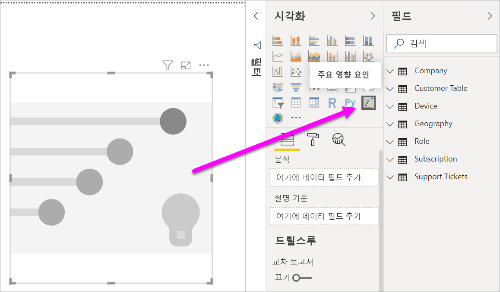

2. 조사하려는 **분석** 필드로 끌어다 놓습니다. **분석** 필드는 범주별(비-연속) 변수만 지원합니다. 서비스의 고객 등급을 **낮음**으로 이끌어가는 것에 관심이 있기 때문에 **고객 테이블** > **등급**을 선택합니다.    
3. 그런 다음, **등급**에 영향을 줄 수 있다고 생각되는 필드를 **설명 기준**에 끌어다 놓습니다. 원하는 만큼 많은 필드에서 끌어다 놓을 수 있습니다. 이 경우, 다음과 같이 시작합니다. 
    - 국가-지역 
    - 조직 내 역할 
    - 구독 유형 
    - 회사 규모 
    - 테마     
4. 부정적인 등급에 관심이 있으므로 **등급에 영향을 주는 항목**에 대한 드롭다운에서 **낮음**을 선택합니다.  

    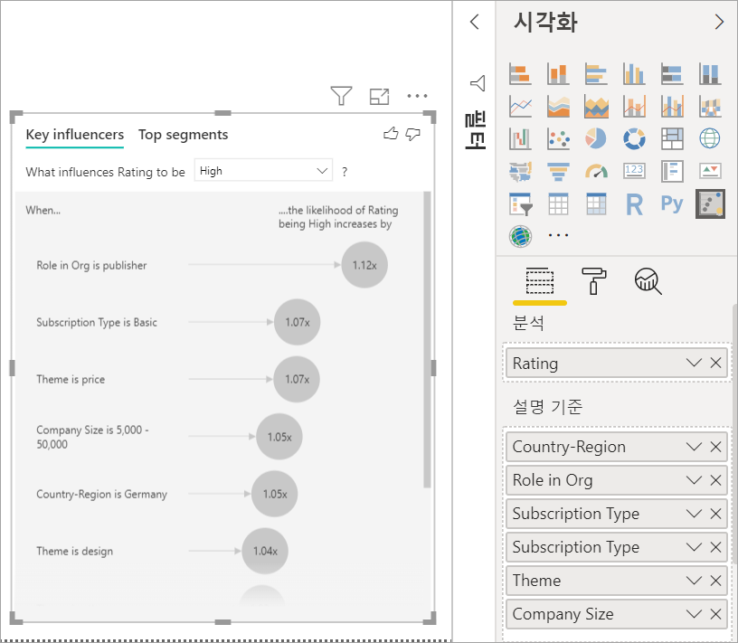

분석 중인 필드의 테이블 수준에서 분석이 실행됩니다. 이 경우, 고객 수준에서 정의되는 **등급** 메트릭에 관심이 있습니다(각 고객은 높은 점수 또는 낮은 점수가 있음). 시각적 개체를 사용하기 위해서는 고객 수준에서 모든 설명 요소를 정의해야 합니다. 

위의 예제에서 모든 설명 요소는 메트릭과 일 대 일 또는 다 대 일 관계를 가집니다. 예를 들어, 각 점수에는 고객 리뷰의 주요 테마의 항목과 연결된 정확히 하나의 테마가 있습니다. 마찬가지로 고객은 한 국가 출신이며 해당 조직에서 멤버 자격 유형과 하나의 역할을 가지고 있습니다. 따라서 설명 요소는 이미 고객의 특성이며 변환이 필요하지 않습니다. 즉, 시각적 요소가 이를 즉시 사용할 수 있습니다. 

나중에 자습서에서 일 대 다 관계가 있는 더 복잡한 예제를 살펴볼 것입니다. 이러한 경우 분석을 실행하려면 먼저 열을 고객 수준까지 집계해야 합니다.  

설명 요소로 사용되는 측정값과 집계도 **분석** 메트릭의 테이블 수준에서 평가되며, 이 문서 뒷부분에서 몇 가지 예가 표시됩니다. 

## 범주별 주요 영향 요인 해석 
낮은 등급에 대한 주요 영향 요인을 살펴보겠습니다. 

### 낮은 등급의 가능성에 영향을 주는 상위 단일 요소

조직에는 소비자, 관리자 및 게시자의 세 가지 역할이 있습니다. 소비자가 되는 것이 낮은 등급에 기여하는 상위 요소라는 것을 표시합니다. 

더 정확히 말하자면 소비자가 부정적인 점수를 줄 가능성이 2.57배 더 높습니다. 주요 영향 요인 차트는 왼쪽의 목록에서 먼저 **조직 내 역할이 소비자임**을 표시합니다. **조직 내 역할이 소비자임**을 선택하면 Power BI는 오른쪽 창에 추가 세부 정보 즉, 낮은 등급의 가능성에 대한 각 **역할**의 비교 영향을 보여줍니다.
  
- 14.93%의 소비자가 낮은 점수를 줍니다.  
- 평균적으로 다른 모든 역할은 5.78%의 낮은 점수를 줍니다. 
- 따라서 소비자는 다른 모든 역할에 비해 낮은 점수를 줄 가능성이 2.57배 높습니다(녹색 막대와 빨간색 점선 사이의 차이). 

### 낮은 등급의 가능성에 영향을 주는 두 번째 단일 요소

주요 영향 요인 시각적 개체는 다양한 변수의 요인을 비교하여 순위를 매길 수 있습니다.  두 번째 영향 요인은 **조직 내 역할**과 아무런 관련이 없습니다.  목록에서 두 번째 영향 요인(**테마는 유용성입니다**)을 선택합니다. 

여기서 두 번째로 중요한 요소는 고객의 리뷰 테마와 관련되어 있음을 확인할 수 있습니다. 제품의 *유용성*에 대해 주석을 단 고객은 안정성, 디자인 또는 속도와 같은 다른 테마에 대해 주석을 단 고객에 비해 낮은 점수를 줄 가능성이 2.21배 높습니다. 

평균(빨간색 점선)이 5.78%에서 11.34%로 변경된 시각적 개체 사이를 볼 수 있습니다. 다른 모든 값의 평균을 기반으로 하기 때문에 평균은 동적입니다. 첫 번째 영향 요인의 경우 평균에서 고객 역할을 배제하고 두 번째 영향 요인의 경우 유용성 테마를 제외합니다. 
 
시각적 개체의 하단에 있는 상자를 선택하면 영향력 있는 값(이 경우 낮은 점수를 구동하는 역할)에만 시각적 개체가 필터링됩니다. 따라서 12개의 테마를 살펴보면 4개의 Power BI가 낮은 등급을 구동하는 것으로 확인되었습니다. 

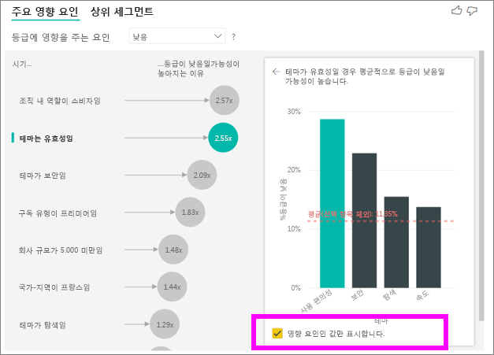

## 다른 시각적 개체와 상호 작용 
 
사용자가 캔버스에서 슬라이서, 필터 또는 다른 시각적 개체를 클릭할 때마다 주요 영향 요인 시각화 개체는 데이터의 새 부분에 대한 분석을 다시 실행합니다. 예를 들어 회사 규모를 보고서에 끌어서 슬라이서로 사용합니다. 엔터프라이즈 고객(회사 크기가 50,000보다 큼)의 주요 영향 요인이 일반적인 모집단과 다른지 확인하고자 합니다.  
 
**>50,000**을 선택하면 분석이 다시 실행되며 영향 요인이 변경된 것을 확인할 수 있습니다. 대기업 고객의 경우 낮은 등급에 대한 상위 영향 요인은 **보안**과 관련된 **테마**가 있습니다. 많은 고객이 불만을 갖고 있는 특정 보안 기능이 있는지 추가 조사를 할 수도 있습니다. 

## 연속 주요 영향 요인 해석 
 
지금까지 시각적 개체를 사용하여 다양한 범주별 필드가 어떻게 낮은 등급에 영향을 주는지 탐색했습니다. 연속 요인(예: 시기, 높이, 가격)이 ‘설명 기준’에 포함되도록 하는 것도 가능합니다. 고객 테이블에서 '재직 기간'을 '설명 기준'으로 드롭하면 어떻게 되는지 살펴보겠습니다. 재직 기간은 고객이 서비스를 얼마나 오랫동안 사용해 왔는지를 나타냅니다. 
 
**재직 기간**이 증가함에 따라 낮은 등급을 받을 가능성도 증가한다는 것을 알 수 있습니다. 이러한 추세는 장기 고객이 실제로 부정적인 점수를 줄 가능성이 높다는 것을 의미합니다. 이는 흥미로운 인사이트이며 나중에 후속 조치를 취할 수도 있습니다.  
 
시각화는 재직 기간이 13.44개월 증가할 때마다 평균적으로 낮은 등급의 가능성이 1.23배 증가한다는 것을 알려줍니다. 이 경우 13.44개월은 재직 기간의 표준 편차를 나타냅니다. 따라서 수신한 인사이트는 표준 양(재직의 표준 편차)만큼 재직 기간을 늘리면 낮은 등급을 받을 가능성에 얼마나 영향을 주는지 살펴봅니다. 
 
오른쪽의 산점도에는 각 재임 기간 값에 대한 낮은 등급의 평균 %가 표시되고, 기울기를 강조 표시하는 추세선이 포함되어 있습니다.  

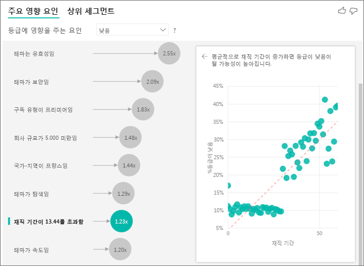

## 주요 영향 요인으로 측정값/집계 해석 
 
마지막으로 사용자는 측정값 및 집계를 분석 내에서 설명 요소로 사용할 수 있습니다. 예를 들어, 고객 지원 티켓의 수나 공개 티켓의 평균 기간이 받은 점수에 어떤 영향을 주는지 알고자 할 수 있습니다. 
 
이 경우 고객이 주는 점수에 영향을 주는 지원 티켓의 수가 있는지 참조하려고 합니다. 지원 티켓 테이블에서 지원 티켓 ID를 가져올 것입니다. 고객은 여러 개의 지원 티켓을 가질 수 있기 때문에 고객 수준에 ID를 집계해야 합니다. 고객 수준에 대한 분석을 실행하고 있으므로 모든 드라이버를 해당 세분화 수준으로 정의해야 함으로 이 집계가 중요합니다. 
 
ID의 수를 살펴볼 예정입니다(따라서 각 고객 행은 이와 관련된 지원 티켓의 수가 있음). 이 경우 지원 티켓 수가 증가함에 따라 등급이 낮을 가능성이 5.51배 높아집니다. 오른쪽 시각적 개체는 다른 등급 값(고객 수준에서 평가)별 지원 티켓의 평균 수를 보여줍니다. 

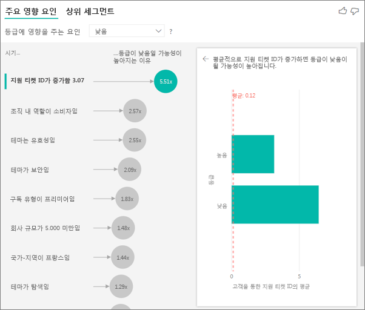

## 결과 해석: 상위 세그먼트 
 
‘주요 영향 요인’ 탭에서는 사용자가 각 요소를 개별적으로 평가할 수 있지만, 사용자는 ‘상위 세그먼트’로 전환하여 요소의 조합이 분석 중인 메트릭에 어떤 영향을 주는지 확인할 수 있습니다. 
 
상위 세그먼트는 처음에 Power BI에서 검색된 모든 세그먼트의 개요를 보여줍니다. 아래 예제에서 6개의 세그먼트를 찾았습니다. 이러한 세그먼트는 세그먼트 내의 낮은 등급의 %로 순위가 지정됩니다. 예를 들어 세그먼트 1은 74.3% 고객 등급이 낮은 것으로 표시됩니다.  거품이 클수록 낮은 등급 비율이 높습니다. 반면의 거품 크기는 세그먼트 내에 얼마나 많은 고객이 있는지를 나타냅니다. 

거품을 선택하면 해당 세그먼트의 세부 정보가 표시됩니다. 예를 들어 세그먼트 1을 선택하면 지원 티켓 수(4장 초과)가 많은 상대적으로 확고한 고객(29개월 넘게 함께 해왔음)으로 구성됩니다. 마지막으로 이들은 게시자가 아닙니다(따라서 이들은 소비자 또는 관리자임).  
 
이 그룹에서는 74.3%가 낮은 등급을 받았습니다. 평균 고객은 11.7%의 낮은 등급을 부여하기 때문에 이 세그먼트는 낮은 등급(63% 포인트 높음)의 비율이 상당히 높습니다. 또한 세그먼트 1에는 데이터의 약 2.2%가 포함되어 있어 모집단의 주소 지정이 가능한 부분을 나타냅니다. 

## 고려 사항 및 문제 해결 
 
**미리 보기의 제한 사항은 무엇인가요?** 
 
주요 영향 요인 시각적 개체는 현재 공개 미리 보기로 제공되며 사용자가 알아야 할 몇 가지 제한 사항이 있습니다. 현재 사용할 수 없는 기능은 다음과 같습니다. 
- 집계/측정값 메트릭 분석 
- 포함된 시각적 개체 사용 
- Power BI 모바일에서 시각적 개체 사용 
- RLS 지원 
- 직접 쿼리 지원 
- 라이브 쿼리 지원 
 
**영향 요인/세그먼트를 찾을 수 없다는 오류가 표시됩니다. 왜 그런가요?**  

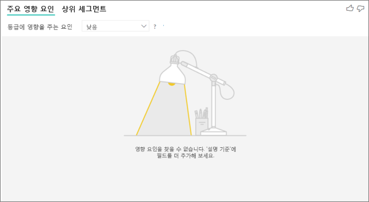

이 오류는 **설명 기준**에 필드를 포함했지만 영향 요인을 찾지 못한 경우에 발생합니다.   
- ‘분석’ 및 ‘설명 기준’ 모두에 분석된 메트릭을 포함시켰습니다(**설명 기준**에서 제외해야 함). 
- 설명 필드에는 관찰이 거의 없는 너무 많은 범주가 있습니다. 이로 인해 몇 가지 관찰을 기반으로 일반화하기 어렵기 때문에 시각화가 영향을 주는 요소를 결정하는 것이 어려워집니다. 
- 설명 요소는 일반화하기에 충분한 수의 관찰을 가지고 있지만 시각화는 다시 보고할 의미 있는 상관 관계를 찾지 못했습니다. 
 
**분석하고 있는 메트릭이 분석을 실행할 충분한 테이터를 가지고 있지 않다는 오류가 나타납니다. 왜 그런가요?**  

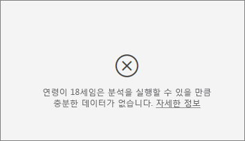

시각화는 다른 그룹(예: 높은 등급을 준 고객)과 비교하여 한 그룹(낮은 등급을 준 고객)의 데이터에서 패턴을 살펴봄으로써 작동합니다. 모델의 데이터는 관찰이 거의 없는 경우 패턴을 찾기가 어렵습니다. 시각화에서 의미 있는 영향 요인을 검색할 충분한 데이터가 없는 경우 분석을 실행하기 위해 더 많은 데이터가 필요함을 나타냅니다. 선택한 상태에 대해 100회 이상의 관찰(고객 이탈)을 하고 비교를 위해 사용하고 있는 상태에 대해 10회 이상 관찰하는 것이 좋습니다(고객이 이탈되지 않음).  
 
**‘설명 기준’의 필드가 분석할 메트릭을 포함하는 테이블과 고유한 관련이 없다는 오류가 표시됩니다. 왜 그런가요?**  
 
분석 중인 필드의 테이블 수준에서 분석이 실행됩니다. 예를 들어, 서비스에 대한 고객 피드백을 분석할 경우 고객이 높은 등급 또는 낮은 등급을 주었는지 여부를 알려주는 테이블이 있을 수 있습니다. 이 경우 분석은 고객 테이블 수준에서 실행됩니다. 

메트릭을 포함하는 테이블보다 더 세부적인 수준으로 정의된 관련 테이블이 있는 경우 이 오류가 발생합니다. 예를 통해 이를 설명해 보겠습니다. 
 
- 고객이 서비스에 대해 낮은 등급을 부여하도록 이끄는 요소를 분석하고 있습니다. 
- 고객이 서비스를 사용하는 디바이스가 고객이 제공하는 리뷰에 영향을 미치는지 확인하는 데 관심이 있습니다. 
- 고객은 다양한 방법으로 서비스를 사용할 수 있습니다.   
- 아래 예제에서 고객 10000000명은 브라우저와 태블릿 모두를 사용하여 서비스와 상호 작용합니다. 

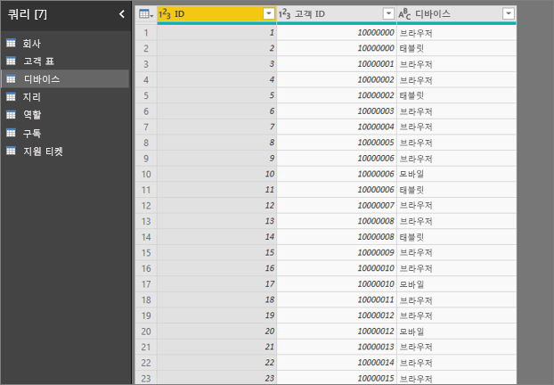

디바이스 열을 설명 요소로 사용하려는 경우 다음 오류가 표시됩니다. 

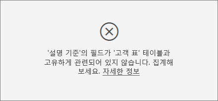

이는 디바이스가 고객 수준에서 정의되지 않았기 때문에 한 고객이 여러 디바이스에서 서비스를 사용할 수 있습니다. 시각화를 통해 패턴을 찾으려면 디바이스가 고객의 속성이 되어야 합니다. 이 경우 비즈니스에 대한 이해에 따라 몇 가지 솔루션이 있습니다. 
 
- 예를 들어 디바이스 수가 고객이 제공하는 점수에 영향을 줄 수 있다고 생각하면 계산할 디바이스의 요약을 변경할 수 있습니다. 
- 특정 디바이스에서 서비스를 사용하는 것이 고객의 등급에 영향을 미치는지 확인하기 위해 디바이스 열을 피벗할 수 있습니다.  
 
이 예제에서 내 데이터를 피벗하여 ‘브라우저, ‘모바일 및 ‘태블릿에 대한 새 열을 만들었습니다. 이제 ‘설명 기준’에서 이를 사용할 수 있습니다. 모든 디바이스가 영향 요인으로 판명되었으며 브라우저가 고객 점수에 가장 큰 영향을 주는 것으로 나타났습니다. 

더 정확히 말하면, 서비스를 사용하기 위해 브라우저를 이용하지 않는 고객은 브라우저를 이용하는 고객보다 낮은 점수를 줄 가능성이 3.79배 높습니다. 모바일의 경우 역이 true인 목록에서 더 낮은 것을 알 수 있습니다. 모바일 앱을 사용하는 고객은 그렇지 않은 고객보다 낮은 점수를 줄 가능성이 높습니다.  

**내 분석에 측정값이 포함되어 있지 않다는 경고가 표시됩니다. 왜 그런가요?** [2052261] 

분석 중인 필드의 테이블 수준에서 분석이 실행됩니다. 고객 이탈을 분석하는 경우 고객이 이탈했는지 여부를 알려주는 테이블이 있을 수 있습니다. 이 경우 분석은 고객 테이블 수준에서 실행됩니다.
 
측정값 및 집계는 기본적으로 해당 테이블 수준에서 분석됩니다. ‘월 평균 지출’에 대한 측정값이 있는 경우 고객 테이블 수준에서 분석됩니다.  

고객 테이블에 고유 식별자가 없는 경우 측정값을 계산할 수 없으며 분석에서 무시됩니다. 이를 방지하기 위해 메트릭이 있는 테이블(이 경우 고객 테이블)에 고유 식별자(예: 고객 ID)가 있는지 확인합니다. 파워 쿼리를 사용하여 인덱스 열을 추가하는 것도 매우 쉽습니다.
 
**내가 분석하고 있는 메트릭에 10개를 넘는 고유 값이 있고 이것이 분석 품질에 영향을 줄 수 있다는 경고가 표시됩니다. 왜 그런가요?**  

AI 시각화는 범주 분석에 최적화되어 있습니다(예: 이탈이 ‘예’ 또는 ‘아니요’, 고객 만족도가 ‘높음’, ‘보통’ 또는 ‘낮음’ 등). 분석할 범주 수를 늘리면 범주당 관찰이 줄어들어 시각화가 데이터에서 패턴을 찾기가 더 어려워집니다. 

강력한 영향 요인을 찾기 위해 유사한 값을 단일 단위로 그룹화하는 것이 좋습니다. 예를 들어, 가격에 대한 메트릭이 있는 경우 유사한 가격을 ‘높음’, ‘보통’, ‘낮음’ 버킷과 같은 것으로 그룹화하고 개별 가격 포인트를 사용하여 더 나은 결과를 얻을 수 있습니다. 

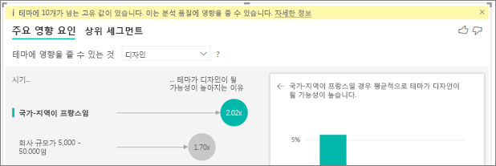

**내 데이터에는 주요 영향 요인처럼 보여야 하는 요소가 있어야 하지만 그렇지 않은 요소가 있습니다. 어떻게 그런 일이 발생하나요?**

아래 예제에서 소비자인 고객이 낮은 등급(14.93% 등급은 낮음)을 구동했음을 표시합니다. 흥미롭게도 관리자 역할도 낮은 등급(13.42%)의 비율이 높지만 영향 요인으로 간주되지 않습니다. 

이것의 이면에 있는 원인은 시각화가 영향 요인을 찾을 때 데이터 요소의 수도 고려하기 때문입니다. 아래 예제에서 29,000명이 넘는 소비자와 10배 적은 관리자(약 2,900명)를 보유하고 있습니다. 게다가 이들 중 390명만이 낮은 등급을 주었습니다. 따라서 시각적 개체에는 단지 우연으로 찾은 관리자 등급의 패턴이 진정으로 찾은 것인지 여부를 확인할 충분한 데이터가 없습니다.  

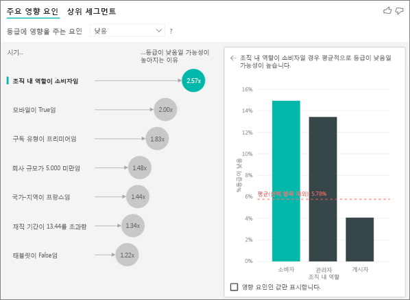

**주요 영향 요인을 어떻게 계산하나요?**

배후에서 AI 시각화는 주요 영향 요인을 계산하기 위한 로지스틱 회귀 분석을 실행합니다. 로지스틱 회귀 분석은 서로 다른 그룹을 비교하는 통계 모델입니다. 낮은 등급을 이끄는 것을 살펴볼 경우 로지스틱 회귀 분석이 낮은 점수를 준 고객이 높은 점수를 준 고객과 어떻게 다른지 살펴봅니다. 여러 개의 범주(높은 점수, 중립 점수, 낮은 점수)가 있는 경우 낮은 등급을 준 고객이 낮은 등급을 주지 않은 고객과 어떻게 다른지 살펴봅니다(높은 등급이나 중립 등급을 준 고객과 어떻게 다른지). 
 
로지스틱 회귀 분석은 데이터의 패턴을 검색하여 낮은 등급을 준 고객이 높은 등급을 준 고객과 어떻게 다른지 찾아냅니다. 예를 들어 지원 티켓이 많은 고객은 지원 티켓이 거의 없거나 없는 고객보다 낮은 등급을 주는 %가 훨씬 높습니다.
 
로지스틱 회귀 분석은 얼마나 많은 데이터 요소가 존재하는지도 고려합니다. 예를 들어 관리자 역할을 수행하는 고객이 비례적으로 더 많이 부정적인 점수를 주지만 소수의 관리자만 있는 경우 이는 영향력 있는 요소로 고려되지 않습니다. 이는 패턴을 추론하는 데 사용할 수 있는 데이터 요소가 충분하지 못하기 때문입니다. 통계 테스트(Wald 테스트)는 요소가 영향 요인으로 간주되는지 여부를 결정하는 데 사용됩니다. 시각적 개체는 0.05의 p-값을 사용하여 임계값을 결정합니다. 
 
**세그먼트는 어떻게 계산하나요?**

배후에서 AI 시각화는 흥미로운 하위 그룹을 찾기 위한 의사 결정 트리를 실행합니다. 의사 결정 트리의 목적은 관심 있는 메트릭에서 상대적으로 높은 데이터 요소의 하위 그룹(예: 낮은 등급을 준 고객)으로 종료되는 것입니다. 

의사 결정 트리는 각각의 설명 요소를 사용하여 어떤 요소가 가장 잘 ‘분할’하게 할 것인지를 판단하려고 시도합니다. 예를 들어, 대기업 고객만 포함하도록 데이터를 필터링하는 경우 높은 등급과 낮은 등급을 준 고객을 분리할 수 있나요? 또는 보안에 대해 의견을 제시한 고객만 포함하도록 필터링하는 것이 더 나은가요? 

의사 결정 트리가 분할을 수행하면 데이터의 하위 그룹(예: 보안에 의견을 제시한 고객)을 사용하여 해당 데이터에 대한 차선의 분할이 무엇인지를 파악하려고 시도합니다. 각 분할 후 대표 그룹이 데이터에서 패턴을 추론할 수 있는 충분한 데이터 요소를 가지고 있는지 또는 데이터의 변칙이 있는지, 따라서 실제 세그먼트가 아닌지 여부도 고려합니다. (0.05의 p-값이 있는 분할 조건의 통계적 중요성을 확인하기 위해 다른 통계 테스트가 적용됩니다). 

의사 결정 트리 실행가 완료되면 모든 분할(보안 주석, 대기업)을 사용하여 Power BI 필터를 만듭니다. 이 필터의 조합은 시각적 개체에서 하나의 세그먼트로 패키지됩니다. 
 
**더 많은 필드를 ‘설명 기준’으로 끌어오면 특정 요소가 영향 요인이 되거나/영향 요인이 중지되는 이유가 무엇인가요?**

시각화는 모든 설명 요소를 함께 평가합니다. 이는 요소 자체가 영향 요인이 될 수 있지만, 다른 요소와 비교될 때 영향 요인이 아닐 수 있다는 것을 의미합니다. 침실과 집 크기를 설명 요소로서 주택 가격을 높이는 것으로 분석한다고 가정해 보겠습니다. 
- 그 자체로 더 많은 침실이 주택 가격을 높이는 것이 될 수 있습니다. 
- 분석에 집 크기를 포함한다는 것은 이제 집 크기를 일정하게 유지하면서 침실에 분석 대상을 살펴본다는 의미합니다. 
- 집의 크기를 1500sq로 고정하는 경우 침실의 수를 계속 늘려도 주택 가격은 급격히 상승할 가능성은 낮습니다. 침실은 집 크기를 고려하기 전 만큼 중요한 요소가 아닐 수 있기 때문입니다. 

## 다음 단계
[Power BI의 콤보 차트](power-bi-visualization-combo-chart.md)

[Power BI의 시각화 유형](power-bi-visualization-types-for-reports-and-q-and-a.md)
