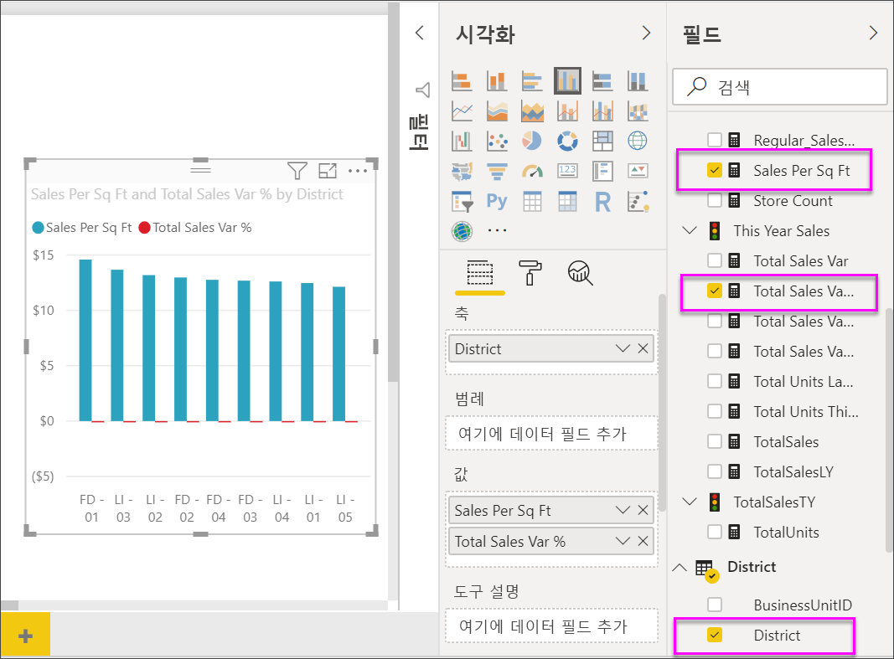
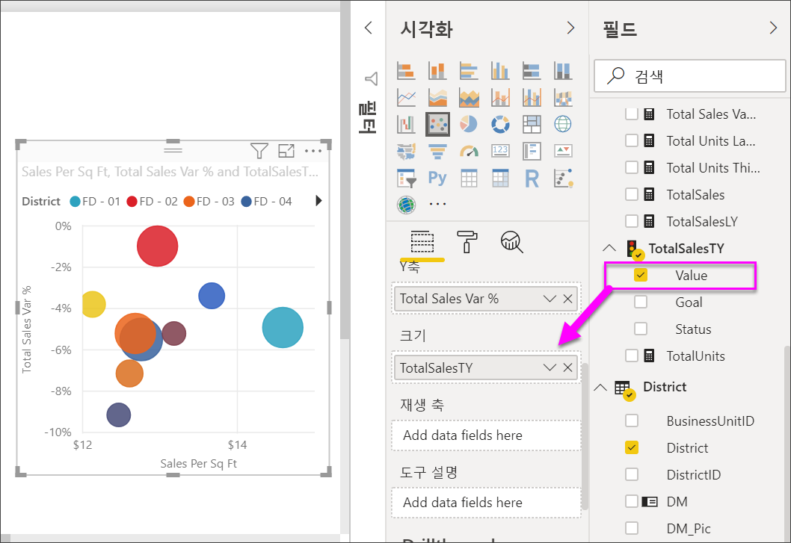
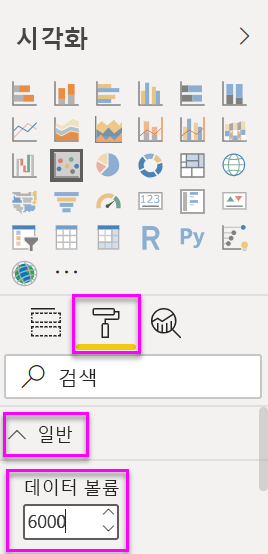
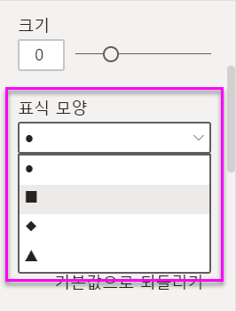
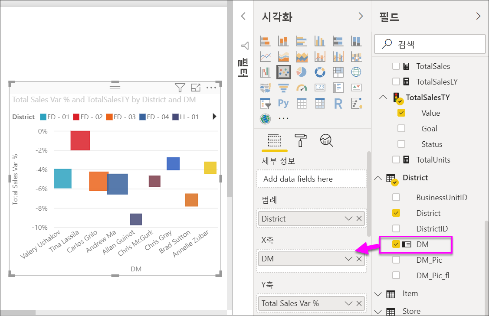
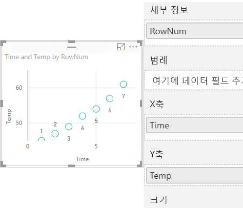

# Power BI의 분산형 차트, 거품형 차트 및 점 그림 차트

[!INCLUDE [power-bi-visuals-desktop-banner](../includes/power-bi-visuals-desktop-banner.md)]

분산형 차트에는 항상 가로 축을 따라 하나의 숫자 데이터 세트를 표시하고 세로 축을 따라 다른 숫자 값 세트를 표시하는 두 개의 값 축이 있습니다. 차트에서 x 및 y 숫자 값의 교차점에 점이 표시되고 이러한 값이 단일 데이터 요소로 결합됩니다. Power BI에서는 이러한 데이터 요소를 가로 축에 (불)균등하게 분산할 수 있습니다. 차트에 표시되는 데이터에 따라 다릅니다.

이 비디오를 통해 Will이 분산형 차트를 만드는 방법을 본 후 아래 단계에 따라 직접 분산형 차트를 만드세요.
   > [!NOTE]
   > 이 비디오에서는 이전 버전의 Power BI Desktop을 사용합니다.
   > 
   > 
<iframe width="560" height="315" src="https://www.youtube.com/embed/PVcfPoVE3Ys?list=PL1N57mwBHtN0JFoKSR0n-tBkUJHeMP2cP" frameborder="0" allowfullscreen></iframe>

데이터 요소의 수를 10,000까지 설정할 수 있습니다.  

## 분산형 차트, 거품형 차트 또는 점 그림 차트를 사용해야 하는 경우

### 분산형 및 거품형 차트

분산형 차트는 두 숫자 값 사이의 관계를 표시합니다. 거품형 차트는 데이터 요소를 거품으로 바꾸고 거품 ‘크기’로 제삼의 추가 데이터 차원을 나타냅니다. 

다음과 같은 경우 분산형 차트를 사용하는 것이 좋습니다.

* 두 숫자 값 사이의 관계를 표시하려는 경우.

* 두 개의 숫자 그룹을 일련의 xy 좌표로 그리려는 경우.

* 가로 축 눈금을 변경하고 싶을 때 꺾은선형 차트 대신 사용하려는 경우.

* 가로 축을 로그 눈금으로 전환하려는 경우.

* 쌍을 이루거나 그룹화된 값 집합을 포함하는 워크시트 데이터를 표시하려는 경우.

    > [!TIP]
    > 분산형 차트에서는 그룹화된 값에 대한 자세한 정보를 표시하기 위해 축의 개별 눈금을 조정할 수 있습니다.

* 선형 또는 비선형 추세, 클러스터, 이상값 등을 표시하여 큰 데이터 세트의 패턴을 표시하려는 경우.

* 시간과 관계없이 많은 수의 데이터 요소를 비교하려는 경우.  분산형 차트에 더 많은 데이터를 포함할수록 더 정확한 비교가 가능합니다.

분산형 차트의 기능뿐 아니라, 거품형 차트도 좋은 선택입니다.

* 데이터에 각각 값 세트를 포함하는 세 가지 데이터 계열이 있는 경우.

* 재무 데이터를 제공하려는 경우.  다양한 거품 크기는 시각적으로 특정 값을 강조 표시하는 데 유용합니다.

* 사분면에 사용하려는 경우.

### 점 그림 차트

X축을 따라 범주 데이터를 그릴 수도 있다는 점을 제외하면 점 그림 차트는 거품형 차트 및 분산형 차트와 비슷합니다.

X축에 따라 범주 데이터를 포함하려는 경우 좋은 선택입니다.

## 필수 조건

이 자습서는 [소매점 분석 샘플 PBIX 파일](http://download.microsoft.com/download/9/6/D/96DDC2FF-2568-491D-AAFA-AFDD6F763AE3/Retail%20Analysis%20Sample%20PBIX.pbix)을 사용합니다.

1. 메뉴 모음의 왼쪽 위 섹션에서 **파일** > **열기**를 선택합니다.
   
2. **소매점 분석 샘플 PBIX 파일**을 찾습니다.

1. **소매점 분석 샘플 PBIX 파일**을 보고서 보기 으로 엽니다.

1. 선택  탭을 선택합니다.

## 분산형 차트 만들기

1. 빈 보고서 페이지에서 시작하고 **필드** 창에서 다음 필드를 선택합니다.

    * **판매액** > **제곱 피트당 판매액**

    * **판매액** > **전체 판매액 분산%**

    * **구역** > **구역**

    

1. **시각화** 창에서 아이콘 을 선택합니다. 묶은 세로 막대형 차트를 분산형 차트로 변환합니다.

   

1. **자세히**에서 **범례**로 **구역**를 끌어다 놓습니다.

    그러면 Power BI가 Y축에 **총매출 분산 %** 을 그리고 X축에 **평방 미터당 매출**을 그리는 분산형 차트를 표시합니다. 데이터 요소 색은 구역을 나타냅니다. 데이터 요소 색은 구역을 나타냅니다.

    

이제 3차원을 추가해보겠습니다.

## 거품형 차트 만들기

1. **필드** 창에서 **판매량** > **올해 판매액** > **값**을 **크기** 웰로 끌어다 놓습니다. 데이터 요소는 판매 값과 비례하는 볼륨으로 확장합니다.

   

1. 거품을 마우스로 가리킵니다. 거품 크기는 **This Year Sales**의 값을 반영합니다.

    

1. 거품형 차트에 표시할 데이터 요소의 수를 설정하려면 **시각화** 창의 **서식** 섹션에서 **일반**을 확장하고 **데이터 볼륨**을 조정합니다.

    

    최대 데이터 볼륨 수를 10,000개로 설정할 수 있습니다. 숫자가 클수록 성능을 위해 먼저 테스트하는 것이 좋습니다.

    > [!NOTE]
    > 더 많은 데이터 요소는 더 긴 로드 시간을 의미할 수 있습니다. 보다 높은 눈금 끝 값을 한도로 하여 보고서를 게시하도록 선택하는 경우 웹 및 모바일에서도 보고서를 테스트하여 차트의 성능이 사용자의 기대에 부합하는지 확인해야 합니다.

1. [시각화 색, 레이블, 제목, 배경 등의 서식을 지정](service-getting-started-with-color-formatting-and-axis-properties.md)할 수 있습니다.

    [액세스 가능성을 향상시키려면](../desktop-accessibility.md) 각 줄에 표식 모양을 추가하는 것이 좋습니다. 표식 모양을 선택하려면 **셰이프**를 확장하고 **표식 모양**을 선택한 후 모양을 선택합니다.

    

    표식 모양을 다이아몬드, 삼각형 또는 사각형으로 변경할 수도 있습니다. 각 선에 다양한 표식 모양을 사용하면 보고서 소비자가 선(또는 영역)을 보다 쉽게 구분할 수 있습니다.

## 점 그림 차트 만들기

점 그림 차트를 만들려면 숫자 **X축** 필드를 범주 필드로 바꿉니다.

**X축** 창에서 **제곱 피트당 판매액**을 제거하고 **구역** > **구역 관리자**로 바꿉니다.

## 고려 사항 및 문제 해결

### 분산형 차트에 하나의 데이터 요소만 있음

분산형 차트에 X축과 Y축의 모든 값을 집계하는 하나의 데이터 요소만 있나요?  또는 단일 수평선이나 수직선의 모든 값을 집계하나요?

**자세히** 웰에 필드를 추가하여 Power BI에 값을 그룹화하는 방법을 알립니다. 필드는 그리려는 각 지점에 고유해야 합니다. 단순 행 번호 또는 ID 필드가 유효합니다.

데이터에 해당 필드가 없는 경우 X 및 Y 값을 지점마다 고유한 항목으로 연결하는 필드를 만듭니다.

새 필드를 만들려면 [Power BI Desktop 쿼리 편집기를 사용하여 인덱스 열을](../desktop-add-custom-column.md) 데이터 세트에 추가합니다. 그런 다음, 이 열을 시각화의 **자세히** 웰에 추가합니다.

## 다음 단계

* [Power BI 분산형 차트의 고밀도 샘플링](desktop-high-density-scatter-charts.md)

* [Power BI의 시각화 유형](power-bi-visualization-types-for-reports-and-q-and-a.md)

궁금한 점이 더 있나요? [Power BI 커뮤니티를 이용하세요.](http://community.powerbi.com/)
