# Power BI의 슬라이서

[!INCLUDE [power-bi-visuals-desktop-banner](../includes/power-bi-visuals-desktop-banner.md)]

보고서를 읽는 사람이 전체 판매액 메트릭을 보고 개별 구역 관리자 및 다른 시간 프레임에 대한 성과를 강조 표시할 수 있도록 하려 합니다. 별도의 보고서 또는 비교 차트를 만들거나 슬라이서를 사용할 수 있습니다. 슬라이서는 보고서의 다른 시각화에 표시되는 데이터 세트의 부분을 좁히는 대체 필터링 방법입니다. 

이 자습서에서는 무료 [소매점 분석 샘플](../sample-retail-analysis.md)을 사용하여 목록 및 날짜 범위 슬라이서를 만들고, 서식을 지정하고, 이를 사용하는 방법을 안내합니다. 슬라이서의 서식을 지정하고 사용하는 방법을 재미있게 알아보세요. 

## 슬라이서를 사용하는 경우
다음과 같은 경우 슬라이서를 사용하는 것이 좋습니다.

* 보고서 캔버스에서 자주 사용되거나 중요한 필터를 표시하여 더 쉽게 액세스할 수 있게 하려는 경우
* 드롭다운 목록을 열지 않고도 현재 필터링된 상태를 더 쉽게 보려는 경우 
* 데이터 테이블에서 불필요하고 숨겨진 열을 필터링하는 경우
* 중요한 시각적 개체 옆에 슬라이서를 배치하여 더 집중된 보고서를 만드는 경우

Power BI 슬라이서에는 다음과 같은 제한 사항이 있습니다.

- 슬라이서는 입력 필드를 지원하지 않습니다.
- 슬라이서 드릴다운은 지원하지 않습니다.

## 슬라이서 만들기

**구역 관리자별로 데이터를 필터링하는 새 슬라이서 만들기**

이 자습서는 [소매점 분석 샘플 PBIX 파일](https://download.microsoft.com/download/9/6/D/96DDC2FF-2568-491D-AAFA-AFDD6F763AE3/Retail%20Analysis%20Sample%20PBIX.pbix)을 사용합니다.

1. 메뉴 모음의 왼쪽 위 섹션에서 **파일** > **열기**를 선택합니다.
   
2. **소매점 분석 샘플 PBIX 파일**을 찾습니다.

1. **소매점 분석 샘플 PBIX 파일**을 보고서 보기 으로 엽니다.

1. 선택  탭을 선택합니다.

2. 개요 페이지에서 캔버스에 아무것도 선택되어 있지 않으면 **시각화** 창에서 **슬라이서** 아이콘 을 선택하여 새 슬라이서를 만듭니다. 
3. 새 슬라이서를 선택한 상태로 필드 창에서 **구역** > **DM**을 선택하여 슬라이서를 채웁니다. 새 슬라이서는 이름 앞에 선택 상자가 있는 목록입니다. 
    
    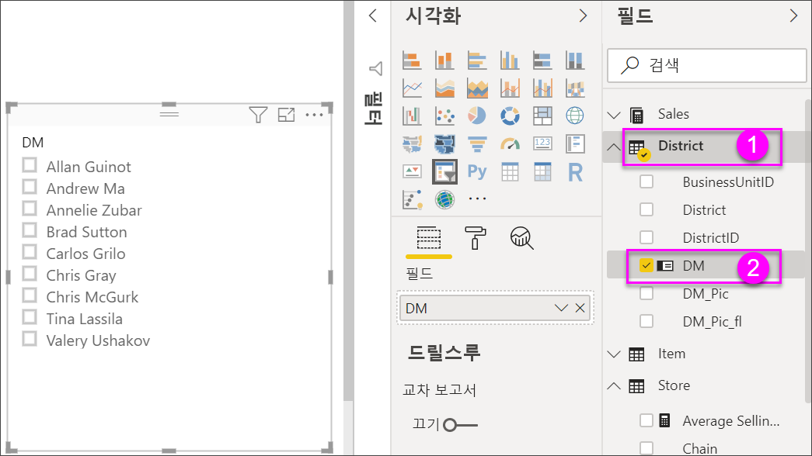
    
4. 캔버스에서 슬라이서 및 기타 요소의 크기를 조정하고 끌어서 슬라이서에 사용할 공간을 만듭니다. 슬라이서 크기를 너무 작게 조정하면 슬라이서 항목이 잘립니다. 
5. 슬라이서에서 이름을 선택하고 페이지의 다른 시각화 요소에 미치는 영향을 확인합니다. 이름을 다시 선택하여 선택을 취소하고 **Ctrl** 키를 누른 채로 둘 이상의 이름을 선택합니다. 모든 이름을 선택하면 아무것도 선택하지 않은 것과 동일한 효과가 있습니다. 

6. 또는 페인트 롤러 아이콘을 선택하여 슬라이서의 서식을 지정합니다. 여기에 모두 설명하기에는 옵션이 너무 많습니다. 실험을 통해 자신에게 적합한 슬라이서를 만드세요. 아래 예제에서 첫 번째 슬라이서는 가로 방향을 사용하고 항목에 색이 지정된 배경을 사용합니다. 두 번째 슬라이서는 세로 방향으로 유지되었고, 대신 보다 표준적인 모양을 위해 텍스트에 색을 사용합니다.

   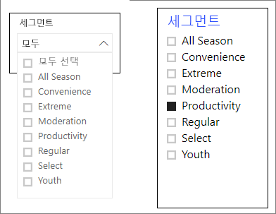
>[!TIP]
>목록 슬라이서 항목은 기본적으로 오름차순으로 정렬됩니다. 정렬 순서를 내림차순으로 바꾸려면 슬라이서의 오른쪽 위에 있는 줄임표( **...** )를 선택하고 **내림차순 정열**을 선택합니다.

**날짜 범위별로 데이터를 필터링하는 새 슬라이서를 만들려면**

1. 캔버스에 아무것도 선택되지 않은 상태에서 필드 창에서 **매장**을 드롭다운하고 **개장 날짜**를 시각화 창의 **값** 웰로 끌어 놓아 새 시각화를 만듭니다.
2. 새 시각화를 선택한 상태로 **슬라이서** 아이콘을 선택하여 새 시각화를 슬라이서로 변환합니다. 이 슬라이서는 채워진 날짜 범위를 사용하는 슬라이더 컨트롤입니다.
    
    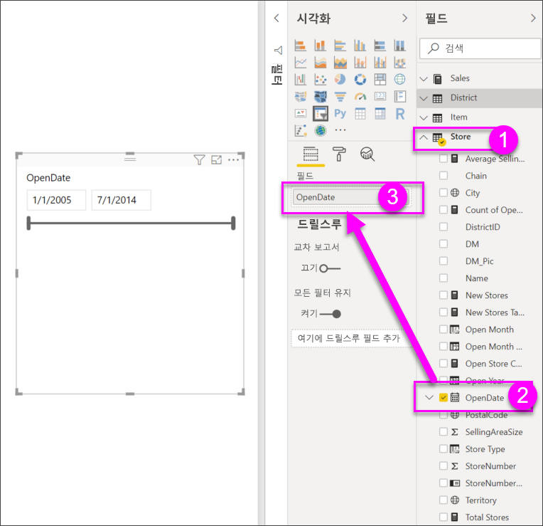

    
4. 캔버스에서 슬라이서 및 기타 요소의 크기를 조정하고 끌어서 슬라이서에 사용할 공간을 만듭니다. 슬라이더 크기는 슬라이서 크기로 조정하지만 슬라이서 크기를 너무 작게 조정하면 해당 슬라이더가 사라지고 날짜가 잘립니다. 
4. 슬라이더로 다른 날짜 범위를 선택하거나, 날짜 필드를 선택하여 값을 입력하거나 더 정확한 선택을 위해 달력을 팝업으로 표시합니다. 페이지의 다른 시각화에 미치는 영향을 확인합니다.
    
    >[!NOTE]
    >숫자 및 날짜/시간 데이터 형식은 기본적으로 범위 슬라이더 슬라이서를 생성합니다. 이제 2018년 2월 Power BI 업데이트부터 정수 데이터 형식 범위 슬라이더는 소수 자릿수를 표시하지 않고 정수 값에 맞춰집니다. 

5. 슬라이서 형식을 변경하려면 슬라이서를 선택한 상태로 슬라이서의 오른쪽 위 영역을 마우스로 가리키고, 표시되는 캐럿을 드롭다운하고, **목록** 또는 **이전**과 같은 다른 옵션 중 하나를 선택합니다. 슬라이서 모양 및 선택 옵션이 어떻게 변경되는지 확인합니다. 
 
    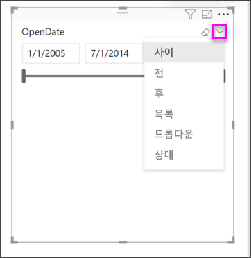

날짜 및 숫자 범위 슬라이서를 만드는 방법에 대한 자세한 내용은 다음과 같은 비디오를 시청하고 [Power BI Desktop에서 숫자 범위 슬라이서 사용](../desktop-slicer-numeric-range.md)을 참조하세요.
   > [!NOTE]
   > 이 비디오에서는 이전 버전의 Power BI Desktop을 사용합니다.
   > 
   > 
<iframe width="560" height="315" src="https://www.youtube.com/embed/zIZPA0UrJyA" frameborder="0" allowfullscreen></iframe> 

## 슬라이서의 영향을 받는 페이지 시각적 개체 제어
기본적으로 보고서 페이지의 슬라이서는 서로를 포함하여 해당 페이지의 다른 모든 시각화에 영향을 줍니다. 방금 만든 목록 및 날짜 슬라이더에서 값을 선택할 때 다른 시각화에 미치는 영향을 확인하세요. 필터링된 데이터는 두 슬라이서에서 선택한 값의 교차 영역입니다. 

**시각적 개체 상호 작용**을 사용하여 일부 페이지 시각화가 다른 시각화의 영향을 받지 않도록 제외할 수 있습니다. **개요** 페이지에서 “FiscalMonth 및 구역 관리자별 총 판매액 차이” 차트에는 항상 표시하려고 하는 월별 지역 관리자에 대한 전체 비교 데이터가 표시됩니다. **시각적 개체 상호 작용**을 사용하여 슬라이서 선택 항목이 이 차트를 필터링하지 못하도록 할 수 있습니다. 

1. **구역 월별 판매량** 페이지의 구역 관리자 슬라이서가 선택된 상태에서
    - Power BI Desktop에서 **시각적 개체 도구** 아래의 **서식** 메뉴를 선택하고 **상호 작용 편집**을 선택합니다.
   
   필터 컨트롤 은 페이지의 다른 모든 시각적 개체 위에 표시됩니다. 처음에는 모든 **필터** 아이콘이 선택됩니다.
   
2. **FiscalMonth 및 구역 관리자별 총 판매액 차이** 차트 위에서 **없음** 아이콘을 선택하여 슬라이서가 필터링을 중지하도록 설정합니다. 
3. **월**을 선택하고 **FiscalMonth 및 구역 관리자별 총 판매액 차이** 차트 위에서 **없음** 아이콘을 다시 선택하여 이 슬라이서가 필터링을 중지하도록 설정합니다. 이제 슬라이서에서 이름과 날짜 범위를 선택할 때 FiscalMonth 및 구역 관리자별 총 판매액 차이 차트가 변경되지 않습니다. 

상호 작용 편집에 대한 자세한 내용은 [Power BI 보고서의 시각적 상호 작용](../service-reports-visual-interactions.md)을 참조하세요.

## 다른 페이지에서 슬라이서 동기화 및 사용
2018년 2월 Power BI 업데이트부터 보고서의 일부 또는 모든 페이지에서 슬라이서를 동기화하여 사용할 수 있습니다. 

현재 보고서에서 **구역 월별 판매량** 페이지에도 **구역 관리자** 슬라이서가 있지만, 이 슬라이서를 **개요** 페이지에도 포함하려면 어떻게 해야 할까요? **신규 매장** 페이지에도 슬라이서가 있지만 **매장 이름** 정보만 제공합니다. **슬라이서 동기화** 창을 사용하여 **구역 관리자** 슬라이서를 이러한 페이지에 동기화할 수 있으므로 한 페이지에서 슬라이서를 선택하면 세 페이지 모두의 시각화에 영향을 줍니다.

1. **개요** 메뉴에서 Power BI Desktop의 **슬라이서 동기화**를 선택합니다.

    

1.  **슬라이서 동기화** 창은 **필터** 창과 **시각화** 창 사이에 표시됩니다.  

    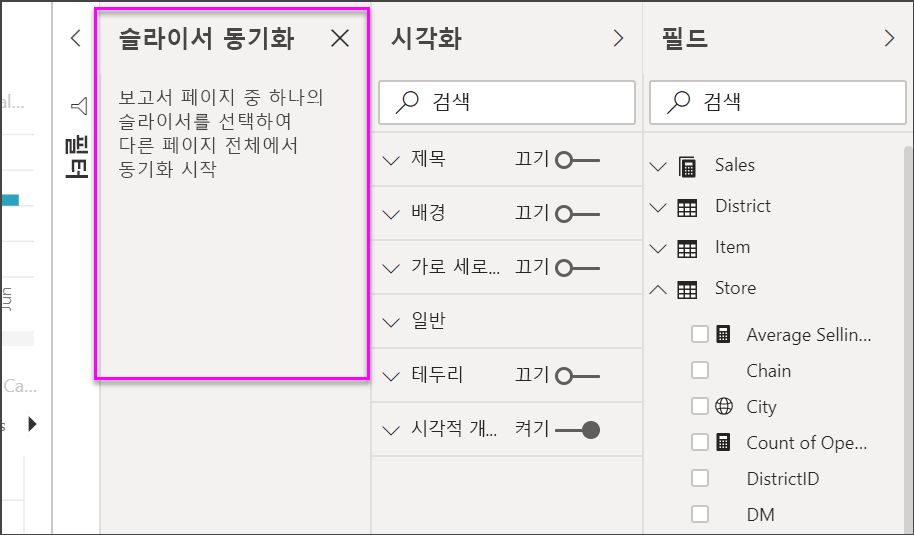

1. **구역 월별 판매량** 페이지에서 **구역 관리자** 슬라이서를 선택합니다. 
    
    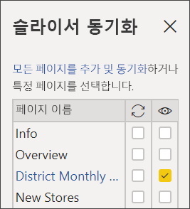
    
3. **동기화** 열에서 **신규 매장** 페이지 및 **개요** 페이지를 선택하여 **구역 월별 판매량** 슬라이서를 해당 페이지에 동기화합니다. 
    
3. **표시** 열에서 **신규 매장** 페이지와 **개요** 페이지를 선택합니다. 이제 **슬라이서 동기화** 창이 아래 이미지와 같이 표시됩니다.

    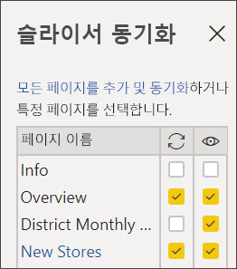

1. 슬라이서를 동기화하여 다른 페이지에 표시되도록 설정한 결과를 관찰합니다. **구역 월별 판매량** 페이지의 **구역 관리자** 슬라이서는 이제 **개요** 페이지의 슬라이서와 동일한 선택 항목을 표시합니다. **신규 매장** 페이지에서 **구역 관리자** 슬라이서의 선택 항목은 **매장 이름** 슬라이서에서 사용 가능한 선택 항목에 영향을 줍니다. 
    
    >[!TIP]
    >슬라이서는 처음에는 원래 페이지와 같은 크기 및 위치로 동기화된 페이지에 표시되지만 다양한 페이지에서 동기화된 슬라이서를 개별적으로 이동하고, 크기를 조정하고, 서식을 지정할 수 있습니다. 

>[!NOTE]
>슬라이서를 페이지에 동기화하지만 해당 페이지에 표시되지 않도록 설정할 경우 다른 페이지에서 선택한 항목에 따라 페이지의 데이터가 필터링됩니다.
 
## 슬라이서 서식 지정
슬라이서 형식에 따라 다양한 서식 옵션을 사용할 수 있습니다. **가로** 방향, **반응형** 레이아웃 및 **항목** 색 지정을 사용하면 표준 목록 항목이 아닌 단추 또는 타일을 생성하고 슬라이서 항목 크기가 다양한 화면 크기 및 레이아웃에 맞게 조정되도록 설정할 수 있습니다.  

1. 아무 페이지에서나 **구역 관리자** 슬라이서를 선택한 상태에서 **시각화** 창에서 **서식** 아이콘 을 선택하여 서식 컨트롤을 표시합니다. 
    
    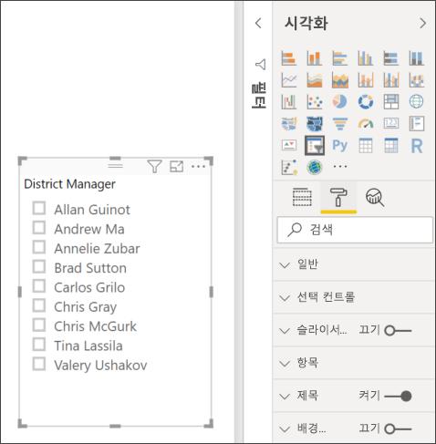
    
2. 각 범주 옆에 있는 드롭다운 화살표를 선택하여 옵션을 표시하고 편집합니다. 

### 일반 옵션
1. **윤곽선 색**에서 빨간색을 선택하고 **윤곽선 두께**를 "2"로 변경합니다. 이 옵션을 사용하면 머리글 및 항목 윤곽선 또는 밑줄의 색과 두께를 설정할 수 있습니다. 
2. **방향**에서는 **세로**가 기본값입니다. **가로**를 선택하여 가로로 정렬된 타일이나 단추 및 슬라이서에 맞지 않는 항목에 액세스하기 위한 스크롤 화살표가 있는 슬라이서를 생성합니다.
    
    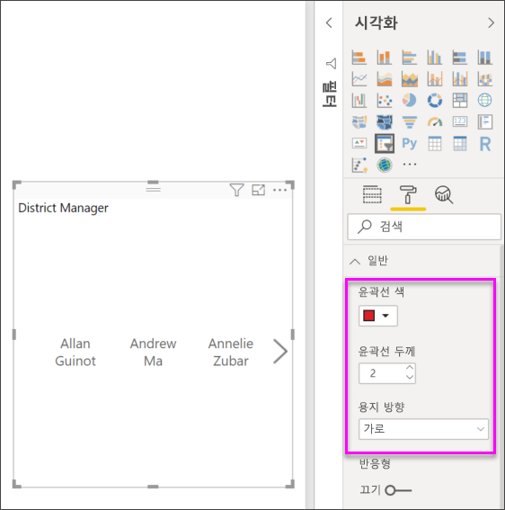
    
3. **반응형** 레이아웃을 켜서 보기 화면 및 슬라이서 크기에 따라 슬라이서 항목의 크기와 정렬을 변경합니다. 목록 슬라이서의 경우 반응형 레이아웃은 가로 방향으로만 사용할 수 있고 이 레이아웃을 사용하면 작은 화면에서 항목이 잘리지 않습니다. 범위 슬라이더 슬라이서의 경우 반응형 서식에 따라 슬라이더의 스타일이 변경되고 이 서식을 사용하면 더 유연하게 크기를 조정할 수 있습니다. 두 슬라이서 형식은 모두 매우 작은 크기의 필터 아이콘이 됩니다. 
    
    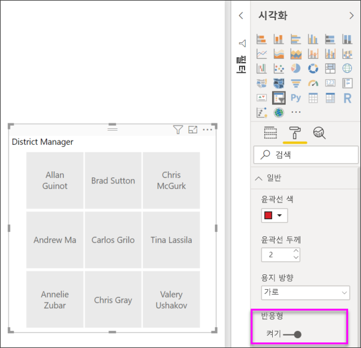
    
    >[!NOTE]
    >반응형 레이아웃의 변경 내용은 사용자가 설정한 특정 제목 및 항목 서식을 재정의할 수 있습니다. 
    
4. **X 위치**, **Y 위치**, **너비** 및 **높이**에서 슬라이서 위치와 크기를 숫자 정밀도로 설정하거나, 슬라이서를 캔버스에서 직접 이동하고 크기를 조정합니다. 다양한 항목 크기와 정렬을 사용해 보고 반응형 서식이 이에 따라 어떻게 변경되는지 확인하세요.  

    

가로 방향 및 반응형 레이아웃에 대한 자세한 내용은 [Power BI에서 크기를 조정할 수 있는 반응형 슬라이서 만들기](../power-bi-slicer-filter-responsive.md)를 참조하세요.

### 선택 컨트롤 옵션(목록 슬라이서만 해당)
1. **모두 선택 표시**는 기본적으로 **꺼져** 있습니다. 토글 시 모든 항목을 선택하거나 선택 취소하는 **모두 선택** 항목을 슬라이서에 추가하려면 **켜기**로 전환합니다. 모든 항목이 선택되어 있을 때 한 항목을 클릭하거나 탭하면 선택이 취소되고 “is-not” 형식의 필터가 허용됩니다. 
    
    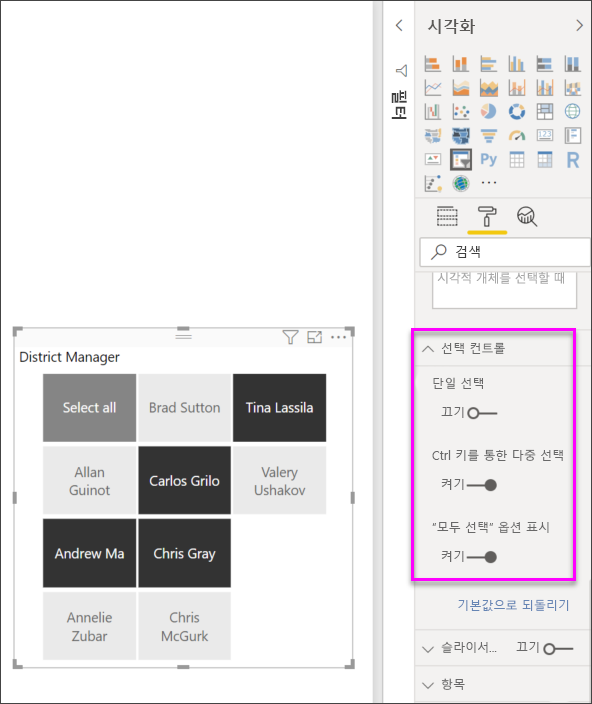
    
2. **단일 선택**은 기본적으로 **켜져** 있습니다. 각 항목을 클릭하거나 탭하면 항목이 선택되고 **Ctrl** 키를 누른 채로 클릭하거나 탭하면 여러 항목이 선택됩니다. **Ctrl** 키를 누르지 않고 여러 항목을 선택할 수 있게 하려면 **단일 선택**을 **끄기**로 전환합니다. 각 항목을 다시 클릭하거나 탭하면 선택이 취소됩니다. 

### 제목 옵션
**제목**은 기본적으로 **설정**되어 있으므로 슬라이서 위쪽에 데이터 필드 이름이 표시됩니다. 
1. 제목 텍스트의 서식을 지정하여 **글꼴색**을 빨강으로, **텍스트 크기**를 14pt로, **정렬**을 중앙으로, **글꼴 패밀리**를 Arial Black으로 설정합니다. 

### 항목 옵션(목록 슬라이서만 해당)
1. 항목 텍스트와 배경의 서식을 지정하여 **글꼴색**을 검정으로, **배경**을 연한 빨강으로, **텍스트 크기**를 10pt로, **글꼴 패밀리**를 Arial로 설정합니다. 
2. **윤곽선**에서 **프레임**을 선택하여 **일반** 옵션에서 설정한 크기와 색상으로 각 항목 둘레에 테두리를 그립니다. 
    
    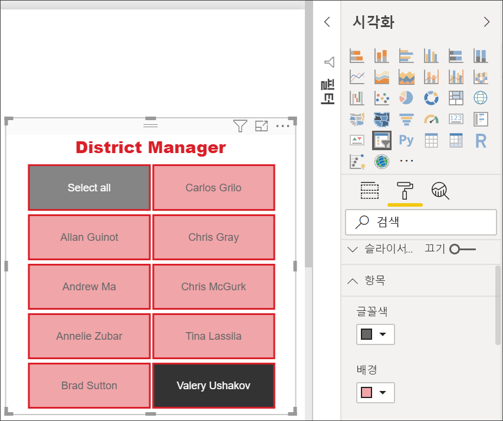
    
    >[!TIP]
    >- **방향 > 가로**를 사용하면 선택 취소된 항목이 선택된 텍스트와 배경색으로 표시되고, 선택된 항목은 시스템 기본값(일반적으로 흰색 텍스트의 검은 배경)으로 표시됩니다.
    >- **방향 > 세로**를 사용하면 항목이 항상 설정된 색상으로 표시되고 선택 상자는 선택 시 항상 검은색으로 표시됩니다. 

### 날짜/숫자 입력 및 슬라이더 옵션(범위 슬라이더 슬라이서만 해당)
- 날짜/숫자 입력 옵션은 **윤곽선** 또는 밑줄이 없다는 것을 제외하고 목록 슬라이서의 **항목** 옵션과 동일합니다.
- 슬라이더 옵션을 사용하면 범위 슬라이더의 색을 설정하거나 슬라이더를 **끄기**로 전환하여 숫자 입력만 남겨 둘 수 있습니다.

### 다른 서식 지정 옵션
다른 서식 지정 옵션은 기본적으로 꺼져 있습니다. **켜기**로 전환할 경우: 
- **배경:** 전체 슬라이서에 배경색을 추가하고 투명도를 설정합니다.
- **가로 세로 비율 잠금:** 슬라이서의 크기가 조정된 경우 슬라이서의 모양을 유지합니다.
- **테두리:** 슬라이서 둘레에 1픽셀 테두리를 추가하고 색을 설정합니다. (이 슬라이서 테두리는 일반 윤곽 설정과 별개이며 영향을 받지 않습니다.) 

## 다음 단계
[Power BI의 시각화 유형](power-bi-visualization-types-for-reports-and-q-and-a.md)

[Power BI의 테이블](power-bi-visualization-tables.md)

