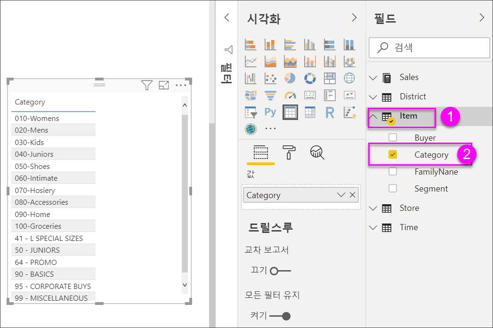
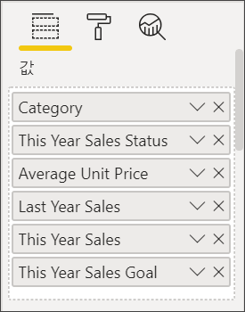
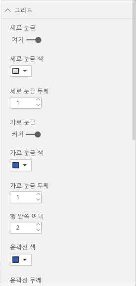
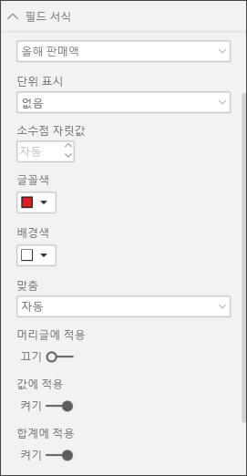
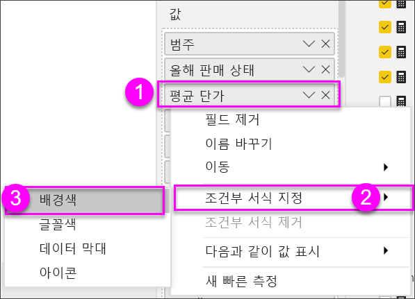
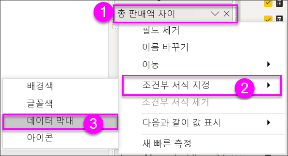
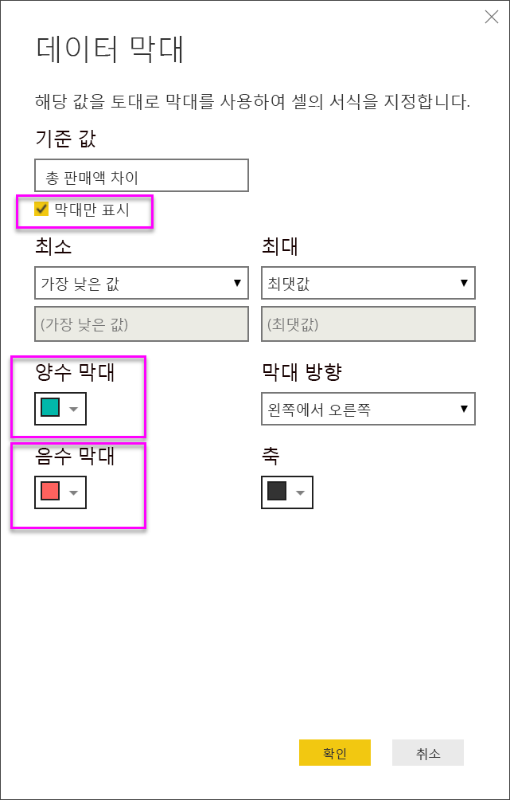

# Power BI 보고서 및 대시보드에서 테이블 작업
테이블은 논리적으로 연속된 행과 열에서 관련된 데이터를 포함하는 표입니다. 머리글과 합계에 대한 행이 포함될 수도 있습니다. 테이블은 단일 범주에 대한 많은 값을 볼 수 있는 정량적 비교와 잘 작동합니다. 예를 들어 이 테이블은 **범주**합에 대한 5개의 서로 다른 측정값을 표시합니다.

## 테이블을 사용하는 경우
다음과 같은 경우 테이블은 좋은 선택입니다.

* 자세한 데이터 및 정확한 값을 보고 비교(시각적 표현 대신)
* 테이블 형식으로 데이터를 표시
* 숫자 데이터를 범주별로 표시   

> [!NOTE]
> 테이블에 너무 많은 값이 있으면 행렬로 전환 및/또는 드릴다운을 사용하는 것이 좋습니다.

## 필수 조건
- Power BI 서비스 또는 Power BI Desktop
- 소매점 분석 샘플

## 테이블 만들기
항목 범주별으로 판매 값을 표시하려면 위에 나온 테이블을 만듭니다. 이를 수행하려면 Power BI 서비스에 로그인하여 **데이터 가져오기 \> 샘플 \> 소매 분석 샘플 > 연결**을 선택한 다음, **[대시보드로 이동]을 선택합니다. 시각화를 만들려면 데이터 집합 및 보고서에 대한 편집 권한이 필요합니다. 다행히 Power BI 샘플은 모두 편집 가능합니다. 보고서가 사용자와 공유되는 경우, 보고서에 시각화를 만들 수 없습니다.

1. 왼쪽 탐색 창에서 **작업 영역 >내 작업 영역**을 선택합니다.    
2. [데이터 집합] 탭을 선택하고 아래로 스크롤 하여 방금 추가한 소매 분석 샘플 데이터 집합으로 이동합니다.  **보고서 만들기** 아이콘을 선택합니다.

    
2. 보고서 편집기에서 **항목** > **범주**를 선택합니다.  Power BI는 자동으로 모든 범주를 나열하는 테이블을 만듭니다.

    
3. **영업 > 평균 단가** 및 **> 지난 해 매출** 및 **>올해 매출**을 선택하고 3개 옵션(값, 목표, 상태) 전부 선택합니다.   
4. 시각화 창에서 well **값**을 찾고 이 페이지에서 차트 열의 순서가 첫 번째 이미지와 일치될 때까지 끌어서 놓습니다.  well 값은 다음과 같이 표시되어야 합니다.

    
5. 핀 고정 아이콘을 선택하여 테이블을 대시보드에 고정  

     

## 테이블 서식 지정
테이블 서식을 지정하는 많은 방법이 있지만 여기에서는 몇 가지만 다루려고 합니다. 다른 서식 옵션을 알아보는 좋은 방법은 서식 창(페인트 롤러 아이콘 )을 열고 살펴보는 것입니다.

* 테이블 그리드의 서식을 지정해 보세요. 여기에서는 파란색 세로 그리드를 추가하고, 행에 공간을 추가하고, 윤곽선과 텍스트 크기를 약간 늘렸습니다.

    

    
* 열 머리글의 경우 배경색을 변경하고, 윤곽선을 추가하고, 글꼴 크기를 늘렸습니다. 

    

~~~

~~~

* 개별 열 및 열 머리글에 서식을 적용할 수도 있습니다. 먼저 **필드 서식**을 확장하고 드롭다운에서 서식을 지정할 열을 선택합니다. 열 값에 따라 필드 서식을 사용하여 표시 단위, 글꼴 색, 소수 자릿수, 배경, 맞춤 등의 항목을 설정할 수 있습니다. 설정을 조정한 후 해당 설정을 머리글 및 합계 행에 적용할지 결정합니다.

    

* 몇 가지 추가 서식 지정 후 최종 테이블은 다음과 같습니다. 서식 옵션은 너무 많기 때문에 서식 옵션을 배우는 가장 좋은 방법은 기본 서식으로 시작하여 [서식] 창 을 열고 살펴보는 것입니다. 

    

### 조건부 서식 지정
서식 지정 유형 중 하나로 *조건부 서식 지정*이 있으며, 이는 Power BI 서비스 또는 Desktop에 있는 **시각화** 창의 **값** 웰 필드에 적용됩니다. 

테이블에 대한 조건부 서식 지정을 사용하여 그라데이션 색 사용을 포함하는 셀 값을 기반으로 하는 사용자 지정된 셀 배경색 및 글꼴 색을 지정할 수 있습니다. 

1. Power BI 서비스 또는 Desktop의 **시각화** 창에서 서식을 지정하려는 **값** 웰의 값 옆에 있는 아래쪽 화살표를 선택합니다(또는 필드를 마우스 오른쪽 단추로 클릭). 필드에 대한 조건부 서식은 **필드**의 **값** 영역에서만 관리할 수 있습니다.

    
2. **배경 색 눈금**을 선택합니다. 대화 상자가 나타나면 색은 물론 ‘최소’ 및 ‘최대’ 값을 구성할 수 있습니다. **분기** 상자를 선택하면 선택적인 *가운데* 값도 구성할 수 있습니다.

    

    평균 단가 값에 사용자 지정 서식을 적용해 보겠습니다. **분기**를 선택하고 몇 가지 색을 추가하고 **확인**을 선택합니다. 

    
3. 양수 및 음수 값이 있는 테이블에 새 필드를 추가합니다.  **판매액 > 총 판매액 분산**을 선택합니다. 

    
4. **총 판매액 분산** 옆에 있는 아래쪽 화살표를 선택하고 **조건부 서식 > 데이터 막대**를 선택하여 데이터 막대 조건부 서식을 추가합니다.

    
5. 표시되는 대화 상자에서 **양수 막대**, **음수 막대**의 색상을 설정하고 **막대만 표시** 옆에 확인 표시를 하고 원하는 다른 부분을 변경합니다.

    

    **확인**을 선택하면 테이블의 숫자 값이 데이터 막대로 바뀌므로 더 쉽게 검색할 수 있습니다.

    
6. 시각화에서 조건부 서식 지정을 제거하려면 필드를 다시 마우스 오른쪽 단추로 클릭하고 **조건부 서식 지정 제거**를 선택합니다.

> [!TIP]
> 서식 창(페인트 롤러 아이콘)에서 조건부 서식을 사용할 수도 있습니다. 서식을 지정할 값을 선택한 후 **색 눈금** 또는 **데이터 막대**를 켜짐으로 설정하여 기본 설정을 적용하거나 설정을 사용자 지정하고 **고급 컨트롤**을 선택합니다.
> 
> 

## 테이블의 열 너비 조정
경우에 따라 Power BI는 보고서와 대시보드에 열 머리글을 자릅니다. 전체 열 이름을 표시하려면 머리글의 오른쪽으로 공간을 마우스로 가리켜 이중 화살표를 표시하고 선택하고 끕니다.

## 고려 사항 및 문제 해결
* 열 서식 지정을 적용할 때 자동, 왼쪽, 가운데, 오른쪽 중에 하나의 열당 맞춤 옵션을 선택할 수 있습니다. 일반적으로 열은 모두 텍스트 또는 숫자만을 포함하고 섞지 않습니다. 하지만 열에 숫자와 텍스트가 모두 포함되어 있는 경우 **자동**은 텍스트의 경우 왼쪽에 정렬하고, 번호의 경우 오른쪽에 정렬합니다. 이 동작은 왼쪽에서 오른쪽으로 읽는 언어를 지원합니다.   

궁금한 점이 더 있나요? [Power BI 커뮤니티를 이용하세요.](http://community.powerbi.com/)

