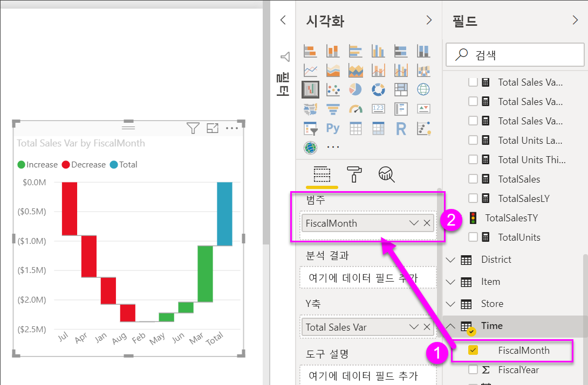
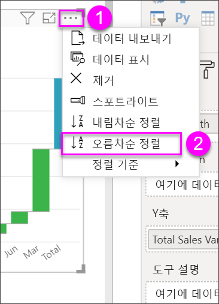
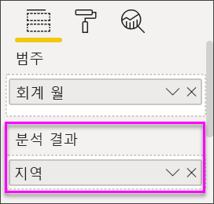

# Power BI의 폭포 차트

폭포 차트는 Power BI가 값을 더하거나 뺄 때의 누계를 보여 줍니다. 초기 값(예: 순수입)이 일련의 양수 및 음수 변경에 어떻게 영향을 받는지 이해하는 데 유용합니다.

세로형 막대는 색으로 구분되어 증가 및 감소를 빠르게 구분할 수 있습니다. 중간 값 열이 부동 세로형 막대인 반면, 초기 및 최종 값 세로형 막대는 종종 [가로축에서 시작합니다](https://support.office.com/article/Create-a-waterfall-chart-in-Office-2016-for-Windows-8de1ece4-ff21-4d37-acd7-546f5527f185#BKMK_Float "가로축에서 시작합니다"). 이러한 스타일로 인해, 폭포 차트는 교량 차트라고도 합니다.

<iframe width="560" height="315" src="https://www.youtube.com/embed/qKRZPBnaUXM" frameborder="0" allow="autoplay; encrypted-media" allowfullscreen></iframe>

## 폭포 차트를 사용하는 경우

다음과 같은 경우 폭포 차트를 사용하는 것이 좋습니다.

* 시계열 또는 다른 범주에 걸쳐 측정값의 변화가 있는 경우

* 합계 값에 영향을 주는 주요 변경을 감사하는 경우

* 다양한 수익원과 총수익(또는 손실)을 표시하여 회사의 연간 수익을 그리려는 경우

* 1년 동안 회사의 시작 및 종료 인력을 나타내기 위해

* 매달 벌고 쓰는 금액이 얼마인지 그리고 계좌의 잔고가 얼마인지를 시각화하기 위해

## 필수 조건

* Power BI 서비스 또는 Power BI Desktop

* 소매점 분석 샘플 보고서

## 소매점 분석 샘플 보고서 가져오기

이 지침은 소매 분석 샘플을 사용합니다. 시각화를 만들려면 데이터 세트 및 보고서에 대한 편집 권한이 필요합니다. 다행히 Power BI 샘플은 모두 편집 가능합니다. 누군가가 공유해 준 보고서에서 시각화를 만들 수 없습니다. 과정을 따르려면 [소매점 분석 샘플 보고서](../sample-datasets.md)를 획득합니다.

**소매 분석 샘플** 데이터 세트를 가져온 후 시작할 수 있습니다.

## 폭포 차트 만들기

월별 매출 편차(실제 매출과 예상 매출의 편차)를 표시하는 폭포 차트를 만들겠습니다.

1. **내 작업 영역**에서 **데이터 세트** > **보고서 만들기**를 선택합니다.

    

1. **필드** 창에서 **판매량** > **총판매액 차이**를 선택합니다.

   

1. 폭포 아이콘  을 선택하여 차트를 트리맵으로 변환합니다.

    **총판매액 차이**가 **Y축** 영역에 없는 경우 그곳으로 끌어 놓습니다.

    

1. **시간** > **FiscalMonth**를 선택하여 **범주** 영역에 추가합니다.

    

1. Power BI에서 폭포 차트가 시간순으로 정렬되도록 합니다. 차트의 오른쪽 위 모서리에서 줄임표(...)를 선택합니다.

    **오름차순 정렬** 및 **FiscalMonth** 옵션 왼쪽 옆에 노란색 표시가 있는지 확인합니다.

    

    X축 값을 살펴보고 **1월**에서 **8월**까지 순서대로 표시할 수도 있습니다.

    조금 더 세부적으로 들어가 월간 편차의 가장 큰 요인을 살펴봅니다.

1. **매장** > **지역**을 **분석 결과** 영역으로 끕니다.

    

    기본적으로 Power BI는 월별 증가 또는 감소에 상위 5개 요인을 추가합니다.

    

    상위 2개 요인에만 관심이 있는 경우

1. **서식** 창에서 **분석 결과**를 선택하고 **최대 분석 결과**를 **2**로 설정합니다.

    

    간단히 살펴보면 오하이오 및 펜실베이니아 지역이 폭포 차트의 증감에 가장 큰 영향을 주는 지역인 것으로 보입니다.

    

    흥미로운 결과입니다. 이 두 지역의 매출이 다른 지역보다 훨씬 더 높아서 이처럼 큰 영향을 주는 것일까요? 확인해 보겠습니다.

1. 올해와 작년의 지역별 매출을 보여 주는 지도를 만듭니다.

    

    지도가 이 이론을 뒷받침해 주고 있습니다. 이 두 지역의 작년(거품 크기)과 올해(거품 음영) 매출이 최고값을 기록했다고 나와 있습니다.

## 강조 표시 및 교차 필터링

**필터** 창 사용 방법에 대한 자세한 내용은 [편집용 보기에서 보고서에 필터 추가](../power-bi-report-add-filter.md)를 참조하세요.

보고서 페이지에서 다른 시각화 요소를 교차 필터링하는 폭포 차트에서 세로형 막대를 강조 표시하고 그 반대의 경우도 마찬가지입니다. 그러나 **총** 열은 강조 표시를 트리거하거나 교차 필터링에 응답하지 않습니다.

## 다음 단계

* [Power BI 보고서에서 시각적 개체가 조작되는 방식 변경](../service-reports-visual-interactions.md)

* [Power BI의 시각화 유형](power-bi-visualization-types-for-reports-and-q-and-a.md)
