# Azure Active Directory B2B를 사용 하 여 외부 게스트 사용자에 게 Power BI 콘텐츠 배포

**요약:** Azure Active Directory-비즈니스 (b2b) Azure AD의 통합을 사용 하 여 조직 외부 사용자에 게 콘텐츠를 배포 하는 방법을 설명한 기술 백서입니다.

**작성자:** Lukasz Pawlowski, Kasper de Jonge

**기술 검토자:** Adam Wilson, Sheng Liu, Qian Liang, Sergei Gundorov, Jacob Grimm, Adam Saxton, Maya Shenhav, Nimrod Shalit, Elisabeth Olson

> [!NOTE]
> 이 백서는 브라우저에서 **인쇄**를 선택한 다음, **PDF로 저장**을 선택하여 저장하거나 인쇄할 수 있습니다.

## 소개

Power BI는 조직 업무의 360도 보기를 제공 하 고 데이터를 사용 하 여 결정을 내릴 수 있도록 이러한 조직의 모든 사용자. 이러한 조직 대부분에 외부 파트너, 클라이언트 및 계약자를 사용 하 여 강력 하 고 신뢰할 수 있는 관계입니다. 이러한 조직에서는 Power BI 대시보드에 대 한 보안 액세스 및 이러한 외부 파트너에 게 보고서를 제공 해야 합니다.

Power BI 통합 [Azure Active Directory-비즈니스 (Azure AD B2B)](https://docs.microsoft.com/azure/active-directory/b2b/what-is-b2b) 수 있도록 Power BI의 안전 하 게 배포할 조직 – 외부 게스트 사용자에 게 콘텐츠를 계속 제어를 유지 하 고 제어 하는 액세스 하는 동안 내부 데이터입니다.

이 백서의 내용는 모든 세부 정보 Azure Active Directory B2B를 사용 하 여 Power BI의 통합을 이해 해야 합니다. 에서는 해당 가장 일반적인 사용 사례, 설치, 라이선스 및 행 수준 보안을 설명 합니다.

> [!NOTE]
> 이 백서에서는 전체에서 Azure AD와 Azure Active Directory 및 Azure Active Directory와 Azure AD B2B 기업 간 이라고합니다.

## 시나리오

Contoso는 자동차 제조업체 이며 모든 구성 요소, 자료 및 해당 제조 작업을 실행 하는 데 필요한 서비스를 사용 하 여 제공 하는 많은 다양 한 공급자를 사용 하 여 작동 합니다. Contoso는 공급망 물류 및 Power BI 공급 체인의 주요 성능 메트릭을 모니터링 하는 데는 계획을 간소화 합니다. Contoso는 안전 하 고 관리 하기 쉬운 방식으로 외부 공급 체인 파트너 analytics를 사용 하 여 공유 하려고 합니다.

Contoso에는 Power BI 및 Azure AD B2B를 사용 하 여 외부 사용자에 대 한 다음과 같은 환경을 설정할 수 있습니다.

### 임시 항목 공유 당

Contoso는 Contoso의 자동차에 대 한 라디에이터 들어보세요 공급자를 사용 하 여 작동 합니다. 모든 Contoso의 자동차에서 데이터를 사용 하 여 라디에이터의 안정성을 최적화 하기 위해 필요한 경우가 많습니다. Contoso의 분석가가 전화 공급자는 엔지니어와 증폭기 안정성 보고서를 공유 하려면 Power BI를 사용 합니다. 엔지니어는 보고서를 보려면 링크를 사용 하 여 전자 메일을 받습니다.

위에서 설명한 대로 이러한 임시 공유에 필요한 기준 비즈니스 사용자가 수행 됩니다. Power BI에서 외부 사용자에 게 전송 하는 링크에는 Azure AD B2B 초대 링크를입니다. 외부 사용자가 링크를 열면 게스트 사용자로 Contoso의 Azure AD 조직에 가입 하도록 요구 됩니다. 초대 수락 되 면 링크에는 특정 보고서 또는 대시보드를 엽니다. Azure Active Directory 관리자 조직 외부 사용자를 초대할 권한이 위임 및 해당 사용자가 수행할 수 있는이 문서의 거 버 넌 스 섹션에 설명 된 대로 초대를 수락한 후을 선택 합니다. Contoso 분석가 Azure AD 관리자가 허용 되는 작업 및 Power BI 때문에 게스트 사용자를 초대할 수 허용 사용자 관리자에 게 콘텐츠를 보려면 Power BI의 테 넌 트 설정에 게스트를 초대할 수 있습니다.

1. 프로세스 외부 사용자와 대시보드 또는 보고서를 공유 하는 Contoso 내부 사용자를 사용 하 여 시작 합니다. 외부 사용자가 없는 경우 이미 Contoso의 Azure에서 게스트 AD 초대 됩니다. 전자 메일 초대를 Contoso의 Azure 포함 하는 전자 메일 주소로 보낼 AD
2. 초대를 Contoso의 Azure AD 및 Contoso의 Azure에서 게스트 사용자로 추가 됩니다 허락할 AD입니다.
3. 받는 사람이 다음 Power BI 대시보드, 보고서 또는 앱은 사용자에 대 한 읽기 전용으로 리디렉션됩니다.

프로세스는 비즈니스 사용자가 Contoso의 비즈니스 용도 대 한 필요에 따라 초대 작업을 수행 하므로 임시 간주 됩니다. 공유 항목 각각은 외부 사용자가 액세스할 수는 단일 링크는 콘텐츠를 볼 수 있습니다.

Contoso 리소스에 액세스 하려면 외부 사용자는 초대 되 면 섀도 계정을 contoso Azure AD에 만들어질 수 있으며 다시 초대 될 필요가 없습니다.  Power BI 대시보드 처럼 Contoso 리소스에 액세스 하려고 처음으로 초대를 교환 하는 동의 프로세스를 통해 이동 합니다.  동의 완료 되지 않은 경우 Contoso의 콘텐츠 액세스할 수 없는 것입니다.  원래 제공 된 링크를 통해 초대를 사용 하는 데 문제가 있으면 Azure AD 관리자 교환 하기 위해 특정 초대 링크를 다시 설정할 수 있습니다.

### 항목 공유 당 계획

Contoso는 라디에이터의 안정성 분석을 수행 하는 계약자를 사용 하 여 작동 합니다. 계약자는 Contoso의 Power BI 환경에는 데이터에 액세스 해야 하는 10 명의 팀을 있습니다. Contoso Azure AD 관리자는 모든 사용자를 초대 하는 데 계약자 변경 시을 추가/변경 내용을 처리와 관련 된입니다. Azure AD 관리자 계약자에서 모든 직원에 대 한 보안 그룹을 만듭니다. 보안 그룹을 사용 하 여 Contoso 직원 수 보고서에 대 한 액세스를 관리 쉽고 모든 필요한 계약자 담당자가 모든 필요한 보고서, 대시보드 및 Power BI 앱에 대 한 액세스를 확인 합니다. Azure AD 관리자를 방지할 수도 시기 적절 한 담당자를 확인 하려면 계약자 또는 Contoso에서 신뢰할 수 있는 직원에 대 한 초대 권한이 위임 하도록 선택 하 여 완전히 초대 프로세스에 관련 되 고 관리 합니다.

일부 조직에서는 외부 사용자를 추가할 때 보다 자세히 제어 해야, 외부 조직의 사용자 수 또는 많은 외부 조직이 초대 합니다. 이러한 경우에 계획 된 공유 수 데 사용할 조직 정책을 적용 하는 데도 초대할 외부 사용자 관리를 신뢰할 수 있는 개인에 게 권한을 위임할 공유의 크기 조정 관리. Azure AD B2B 계획된 초대를 직접 보내도록 지 원하는 [IT 관리자가 Azure portal에서](https://docs.microsoft.com/azure/active-directory/b2b/add-users-administrator), 또는 [초대 관리자 API를 사용 하 여 PowerShell](https://docs.microsoft.com/azure/active-directory/b2b/customize-invitation-api) 사용자 집합이 하나에 초대할 수 있는 동작입니다. 접근 방식을 초대 하는 계획을 사용 하 여, 조직의 사용자를 초대 하 고 승인 프로세스를 구현할 수 있는 사용자를 제어할 수 있습니다. 동적 그룹 수 있도록 보안 그룹 구성원 자격을 자동으로 유지 관리 하기 쉬운와 같은 고급 Azure AD 기능이 있습니다.

1. 수동으로 또는 API를 통해 Azure Active Directory에서 제공 하 여 게스트 사용자를 초대 하는 IT 관리자를 사용 하 여 프로세스 별
2. 사용자가 조직에 초대를 수락 합니다.
3. 사용자가 초대를 수락 하 고, Power BI의 사용자는 보고서 또는 대시보드 외부 사용자 또는 보안 그룹에서 공유할 수 있습니다. 마찬가지로 일반 공유 Power BI를 사용 하 여 외부 사용자는 항목에 대 한 링크를 사용 하 여 전자 메일을 받습니다.
4. 경우 해당 디렉터리에서 해당 인증 링크를 Contoso로 전달 되는 외부 사용자 액세스의 Azure AD 및 Power BI 콘텐츠에 액세스 하는 데 사용 합니다.

### 임시 또는 Power BI 앱의 계획 된 공유

Contoso에 하나 이상의 공급 업체와 공유 해야 하는 대시보드와 보고서 집합이 있습니다. 필요한 모든 외부 사용자가이 콘텐츠에 액세스할 수 있도록 Power BI 앱으로 패키지 됩니다. 앱 액세스 목록에 직접 또는 보안 그룹을 통해 외부 사용자를 추가 하거나 됩니다. Contoso의 사용자가 전자 메일의 예를 들어 외부 모든 사용자에 게 앱 URL을 보냅니다. 외부 사용자가 링크를 열 때 보는 모든 콘텐츠를 단일 환경을 탐색 하기가 쉽습니다.

Power BI 앱을 사용 하 여 쉽게 contoso 해당 공급 업체에 대 한 BI 포털을 빌드할 수 있습니다. 단일 액세스 목록을 모든 필요한 콘텐츠를 확인 하는 중 시간 낭비 및 항목 수준 사용 권한 설정에 대 한 액세스를 제어 합니다. Azure AD B2B 사용자는 추가 로그인 자격 증명이 필요 하지 않습니다 있도록 공급자의 기본 id를 사용 하 여 보안 액세스를 유지 관리 합니다. 계획을 사용 하 여 보안 그룹을 사용 하 여 초대를 하는 경우 앱에 대 한 액세스 관리 프로젝트 안팎으로 직원 회전으로 간소화 됩니다. 수동 또는 사용 하 여 자격이 보안 그룹 [동적 그룹](https://docs.microsoft.com/azure/active-directory/b2b/use-dynamic-groups)공급 업체가 제공한 모든 외부 사용자는 적절 한 보안 그룹에 자동으로 추가 되도록 합니다.

1. Azure portal 또는 PowerShell을 통해 Contoso의 Azure AD 조직에 초대 되 고 사용자가 프로세스가 시작 됩니다.
2. 사용자를 Azure AD에서 사용자 그룹에 추가할 수 있습니다. 정적 또는 동적 사용자 그룹을 사용할 수 있습니다 하지만 동적 그룹 수동 작업을 줄이는 데 도움이 됩니다.
3. 외부 사용자 액세스 사용자 그룹을 통해 Power BI 앱에 권한을 부여 합니다. 앱 URL을 외부 사용자에 게 직접 전송 하거나 사이트에 배치 해야 액세스 권한을 가져야 합니다. Power BI 외부 사용자에 게 앱 링크가 포함 된 전자 메일을 보내려면 최상의 노력 하지만 멤버 자격을 변경할 수는 사용자 그룹을 사용 하는 경우 Power BI는 사용자 그룹을 통해 관리 되는 모든 외부 사용자에 게 보낼 수 없습니다.
4. Contoso의 Azure에서 인증 되는 외부 사용자가 Power BI 앱 URL에 액세스 하면 AD 사용자에 대해 앱을 설치 하 고 모든 포함 된 보고서 및 앱 내에서 대시보드를 볼 수 있습니다.

앱에는 또한 앱 작성자가 사용자가 로그인 할 때 사용할 수 있도록 사용자에 대해 자동으로 응용 프로그램을 설치할 수 있게 하는 고유한 기능이 있으며 이 기능은 일부인 이미 응용 프로그램을 게시 하거나 업데이트할 때 Contoso 조직 외부 사용자에 대 한 자동으로 설치 합니다. 따라서 계획된 초대 방식의 경우 가장 적합 하 고 게시 또는 사용자가 Contoso의 Azure에 추가 된 후 업데이트 된 앱에 따라 달라 집니다 AD입니다. 외부 사용자는 앱 링크를 사용 하 여 앱을 설치할 항상 있습니다.

### 주석 달기 및 조직 콘텐츠 구독

Contoso는 하위 계약 업체 또는 공급 업체를 사용 하려면 계속 되 면 외부 엔지니어 Contoso의 분석가와 밀접 하 게 작동 해야 합니다. Power BI는 사용할 수 있는 내용에 대 한 통신 하는 데 도움이 되는 몇 가지 공동 작업 기능을 제공 합니다. 주석 달기 대시보드 (및 곧 주석 처리를 보고) 설명 데이터 요소를 참조 하며 보고서 작성자에 게 질문을 사용 하 여 통신할 수 있습니다.

현재 외부 게스트 사용자는 주석에서 의견을 읽고 회신 하 여 참여할 수 있습니다. 그러나 내부 사용자와 달리 게스트 사용자 일 수 없습니다 @mentioned 및 주석을 받은 이러한 알림을 수신 하지 않습니다. 게스트 사용자는 작성 당시에 Power BI 내에서 구독 기능을 사용할 수 없습니다. 예정 된 릴리스에서 이러한 제한을 늘릴 수 및 게스트 사용자는 주석 때 이메일을 받게 됩니다 @mentions , Power BI에서 콘텐츠에 대 한 링크를 포함 하는 전자 메일에 구독 배달 되는 경우 또는 합니다.

### Power BI 모바일 앱에서 콘텐츠에 액세스

예정 된 릴리스에서 Power BI 외부 게스트 대응 항목과 보고서 또는 대시보드를 공유 하는 Contoso의 사용자에 게 게스트에 게 알리는 메일을 전송 됩니다. 게스트 사용자가 자신의 모바일 장치에서 대시보드를 보고서에 대 한 링크를 열면 설치 된 경우 콘텐츠는 장치에서 네이티브 Power BI 모바일 앱에서 열립니다. 게스트 사용자는 다음 외부 테 넌 트에 해당 홈 테 넌 트에서 고유한 콘텐츠를 뒤로 자신과 공유한 콘텐츠를 탐색할 수 없습니다.

> [!NOTE]
> 게스트 사용자 수 없습니다. Power BI 모바일 앱을 열고 즉시 이동 외부 테 넌 트, 테 넌 트 외부에 있는 항목에 대 한 링크를 사용 하 여 시작 해야 합니다. 일반적인 해결 합니다 [상위 조직의 Power BI에서 콘텐츠 링크를 배포](#distributing-links-to-content-in-the-parent-organizations-power-bi) 이 문서 뒷부분의 섹션입니다.

### 조직 간 편집 및 Power BI 콘텐츠 관리

Contoso 및 해당 공급 업체 및 하위 계약 업체는 점점 더 밀접 하 게 함께 작동합니다. 종종 계약자의 분석가가 전화 Contoso가 자신과 공유한 보고서에 추가할 메트릭 또는 데이터 시각화를 추가 해야 합니다. 데이터는 Contoso의 Power BI 테 넌 트에 있어야 하지만 외부 사용자를 편집, 새 콘텐츠를 만들고,도 적절 한 개인에 게 배포할 수 있어야 합니다.

Power BI는 사용 하도록 설정 하는 옵션 제공 **외부 게스트 사용자를 편집 하 고 콘텐츠를 관리할 수** 조직에 있습니다. 기본적으로 외부 사용자 경험이 읽기 전용으로 소비 지향 합니다. 그러나이 새 설정을 통해 Power BI 관리자가 외부 사용자를 편집 하 고 관리할 수를 선택할 자체 조직 내에서 콘텐츠. 허용 되 면 외부 사용자 수 보고서, 대시보드를 편집, 게시 또는 앱 업데이트, 작업 영역에서 작업 및 사용 권한을 있는 데이터에 연결 합니다.

이 시나리오는 섹션 사용 하도록 설정 하면 외부 사용자를 편집 및이 문서의 뒷부분에서 Power BI 내에서 콘텐츠 관리에 자세히 설명 되어 있습니다.

## Power BI 및 Azure AD B2B를 사용 하 여 조직 관계

Power BI의 모든 사용자가 조직에 내부 인 경우 Azure AD B2B를 사용할 필요가 없습니다. 그러나 둘 이상의 조직이 데이터와 통찰력에서 공동 작업을 수행 하려면 Azure AD B2B에 대 한 Power BI 지원 하면이 쉽고 비용 효율적으로 작업을 수행 합니다.

일반적으로 발생 한 조직 구조는 Power BI에서 Azure AD B2B 스타일 조직 간 공동 작업에 적합 하는 다음과 같습니다. 대부분의 경우에 azure AD B2B의 작동 되지만 일반적인 상황에 따라이 문서의 끝에서 설명 하는 대체 방법을 고려할 만한입니다.

### 사례 1: 조직 간의 직접 공동 작업

해당 증폭기 공급자를 사용 하 여 Contoso의 관계는 조직 간의 직접 공동 작업의 예시입니다. Contoso에 상대적으로 적은 수의 사용자 및 외부 공유에 액세스 하려는 증폭기 안정성 정보를 Azure AD B2B를 사용 하 여 해당 공급자 기반 하므로 적합 합니다. 것이 사용은 쉽고 간단 하 게 관리 합니다. 도 컨설팅 서비스의 일반적인 패턴 컨설턴트는 조직에 대 한 콘텐츠를 작성 해야 합니다.

일반적으로이 공유 항목 공유 당 임시 사용 하 여 처음에 발생 합니다. 그러나 팀 증가 싶은지 관계, 항목 공유 당 계획 된 대로 방법은 관리 오버 헤드를 줄이기 위해 기본 메서드 됩니다. 또한는 임시 또는 Power BI 앱의 계획 된 공유, 주석 달기 및 조직 콘텐츠를 구독할 모바일 앱에서 콘텐츠에 대 한 액세스는 물론 play 및 조직 간 편집 및 Power BI 콘텐츠 관리에 가져올 수 있습니다. 중요 한 점은 모두 조직의 사용자가 해당 조직에서 Power BI Pro 라이선스가 있으면 환경의 다른 사용자의 Power BI Pro 라이선스를 사용할 수 있습니다. 이 초대 하는 조직 외부 사용자에 대 한 Power BI Pro 라이선스에 대 한 요금을 지불 하지 않아도 되므로 유용 라이선스를 제공 합니다. 이이 문서의 뒷부분에서 라이선스 섹션에서 자세히 설명 합니다.

### 사례 2: 부모와 해당 자회사 또는 계열사

일부 조직 구조는 부분적으로 나 완전히 소유 자회사, 관련된 회사 또는 관리 되는 서비스 공급자 관계 비롯 하 여 더 복잡 합니다. 이러한 조직 지주 회사와 같은 부모 조직에 있지만 다른 지역 요구 사항에서 세미콜론 자율적으로, 때로는 작동 하는 내부 조직입니다. 이 자체 Azure AD 환경 및 Power BI 테 넌 트를 별도 각 조직에 이어집니다.

이 구조에서 상위 조직 일반적으로 그 자회사에 표준화 된 insights 배포 해야 합니다. 일반적으로이 공유 표준화 된 신뢰할 수 있는 광범위 한 대상 콘텐츠의 배포를 사용 하면 다음 이미지에 설명 된 대로 Power BI 앱 방식의 임시 또는 계획 된 공유를 사용 하 여 발생 합니다. 실제로이 문서의 앞부분에서 설명한 모든 시나리오의 조합이 사용 됩니다.

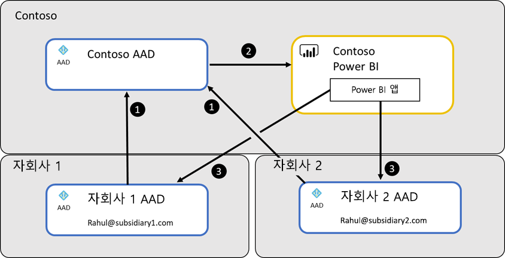

이 다음 프로세스는 다음과 같습니다.

1. 각 지사에서 사용자가 초대 하는 Contoso의 azure AD
2. 액세스 권한을 부여 하려면 이러한 사용자에이 게 필요한 데이터를 Power BI 앱이 게시 하는 다음
3. 사용자가 보고서를 보기 제공한 링크를 통해 앱을 열고 마지막으로,

몇 가지 중요 한 문제는이 구조에는 조직에서 직면:

- 링크 상위 조직의 Power BI에서 콘텐츠를 배포 하는 방법
- 보조 사용자가 부모 조직에서 호스트 되는 데이터 원본에 액세스 하도록 허용 하는 방법

#### 링크를 상위 조직의 Power BI에서 콘텐츠를 배포합니다.

내용에 대 한 링크를 배포 하려면 세 가지 방법은 자주 사용 됩니다. 첫 번째 고 대부분의 기본 열 수 있는 SharePoint Online 사이트에 배치 또는 필요한 사용자에 게 앱에 링크를 보낼 수 있습니다. 다음 사용자 브라우저나 필요한 데이터에 대 한 빠른 액세스에 대 한 링크를 책갈피를 지정할 수 있습니다.

두 번째 방법은 Power BI 콘텐츠 기능을 관리 하 고 조직 간 편집에 의존합니다. 상위 조직의 해당 Power BI에 액세스 하는 지사에서 사용자를 허용 하 고 사용 권한을 통해 액세스할 수 있는 내용을 제어 합니다. Power BI 홈 상위 조직의 테 넌 트에서 공유 하는 콘텐츠 목록을 해당 지사에서 사용자에 게 표시 위치에 액세스할을 수 있습니다. 그런 다음 상위 조직의 Power BI 환경에 대 한 URL은 자회사에 노출 된 사용자 지정 됩니다.

마지막 방법은 각 대리점에 대 한 Power BI 테 넌 트 내에서 만든 Power BI 앱을 사용 합니다. Power BI 앱을 사용 하 여 대시보드를 포함 [외부 링크 옵션을 사용 하 여 구성 하는 타일](https://docs.microsoft.com/power-bi/service-dashboard-edit-tile#hyperlink)합니다. 사용자가 타일을 누르면 적합 한 보고서, 대시보드 또는 상위 조직의 Power BI에서 앱을 가져옵니다. 이 방법은 앱 해당 지사에 모든 사용자에 대해 자동으로 설치할 수 있고 자신의 Power BI 환경에 로그인 할 때마다을에 사용할 수 있다는 이점이 있습니다. 이 방식의 장점은 추가 링크를 고유 하 게 열 수 있는 Power BI 모바일 앱에서 잘 작동 한다는 것입니다. Power BI 환경 간에 쉽게 전환할 수 있도록 두 번째 방법을 사용 하 여이 결합할 수도 있습니다.

#### 보조 사용자가 부모 조직에서 호스트 되는 데이터 원본에 액세스 하도록 허용

자회사에 분석가 종종 부모 조직에서 제공 하는 데이터를 사용 하 여 자신의 analytics 만들려고 합니다. 이 경우 일반적으로 문제를 해결 하려면 클라우드 데이터 원본 사용 됩니다.

첫 번째 접근 방식을 활용 [Azure Analysis Services](https://docs.microsoft.com/azure/analysis-services/analysis-services-overview) 부모 및 다음 이미지와 같이 그 자회사에서 분석가의 요구 사항을 충족 하는 엔터프라이즈 등급 데이터 웨어하우스를 빌드할 수 있습니다. Contoso는 데이터를 호스트 하 고 각 지사에는 사용자를 위해 행 수준 보안만 데이터에 액세스할 수와 같은 기능을 사용할 수 있습니다. 분석가 각 조직에서 Power BI Desktop을 통해 데이터 웨어하우스에 액세스할 하 고 해당 Power BI 테 넌 트 분석 결과 게시할 수 있습니다.

두 번째 접근 방식을 활용 [Azure SQL Database](https://azure.microsoft.com/services/sql-database/) 데이터 액세스를 제공 하기 위해 관계형 데이터 웨어하우스를 빌드할 수 있습니다. 이 유사 하 게 작동 하는 Azure Analysis Services 방식으로 하지만 행 수준 보안은 배포 및 자회사를 통해 유지 관리가 어려울 수 있습니다와 같은 일부 기능.

위 수의 가장 일반적인 보다 정교한 접근 가능한도.

### 사례 3: 파트너 간에 공유 환경

Contoso는 공동으로 공유 어셈블리 줄에 자동차를 빌드 하지만 차량 다른 브랜드 또는 서로 다른 지역에 배포 하는 경쟁 업체와 파트너 관계에 입력할 수 있습니다. 이 광범위 한 공동 작업 및 데이터, 인텔리전스 및 분석 co-ownership 조직에 필요합니다. 이 구조는 또한 컨설팅 서비스 업계에서 일반적으로 컨설턴트 팀을 클라이언트에 대 한 프로젝트 기반 분석을 수행할 수 있습니다.

실제로 이러한 구조는 다음 이미지와 같이 복잡 한 이며 유지 관리 담당자가 필요 합니다. 적용 되려면 조직이 해당 Power BI 테 넌 트에 대 한 구매한 Power BI Pro 라이선스를 다시 사용할 수 있으므로이 구조는 Power BI 콘텐츠 기능을 관리 하 고 조직 간 편집에 사용 합니다.

공유 Power BI 테 넌 트를 설정 하려면 Azure Active Directory를 만들어야 하 고 하나 이상의 Power BI Pro 사용자 계정 active directory에서 사용자에 대 한 구입 해야 합니다. 이 사용자는 공유 조직에 필요한 사용자를 초대 합니다. 중요 한 점은이 시나리오에서는 Contoso의 사용자에 게 처리할지 외부 사용자로 공유 조직의 Power BI 내에서 작동 하는 경우.

프로세스는 다음과 같습니다.

1. 공유 조직의 새 Azure Active Directory로 구축 및 새 조직에 하나 이상의 사용자 계정이 만들어집니다. 해당 사용자를 할당 하는 Power BI Pro 라이선스가 있어야 합니다.
2. 다음이 사용자는 Power BI 테 넌 트를 설정 하 고 Contoso 파트너 조직에서 필요한 사용자를 초대 합니다. 사용자는 또한 Azure Analysis Services와 같은 모든 공유 데이터 자산을 설정합니다. Contoso와 파트너의 사용자가 게스트 사용자로 공유 조직의 Power BI를 액세스할 수 있습니다. 편집 하 고 Power BI에서 콘텐츠 관리를 허용 하는 경우 외부 사용자 수를 사용 하 여 Power BI 홈, 작업 영역, 업로드, 콘텐츠 편집 보고서를 공유 합니다. 일반적으로 모든 공유 자산은 저장 되 고 공유 조직에서 액세스 됩니다.
3. 파티 공동 작업을 동의 하는 방법에 따라 자신의 소유 데이터 및 공유 데이터 웨어하우스 자산을 사용 하 여 분석을 개발 하는 각 조직에 대 한 가능성이 있습니다. 이러한 내부 Power BI 테 넌 트를 사용 하 여 각 내부 사용자에 게 배포할 수 있습니다.

### 사례 4: 수백 또는 수천 개의 외부 파트너 배포

Contoso를 공급자에 대 한 증폭기 안정성 보고서를 만드는 동안 이제 Contoso 하려고 수백 개 공급 업체에 대해 일련의 표준화 된 보고서를 만듭니다. 이렇게 하면 모든 공급자가 제조 결함을 수정 또는 개선 하기 위해 필요한 분석을 확인 하기 위해 Contoso.

조직에서 표준화 된 데이터 및 다 수의 외부 사용자/조직 insights 배포 필요한 경우 사용할 수 있습니다 Power BI 앱 시나리오의 계획 된 또는 임시 공유 신속 하 고 광범위 한 개발 비용 없이 BI 포털을 구축 하려면. Power BI 앱을 사용 하 여 이러한 포털을 빌드하기 위한 프로세스에는 사례 연구에서 설명 합니다. Power BI를 사용 하 여 BI Portal + Azure AD B2B-단계별 지침은이 문서의 뒷부분에 작성 중입니다.

이 경우의 일반적인 변형 때 조직의 Power BI를 사용 하 여 Azure B2C를 사용 하려는 경우에 특히 소비자를 사용 하 여 정보를 공유 하려고 합니다. Power BI는 Azure B2C를 고유 하 게 지원 하지 않습니다. 이 경우에 대 한 옵션을 평가 하 고이 문서 뒷부분의 섹션 일반적인 대체 접근 방식에서는 대체 옵션 2를 사용 하는 것이 좋습니다.

## 사례 연구: Power BI를 사용 하 여 BI Portal + Azure AD B2B – 단계별 지침을 구축

Contoso 해당 BI 포털에 대 한 보안 액세스를 사용 하 여 게스트 사용자를 제공 하는 원활한, 간편한 방법을 제공 하는 Azure AD B2B를 사용 하 여 power BI의 통합 합니다. Contoso 설정할 수 있습니다이 세 단계를 사용 하 여.

1. Power BI에서 BI 포털 만들기

    Contoso에 대 한 첫 번째 작업 Power BI에서 해당 BI 포털을 만드는 것입니다. Contoso의 BI 포털 사용 가능 하 게 여러 내부 및 게스트 사용자에 게는 특화 된 대시보드 및 보고서의 컬렉션으로 구성 됩니다. Power BI에서이 작업을 수행 하는 것에 대 한 Power BI 앱을 빌드하는 것이 좋습니다. 에 대해 자세히 알아보세요 [Power BI에서 앱](https://powerbi.microsoft.com/blog/distribute-to-large-audiences-with-power-bi-apps/)합니다.

- Contoso의 BI 팀은 Power BI에서 앱 작업 영역을 만듭니다.

    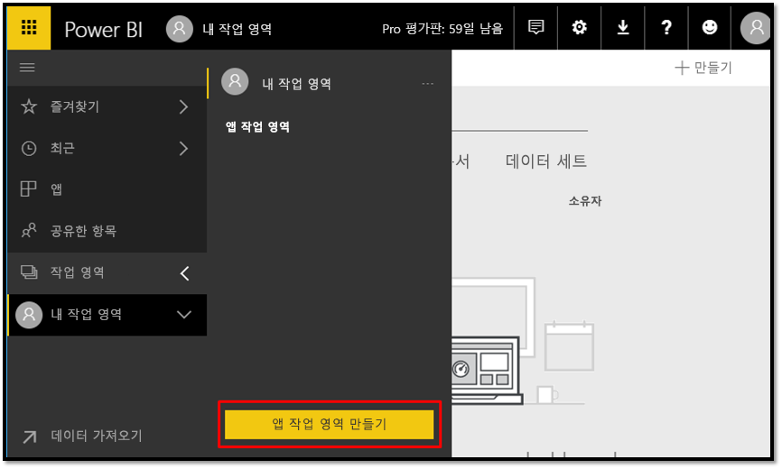
    

- 작업 영역에 추가할 다른 작성자

    

- 콘텐츠 내 작업 영역에서 만들어집니다.

    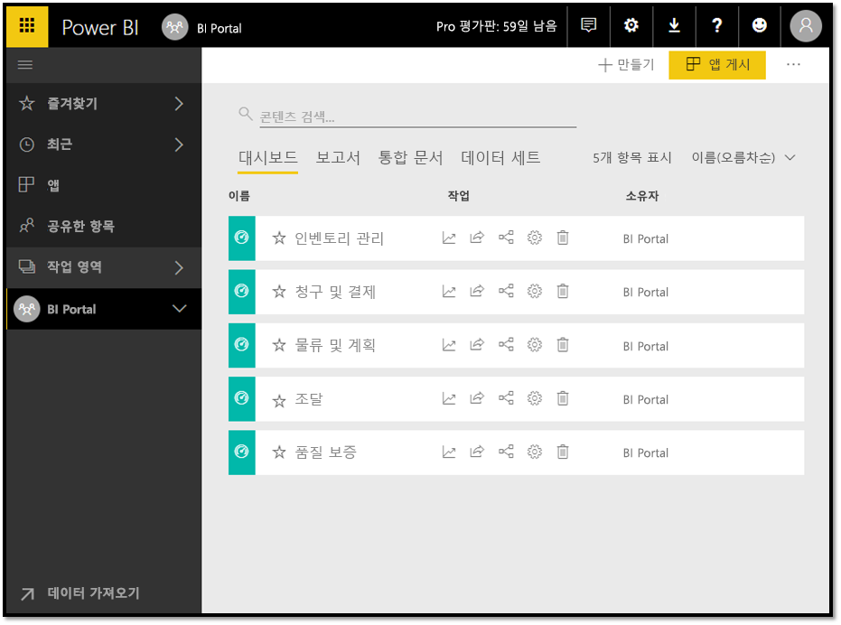

    이제 콘텐츠를 앱 작업 영역에서을 만들었으므로 Contoso는이 콘텐츠를 소비할 파트너 조직에서 게스트 사용자 초대를 준비 합니다.

2. 게스트 사용자 초대

    Power BI에서 해당 BI 포털에 게스트 사용자를 초대 하기 위해 Contoso에 대 한 두 가지 있습니다.

    * 계획된 초대
    * 임시 초대

    **계획된 초대**

    이 방법에서는 Contoso 미리 해당 Azure AD에 게스트 사용자 초대 및 다음에 Power BI 콘텐츠를 배포 합니다. Contoso는 Azure portal 또는 PowerShell을 사용 하 여 게스트 사용자를 초대할 수 있습니다. Azure portal에서 게스트 사용자를 초대 하는 단계는 다음과 같습니다.

    - Contoso의 Azure AD 관리자가 이동할 **Azure portal > Azure Active Directory > 사용자 및 그룹 > 모든 사용자 > 새 게스트 사용자**

    

    - 게스트 사용자에 대 한 초대 메시지를 추가 하 고 초대를 클릭 합니다.

    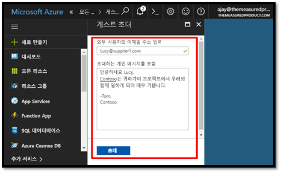

    > [!NOTE]
    > Azure portal에서 게스트 사용자를 초대 하려면 테 넌 트의 Azure Active directory 관리자에 게 지정 해야 합니다.

    Contoso 많은 게스트 사용자를 초대, 따라서 PowerShell을 사용 하 여 수행할 수 있습니다. Contoso의 Azure AD 관리자는 CSV 파일의 모든 게스트 사용자의 전자 메일 주소를 저장합니다. 다음과 같습니다 [Azure Active Directory B2B 공동 작업 코드 및 PowerShell 샘플](https://docs.microsoft.com/azure/active-directory/b2b/code-samples) 및 지침입니다.

    초대를 후 게스트 사용자 초대 링크를 사용 하 여 전자 메일을 받게 됩니다.

    

    게스트 사용자가 링크를 클릭 한 후에 Contoso Azure AD 테 넌 트에서 콘텐츠를 액세스할 수 있습니다.

    > [!NOTE]
    > 설명 된 대로 Azure AD 브랜딩 기능을 사용 하 여 초대 전자 메일의 레이아웃을 변경할 수 있기 [여기](https://docs.microsoft.com/azure/active-directory/active-directory-b2b-invitation-email)합니다.

    **임시 초대**

    Contoso는 미리 초대 하려는 모든 게스트 사용자 알지 될까요? 또는 BI 포털을 만든 Contoso에서 분석가 자신 게스트 사용자에 게 콘텐츠를 배포 하려고 하는 경우에 어떻게? Power BI에서이 시나리오 임시 초대를 사용 하 여 지원 수도 있습니다.

    방금 분석가 앱 액세스 목록에 외부 사용자를 추가할 수는 게시 된 경우. 게스트 사용자 초대를 가져오고 사용자가 동의 자동으로 리디렉션됩니다 Power BI 콘텐츠를 합니다.

    

    > [!NOTE]
    > 초대 조직 외부 사용자가 초대 하는 첫 번째 시간만 필요 합니다.

3. 콘텐츠 배포

    Contoso BI 팀에는 BI 포털을 만들고 게스트 사용자 초대를 앱에 게스트 사용자가 액세스할 수 있도록 게시 하 여 최종 사용자에 게 해당 포털을 배포할 수 있습니다. Contoso 테 넌 트에 이전에 추가한 게스트 사용자의 이름 자동 완성 하는 power BI입니다. 다른 게스트 사용자에 게 임시 초대가 시점에서 추가할 수 있습니다.

    > [!NOTE]
    > 보안 그룹을 사용 하 여 외부 사용자에 대 한 앱에 대 한 액세스를 관리 하는 경우 초대 계획 방법을 사용 하며 액세스 해야 하는 각 외부 사용자와 직접 앱 링크를 공유 합니다. 그렇지 않으면 외부 사용자를 설치 하거나 앱 내에서 콘텐츠를 볼 수 수 있습니다. _

    게스트 사용자가 앱에 대 한 링크를 사용 하 여 이메일을 받습니다.

    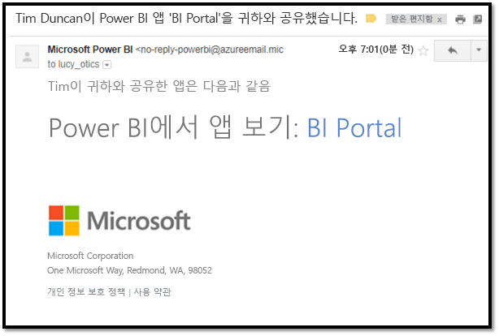

    이 링크를 클릭 하 여 게스트 사용자는 자신의 조직 id로 인증 하 라는 메시지가 표시 됩니다.

    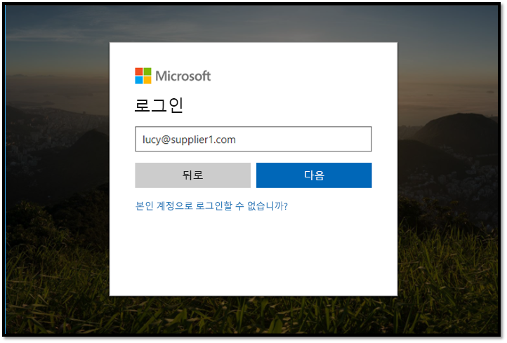

    성공적으로 인증 되 면 Contoso의 BI 응용 프로그램으로 리디렉션됩니다.

    

    게스트 사용자 이후에 책갈피 링크 또는 전자 메일의 링크를 클릭 하 여 Contoso의 응용 프로그램으로 가져올 수 있습니다. Contoso도 쉬워집니다 게스트 사용자에 대 한 게스트 사용자가 이미 사용 하는 모든 기존 엑스트라넷 포털에이 링크를 추가 하 여 합니다.

4. 다음 단계

    Contoso는 Power BI 앱 및 Azure AD B2B를 사용 하 여 신속 하 게 코드 없는 방식으로 해당 공급 업체에 대 한 BI 포털을 만들 수 있었습니다. 이 간단 하 게 표준화 된 analytics 필요할 수 있는 모든 공급자를 배포 합니다.

    이 예제에서는 공급 업체 간에 일반적인 단일 보고서를 배포할 수 있으며 하는 방법을 보여 주었습니다, 하는 동안 Power BI는 더 많은 이동할 수 있습니다. 각 파트너에 게 자체와 관련 된 데이터만 표시 되도록 행 수준 보안 보고서 및 데이터 모델에 쉽게 추가할 수 있습니다. 이 문서 뒷부분의 섹션 외부 파트너에 대 한 데이터 보안 세부 정보에서이 프로세스를 설명합니다.

    종종 개별 보고서 및 대시보드는 기존 포털에 포함 해야 합니다. 이 수행할 수도 있습니다는 대부분의 예제와 같이 방법은 다시 사용 합니다. 그러나 이러한 경우 쉽게 직접 작업 영역에서에서 대시보드 또는 보고서를 포함할 수 있습니다. 초대를 위한 보안 권한 할당 한 프로세스는 사용자가 동일 하 게 유지 해야 합니다.

## 내부 살펴보기: Contoso의 테 넌 트의 Power BI 콘텐츠를 액세스할 수 없게 Supplier1에서 Lucy 요금은 어떻게 되나요?

Contoso 파트너 조직에서 게스트 사용자에 게 Power BI 콘텐츠를 원활 하 게 배포할 수는 방법을 살펴본 했으므로 내부적인 작동 방식을 살펴 보겠습니다.

Contoso 초대 하는 경우 [ lucy@supplier1.com ](mailto:lucy@supplier1.com) 디렉터리를 Azure AD 간의 링크를 만듭니다 [ Lucy@supplier1.com ](mailto:Lucy@supplier1.com) 및 Contoso Azure AD 테 넌 트입니다. 이 링크 통해 Azure AD는 사실을 Lucy@supplier1.com Contoso 테 넌 트에서 콘텐츠에 액세스할 수 있습니다.

루시에 Contoso의 Power BI 앱에 액세스 하려고 하는 경우 Azure AD 확인 Lucy Contoso 테 넌 트에 액세스할 수 있습니다 Power BI 콘텐츠 Contoso 테 넌 트에 액세스 하려면 루시가 인증 되었는지 여부를 나타내는 토큰을 제공 합니다. Power BI는 권한을 부여 하 고 Lucy Contoso의 Power BI 앱에 대 한 액세스 권한을 갖는지 확인 하려면이 토큰을 사용 합니다.

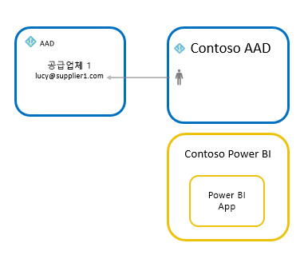

Azure AD B2B를 사용 하 여 power BI의 통합은 모든 비즈니스 전자 메일 주소를 사용 하 여 작동합니다. 사용자를 Azure AD id가 없으면가 만들려면 라는 메시지가 표시 될 수 있습니다. 다음 이미지에는 자세한 흐름을 보여 줍니다.

반드시 Azure AD 계정 사용 또는 외부 당사자에서 만든를 인식 하이는 Azure AD의 확인이 Lucy 자신의 사용자 이름 및 암호를 사용할 수 있으며 자신의 자격 증명은 자동으로 중지 하 여 다른 작업 때마다 테 넌 그녀 조직이 Azure AD에도 사용 하 여 때 회사를 둡니다.

## 라이선싱

Contoso 하나를 선택할 수 세 가지 라이선스 게스트 사용자에 게 해당 공급 업체 및 파트너 조직에서 Power BI 콘텐츠에 액세스할 수 있습니다.

> [!NOTE]
> _Azure AD B2B의 무료 계층은 Azure AD B2B를 사용 하 여 Power BI를 사용 하기에 충분 합니다. 동적 그룹 같은 일부 고급 Azure AD B2B 기능 추가 라이선스가 필요합니다. 추가 정보에 대 한 Azure AD B2B 설명서를 참조 하세요._ [_https://docs.microsoft.com/azure/active-directory/b2b/licensing-guidance_](https://docs.microsoft.com/azure/active-directory/b2b/licensing-guidance)

### 접근 방식 1: Power BI 프리미엄을 사용 하 여 Contoso

이 방법을 사용 하 여 Contoso Power BI 프리미엄 용량 구입이 용량에 해당 BI 포털 콘텐츠를 할당 합니다. 이 Power BI 라이선스 없이 Contoso의 Power BI 앱에 액세스 하려면 파트너 조직의 게스트 사용자 수 있습니다.

외부 사용자도 또한만 환경을 제공 하는 Power BI의 "무료" 사용자에 게 Power BI 프리미엄에 콘텐츠를 사용 하는 경우 사용 될 수 있습니다.

Contoso는 새로 고침 비율 증대, 전용된 용량, 대규모 모델 크기 등 해당 앱에 대해 다른 Power BI 프리미엄 기능을 걸릴 수도 수 있습니다.

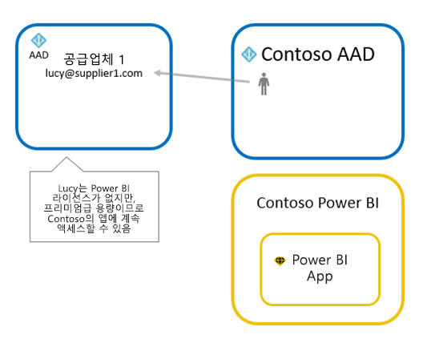

### 방법 2: Contoso는 게스트 사용자에 게 Power BI Pro 라이선스 할당

이 방법을 사용 하 여 Contoso pro 라이선스 할당 게스트 사용자에 게 파트너에서 조직 – Contoso의 Microsoft 365 관리 센터에서이 작업을 수행할 수 있습니다. 따라서 게스트 사용자를 파트너 조직 자체 라이선스를 구입 하지 않고도 Contoso의 Power BI 앱에 액세스 합니다. 조직의 Power BI 채택에 아직 외부 사용자와 공유 하는 것에 대 한 적절 한 수 있습니다.

> [!NOTE]
> _Contoso의 pro 라이선스는 Contoso 테 넌 트에서 콘텐츠에 액세스할 때만 게스트 사용자에 게 적용 됩니다. Pro 라이선스는 Power BI 프리미엄 용량에 있지 않은 콘텐츠에 액세스할 수 있도록 합니다. 그러나 Pro 라이선스가 있는 외부 사용자는 기본적으로 소비 환경에 제한 됩니다. 에 설명 된 방법을 사용 하 여 변경할 수 있습니다이_ _외부 사용자가 편집 하 고 Power BI 내에서 콘텐츠를 관리할 수 있도록_ _이 문서 뒷부분의 섹션입니다._

### 접근 방식 3: 게스트 사용자가 자신의 Power BI Pro 라이선스

이 방법을 사용 하 여 공급자 1 Lucy에 Power BI Pro 라이선스를 할당합니다. 그녀는 Contoso의 Power BI 앱이이 라이선스를 사용 하 여 액세스할 수 있습니다. 외부 Power BI 환경에 액세스할 때 Lucy 자신의 조직에서 자신의 Pro 라이선스를 사용할 수, 있으므로이 방법은 라고도 _사용자 라이선스_ (BYOL). 양사의 Power BI를 사용 하는 경우 전체 분석 솔루션에 대 한 유리 라이선스 제공이 고 외부 사용자에 게 라이선스를 할당 하는 오버 헤드를 최소화 합니다.

> [!NOTE]
> _Lucy 게스트 사용자 인 모든 Power BI 테 넌 트에 공급 업체 1만 루시에 지정 된 pro 라이선스가 적용 됩니다. Pro 라이선스는 Power BI 프리미엄 용량에 있지 않은 콘텐츠에 액세스할 수 있도록 합니다. 그러나 Pro 라이선스가 있는 외부 사용자는 기본적으로 소비 환경에 제한 됩니다. 에 설명 된 방법을 사용 하 여 변경할 수 있습니다이_ _외부 사용자가 편집 하 고 Power BI 내에서 콘텐츠를 관리할 수 있도록_ _이 문서 뒷부분의 섹션입니다._

## 외부 파트너에 대 한 데이터 보안

여러 외부 공급자를 사용 하는 경우에 일반적으로 Contoso를 각 공급자에 고유한 제품에 대 한 데이터가 표시 되는 확인 해야 합니다. 사용자 기반 보안 및 동적 행 수준 보안 쉽게이 Power BI를 사용 하 여 수행할 수 있습니다.

### 사용자 기반 보안

Power BI의 가장 강력한 기능 중 하나는 행 수준 보안입니다. 이 기능을 사용 하면 단일 보고서 및 데이터 집합을 만들지만 각 사용자에 대 한 다른 보안 규칙을 적용 하기 위해 Contoso. 자세한 설명은 참조 하세요. [행 수준 보안 (RLS)](https://powerbi.microsoft.com/documentation/powerbi-admin-rls/)합니다.

Azure AD B2B를 사용 하 여 power BI의 통합에 Contoso를 Contoso 테 넌 트에 초대 되는 즉시 행 수준 보안 규칙 게스트 사용자에 게 할당할 수 있습니다. Contoso 중 하나를 통해 게스트 사용자를 추가할 수 전에 살펴본 것 처럼 계획 된 또는 임시 초대 합니다. Contoso에서 행 수준 보안을 적용 하려는 경우 콘텐츠를 공유 하기 전에 보안 역할에 할당 하는 시간 미리 게스트 사용자를 추가 하려면 계획된 초대를 사용 하는 것이 좋습니다는 것입니다. Contoso를 대신 사용 하는 경우 임시 초대, 있을 짧은 시간 안에 없는 게스트 사용자 모든 데이터를 볼 수는 있습니다.

> [!NOTE]
> 비어 있거나 받은 전자 메일에 연결 된 공유 열기 보고서/대시보드를 찾고 손상 된 사용자 표시 하므로 IT 팀에 대 한 요청을 지원 하기 위해 임시를 사용 하 여 초대 하는 경우 RLS에 의해 보호 되는 데이터에 액세스할 때이 지연 발생할 수 있습니다. 따라서 것이 좋습니다이 scenario.* *에서 계획된 초대를 사용 하려면

예를 들어가 과정을 살펴보겠습니다.

앞서 언급 했 듯이 Contoso 공급 업체를 전 세계 있으며 공급자 조직에서 사용자만 해당 지역에서 데이터에서 통찰력을 얻기는 있는지 확인 하고자 합니다.  하지만 사용자가 Contoso에서 모든 데이터에 액세스할 수 있습니다. 여러 다양 한 보고서를 만드는 대신 Contoso 단일 보고서를 만들고 데이터를 필터링 하기를 보는 사용자를 기반으로 합니다.

Contoso 연결 되어 있는 사용자를 기반으로 데이터를 필터링 할 수 있는지를 Power BI desktop에서 두 가지 역할이 생성 됩니다. 다른 "북아메리카" 및 SalesTerritory "유럽"의 모든 데이터를 필터링 할 하나입니다.

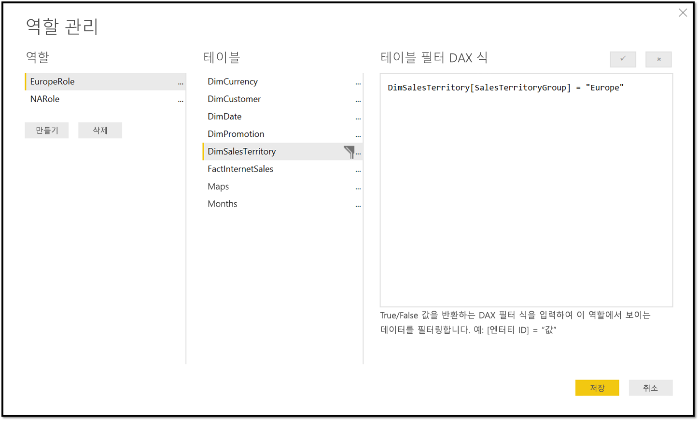

역할은 보고서에 정의 된, 때마다 사용자는 모든 데이터에 액세스 하기 위해 특정 역할에 할당 되어야 합니다. Power BI 서비스 내에서 발생 하는 역할 할당 ( **데이터 집합 > 보안** )

Contoso BI 팀이 두 가지를 볼 수 있는 페이지가 열립니다 자신이 만든 역할입니다.  이제 Contoso BI 팀은 역할에 사용자를 할당할 수 있습니다.

Contoso는 전자 메일 주소를 사용 하 여 파트너 조직에서 사용자 예제에서 추가 "[adam@themeasuredproduct.com](mailto:adam@themeasuredproduct.com)" 유럽 역할:

이 Azure AD에서 확인을 하는 경우 Contoso 표시 창에 추가할 준비가 이름을 볼 수 있습니다.

이제이 사용자가 저와 공유한 앱을 열 때만 느껴질 유럽의 데이터로 보고서:

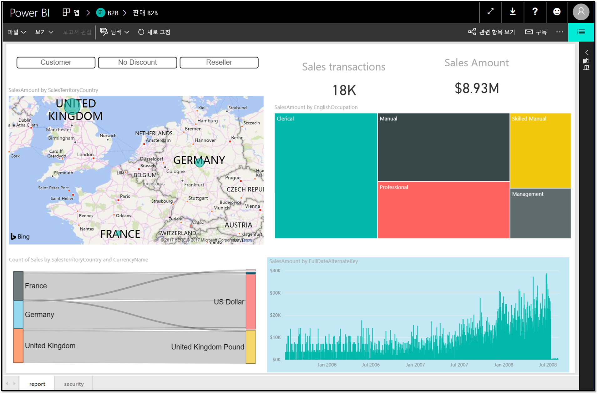

### 동적 행 수준 보안

다른 흥미로운 항목 어떻게 동적 행 수준 보안 (RLS) Azure AD B2B 작업을 확인 하는 것입니다.

즉, Power BI에 연결 하는 사용자의 사용자 이름에 따라 모델의 데이터를 필터링 하 여 동적 행 수준 보안 작동 합니다. 사용자 그룹에 대해 여러 역할에 추가 하는 대신 모델의 사용자를 정의 합니다. 여기에서는 자세히 패턴을 설명 하지 않습니다. Kasper de jong의 자세한 안내가 자세한 쓰기 최대 행 수준 보안의 모든 버전에서 제공 [Power BI Desktop 동적 보안 치트 시트](https://www.kasperonbi.com/power-bi-desktop-dynamic-security-cheat-sheet/), 및 [이 백서](https://msdn.microsoft.com/library/jj127437.aspx) 합니다.

작은 예제를 살펴보겠습니다-Contoso는 그룹에 의해 매출을 간단한 보고서를 확인 합니다.

이 보고서를 두 게스트 사용자는 내부 사용자와 공유 해야 합니다.-내부 사용자는 모든 것을 볼 수 있지만 게스트 사용자 그룹을 볼 수는 이제 액세스 권한을 가져야 합니다. 즉, 게스트 사용자에 대해서만 데이터 필터링 해야 합니다. 데이터를 적절 하 게 필터링 하려면 Contoso 백서 및 블로그 게시물에 설명 된 대로 동적 RLS 패턴을 사용 합니다. 즉, Contoso 데이터 자체에 사용자를 추가 합니다.

그런 다음 Contoso 올바른 관계를 사용 하 여 적절 하 게 데이터를 필터링 하는 적절 한 데이터 모델을 만듭니다.

는 로그인 한 사용자에 따라 자동으로 데이터를 필터링 하려면 Contoso를 연결 하는 사용자에서 전달 하는 역할을 만드는 해야 합니다. 이 예에서 Contoso 만듭니다 두 역할, 즉 첫 번째는 "securityrole" (Azure AD B2B 게스트 사용자에 대해서도 작동) Power BI에 로그인 한 사용자의 현재 사용자 이름 사용 하 여 사용자 테이블을 필터링 하는 것입니다.

Contoso 것을 볼 수 있는 내부 사용자는 다른 "AllRole" 만듭니다 –이 역할 보안 조건자를 갖지 않습니다.

Power BI 데스크톱 파일을 서비스에 업로드 한 후 Contoso 게스트 사용자를 할당할 수 "SecurityRole" 및 "AllRole" 내부 사용자

이제 게스트 사용자가 보고서를 열면 해당만 봅니다 그룹 a: 판매액

행렬 오른쪽에 있는 게스트 사용자 이메일 주소 둘 다 반환 username () 및 userprincipalname () 함수의 결과 볼 수 있습니다.

이제 내부 사용자는 모든 데이터를 가져옵니다.

알 수 있듯이 동적 RLS 내부 또는 게스트 사용자를 사용 하 여 작동 합니다.

> [!NOTE]
> 이 시나리오는 Azure Analysis Services에서 모델을 사용 하는 경우에 작동 합니다. 일반적으로 Azure Analysis Service는 Power BI로 Azure AD에 연결-Azure Analysis Services를 통해 Azure AD B2B 초대 된 게스트 사용자도 인식 되는 경우.

## 온-프레미스 데이터 원본에 연결

와 같은 온 프레미스 데이터 원본에서 활용 하 여 Contoso에 대 한 기능을 제공 하는 power BI [SQL Server Analysis Services](https://powerbi.microsoft.com/documentation/powerbi-gateway-enterprise-manage-ssas/) 하거나 [SQL Server](https://powerbi.microsoft.com/documentation/powerbi-gateway-kerberos-for-sso-pbi-to-on-premises-data/) 덕분에 직접는 [온-프레미스데이터게이트웨이](https://powerbi.microsoft.com/documentation/powerbi-gateway-onprem/). 도 Power BI를 사용 하 여 사용 된 것과 동일한 자격 증명을 사용 하 여 해당 데이터 원본에 로그인 하는 것이 가능 합니다.

> [!NOTE]
> Power BI 테 넌 트에 연결 하려면 게이트웨이 설치할 때 만든 테 넌 트 내에서 사용자를 사용 해야 합니다. 외부 사용자 수 없습니다. 게이트웨이 설치 하 고 테 넌 트에 연결 합니다. _

외부 사용자를 위해 온-프레미스에 외부 사용자에 게 알려지지 않은 일반적으로 더 복잡 수 있습니다 AD입니다. Power BI는 Contoso 관리자에 설명 된 대로 내부 사용자 이름에 외부 사용자 이름에 매핑할 수 있도록 하 여이 대 한 해결 방법을 제공 [데이터 원본 관리-Analysis Services](https://powerbi.microsoft.com/documentation/powerbi-gateway-enterprise-manage-ssas/)합니다. 예를 들어 [ lucy@supplier1.com ](mailto:lucy@supplier1.com) 매핑할 수 있습니다 [lucy\_supplier1\_com #EXT@contoso.com](mailto:lucy_supplier1_com)합니다.

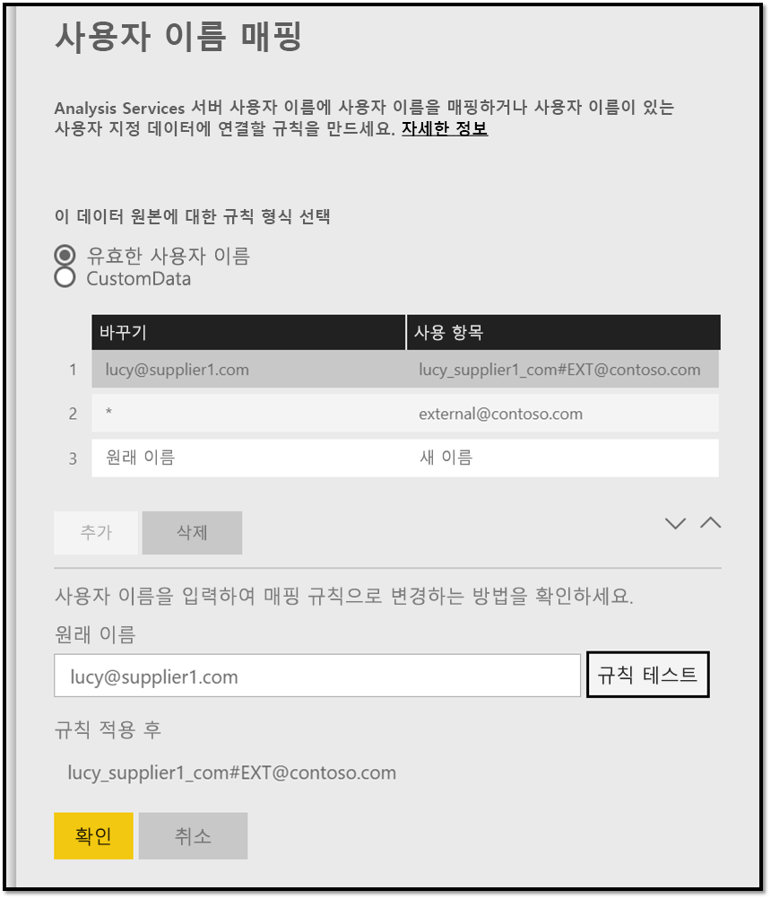

이 메서드는 Contoso에 소수의 사용자 또는 경우 Contoso 단일 내부 계정에 모든 외부 사용자를 매핑할 수 있는 세밀 하 게 합니다. 더 복잡 한 시나리오를 각 사용자가 자신의 자격 증명을 해야 하는 위치에 사용 하는 고급 방법을 [사용자 지정 AD 특성](https://technet.microsoft.com/library/cc961737.aspx) 에 설명 된 대로 매핑을 수행 하도록 [AnalysisServices-데이터원본관리](https://powerbi.microsoft.com/documentation/powerbi-gateway-enterprise-manage-ssas/). 이렇게 하면 Contoso 관리자 (외부 B2B 사용자도 함) Azure AD에서 모든 사용자에 대 한 매핑을 정의할 수 있습니다.  Contoso 초대 또는 예약 된 작업 리듬을 매핑을 완전히 자동화할 수 있도록 스크립트 또는 코드를 사용 하 여 AD 개체 모델을 통해 이러한 특성을 설정할 수 있습니다.

## 외부 사용자가 편집 하 고 Power BI 내에서 콘텐츠를 관리할 수 있도록

Contoso 외부 사용자가 조직 간 편집와 관리를 Power BI 콘텐츠 섹션에서 설명한 대로 조직 내에서 콘텐츠를 제공할 수 있습니다.

> [!NOTE]
> 를 편집 하 고 조직의 Power BI 내에서 콘텐츠 관리 사용자 내 작업 영역 아닌 작업 영역에서 Power BI Pro 라이선스가 있어야 합니다. 출력물에서 살펴본 것 처럼 사용자가 Pro 라이선스를 얻을 수 _이 문서의 Licensing__section 합니다._

Power BI 관리 포털을 제공 합니다 **외부 게스트 사용자를 편집 및 관리를 조직에 콘텐츠 허용** 테 넌 트 설정에서 설정 합니다. 기본적으로 사용 안 함, 외부 사용자에 게 기본적으로 제한 된 읽기 환경을 얻을 수를 의미 하는 설정은 설정 됩니다. Azure AD에 게스트를 설정 하는 usertype 사용자에 게 설정을 적용 됩니다. 아래 표에서 사용자 경험의 UserType 및 설정을 구성 하는 방법에 따라 동작을 설명 합니다.

| **Azure AD의 사용자 유형** | **외부 게스트 사용자가 편집 및 콘텐츠 설정을 관리 하도록 허용** | **Behavior** |
| --- | --- | --- |
| 게스트 | (기본값) 사용자에 대 한 사용 안 함 | 당 항목 전용 뷰를 사용 합니다. 보고서, 대시보드 및 게스트 사용자에 게 전송 URL을 통해 볼 때 앱에 대 한 읽기 전용 액세스를 허용 합니다. Power BI 모바일 앱 게스트 사용자에 게 읽기 전용 보기를 제공합니다. |
| 게스트 | 사용자에 대해 사용 하도록 설정 | 외부 사용자가 전체 Power BI 환경에 대 한 일부 기능을 사용할 수 없는 경우에 합니다. 외부 사용자는 Power BI 서비스 URL을 사용 하 여 포함 된 테 넌 트 정보를 사용 하 여 Power BI에 로그인 해야 합니다. 홈 환경, 내 작업 영역 및 권한 별로 찾아보기, 사용자 가져옵니다 본 콘텐츠를 만듭니다.    Power BI 모바일 앱 게스트 사용자에 게 읽기 전용 보기를 제공합니다. |

> [!NOTE]
> 외부 사용자가 Azure AD의 UserType 멤버에 설정할 수도 있습니다. 이 현재 지원 되지 않습니다 Power BI에서.

Power BI 관리 포털에서 설정은 다음 이미지에 표시 됩니다.

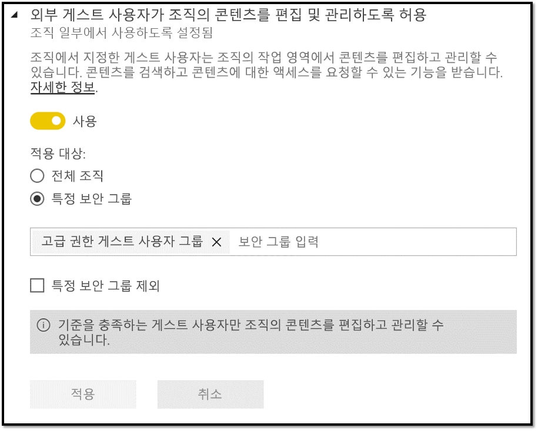

게스트 사용자에 게 읽기 전용 기본 환경 및 편집 하 고 콘텐츠를 관리할 수 있는 얻습니다. 기본값은 Disabled 모든 게스트 사용자가 읽기 전용 경험을 의미 합니다. Power BI 관리자 Azure AD에 정의 된 특정 보안 그룹 또는 조직에서 모든 게스트 사용자에 대 한 설정을 활성화할 합니다. 다음 이미지에서는 Contoso Power BI 관리자는 외부 사용자가 편집한 Contoso 테 넌 트의 콘텐츠 관리를 관리 하려면 Azure AD에서 보안 그룹을 만들었습니다.

Power BI에 로그인 하려면 이러한 사용자를 위해 테 넌 트 URL을 제공 합니다. 테넌트 URL을 찾으려면 이 단계를 수행합니다.

1. 위쪽 메뉴에서 Power BI 서비스에서 도움말을 선택 합니다 ( **?** ) 한 다음 **Power BI에 대 한**합니다.
2. 에 다음 값을 찾습니다 **테 넌 트 URL**합니다. 게스트 사용자와 공유할 수 있습니다 테 넌 트 URL입니다.

    

허용 외부 게스트 사용자를 사용 하 여 편집 하 고 조직에서 콘텐츠 관리를 지정 된 게스트 사용자는 조직의 Power BI에 대 한 액세스를 가져오고 권한이 할 내용을 참조 하세요. 홈 액세스, 찾아보기 및 작업 영역에 콘텐츠를 제공할 및 액세스 목록에 있는 앱을 설치할 수 있습니다는 내 작업 영역입니다. 또 새로운 작업 영역 환경을 사용하는 작업 영역의 관리자를 만들거나 관리자가 될 수 있습니다.

> [!NOTE]
> 경우이 옵션을 사용 해야 기본 Azure AD 설정을 감소 experience.* *를 야기할 수 있는 사용자 선택기와 같은 특정 기능을 사용 하려면 게스트 사용자를 차단 하므로이 문서는 거 버 넌 스 섹션을 검토 하세요.

허용 외부 게스트 사용자를 편집 하 고 조직 테 넌 트 설정에서 콘텐츠 관리를 통해 사용 하도록 설정 하는 게스트 사용자에 대 한 몇 가지 환경에 제공 되지 않습니다. 을 업데이트 하거나 보고서를 게시 하려면 게스트 사용자는 Power BI 서비스 웹 UI, Power BI Desktop 파일을 업로드 하려면 가져올 데이터를 포함 하 여 사용 해야 합니다. 다음 환경은 지원되지 않습니다.

- Power BI Desktop에서 Power BI 서비스에 직접 게시
- 게스트 사용자는 Power BI Desktop를 사용하여 Power BI 서비스의 서비스 데이터 세트에 연결할 수 없습니다.
- Office 365 그룹에 연결된 클래식 작업 영역: 게스트 사용자는 이들 작업 영역의 관리자를 만들거나 관리자가 될 수 없습니다. 이들은 구성원이 될 수 있습니다.
- 작업 영역 액세스 목록 임시 초대 전송이 지원되지 않습니다
- 게스트 사용자에게는 Power BI Publisher for Excel이 지원되지 않습니다
- 게스트 사용자는 Power BI Gateway를 설치하여 조직에 연결할 수 없습니다
- 게스트 사용자는 전체 조직에 게시된 앱을 설치할 수 없습니다
- 게스트 사용자는 조직 컨텐츠 팩을 사용, 생성, 업데이트 또는 설치할 수 없습니다
- 게스트 사용자는 Excel의 분석을 사용할 수 없습니다
- 게스트 사용자 일 수 없습니다 @mentioned 에 주석 달기 (이 기능은 향후 릴리스에서 추가 될 예정임)
- 게스트 사용자 (이 기능은 향후 릴리스에서 추가 될 예정임) 구독을 사용할 수 없습니다.
- 이 기능을 사용하는 게스트 사용자는 회사 또는 학교 계정이 있어야 합니다. 개인 계정을 사용 하 여 게스트 사용자 로그인 제한으로 인해 더 많은 제한이 발생 합니다.

## 거버넌스

### Azure AD B2B와 관련 된 Power BI에서 환경에 영향을 주는 추가 Azure AD 설정

Azure AD B2B 공유를 사용 하는 경우 Azure Active Directory 관리자가 외부 사용자의 환경의 측면을 제어 합니다. 이러한 테 넌 트에 대 한 Azure Active Directory 설정 내에서 외부 공동 작업 설정 페이지에서 제어 됩니다.

설정에 대 한 세부 정보는 다음과 같습니다.

[https://docs.microsoft.com/azure/active-directory/b2b/delegate-invitations](https://docs.microsoft.com/azure/active-directory/b2b/delegate-invitations)

> [!NOTE]
> 기본적으로 게스트 사용자 권한은 제한 옵션을 Yes로 설정, 게스트 사용자에 게 Power BI 내에서 환경에 특히 제한 되어 있으므로 주위에 공유 사용자 사용자 선택기 Ui를 작동 하지 않습니다. 아래와 같이 되도록 좋은 experience.* *로 설정 하려면 Azure AD 관리자를 사용 하는 것이 반드시

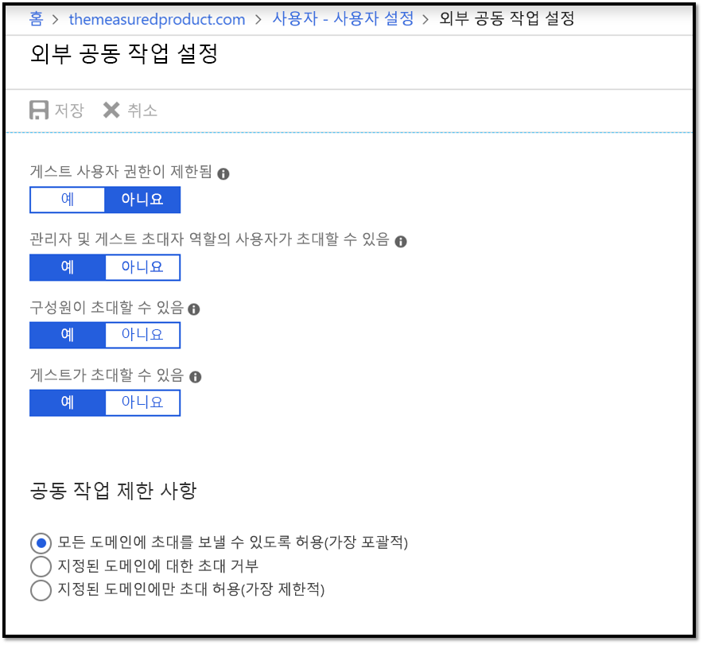

### 컨트롤 게스트 초대

Power BI 관리자는 Power BI 관리 포털을 방문 하 여 Power BI에 대 한 외부 공유를 제어할 수 있습니다. 하지만 테 넌 트 관리자는 다양 한 Azure AD 정책을 사용 하 여 외부 공유를 제어할 수도 있습니다.  이러한 정책은 관리자가 테 넌 트 수

- 최종 사용자가 초대 해제
- 관리자 및 게스트 초대자 역할의 사용자를 초대할 수 있습니다.
- 관리자, 게스트 초대자 역할 및 구성원은 초대
- 게스트를 포함 한 모든 사용자를 초대할 수 있음

자세한 내용은에서 이러한 정책에 대 한 [Azure Active Directory B2B 공동 작업 초대 위임](https://docs.microsoft.com/azure/active-directory/active-directory-b2b-delegate-invitations)합니다.

외부 사용자가 모든 Power BI 작업 역시 [감사 포털의 감사](https://powerbi.microsoft.com/documentation/powerbi-admin-auditing/)합니다.

### 게스트 사용자에 대 한 조건부 액세스 정책

Contoso는 Contoso 테 넌 트의 콘텐츠를 액세스 하는 게스트 사용자에 대 한 조건부 액세스 정책을 적용할 수 있습니다. 상세한 지침을 찾을 수 있습니다 [B2B 공동 작업 사용자에 대 한 조건부 액세스](https://docs.microsoft.com/azure/active-directory/active-directory-b2b-mfa-instructions)합니다.

## 일반적인 대안

Azure AD B2B를 사용 하면 조직에서 데이터 및 보고서를 공유할 쉽게, 몇 가지가 있습니다 다른 일반적으로 사용 되는 경우가 더 우수할 수 있습니다.

### 대체 옵션 1: 파트너에 대 한 중복 id 사용자 만들기

이 옵션을 사용 하 여 Contoso 다음 이미지에 표시 된 대로 Contoso 테 넌 트에 각 파트너 사용자에 대 한 중복 된 id를 수동으로 만들려고 했습니다. 그런 다음 Power BI 내에서 Contoso 공유할 수 할당 된 id에 적절 한 보고서, 대시보드 또는 앱.

이 대안을 선택 하는 이유:

- 사용자의 id는 조직에서 제어 됩니다, email, SharePoint와 같은 서비스 관련를 조직의 컨트롤 내에서 등도. IT 관리자에 게 암호를 재설정할 계정에 대 한 액세스를 사용 하지 않도록 설정 하거나 이러한 서비스에서 작업을 감사할 수 있습니다.
- 따라서 종종 업무 특정 서비스에 액세스 하지 못하도록 제한 됩니다에 대 한 개인 계정을 사용 하는 사용자가 조직 계정을 해야 합니다.
- 일부 서비스는 조직의 사용자만 작동합니다. 예를 들어 Azure B2B를 사용 하 여 외부 사용자의 개인/모바일 장치의 콘텐츠를 관리 하려면 Intune을 사용 하 여 불가능할 수도 있습니다.

이 대안을 선택할 필요가 이유:

- 파트너 조직에서 사용자의 자격 증명 – Contoso에서 콘텐츠에 액세스 하기 위한 자체 조직 및 다른 콘텐츠에 액세스할 수 있는 두 해야 합니다. 이러한 게스트 사용자에 대 한 일 이므로 여러 게스트 사용자가이 환경으로 혼동 됩니다.
- Contoso는 구입 하 고 이러한 사용자에 게 사용자별 라이선스를 할당 해야 합니다. 사용자 전자 메일을 받거나 office 응용 프로그램을 사용 하는 경우 적절 한 라이선스를 편집 하 고 Power BI에서 콘텐츠를 공유 하려면 Power BI Pro를 포함 하 여 해야 합니다.
- Contoso는 좀 더 엄격한 권한 부여 및 내부 사용자에 비해 외부 사용자에 대 한 거 버 넌 스 정책을 적용 하려고 합니다. 이 위해 Contoso 외부 사용자에 대 한 사내 명명법을 만드는 해야 하며 모든 Contoso 사용자는이 용어 체계에 대 한 사용자를 교육 해야 합니다.
- 사용자가 조직을 완료 하는 경우 계속 해 서 Contoso admin에 자신의 계정을 수동으로 삭제할 때까지 Contoso 리소스에 액세스할 수
- Contoso 관리자 만들기, 암호 다시 설정 등을 포함 하 여 게스트에 대 한 id를 관리 해야 합니다.

### 대체 옵션 2: 사용자 지정 인증을 사용 하 여 Power BI Embedded 사용자 지정 응용 프로그램 만들기

Contoso에 대 한 또 다른 옵션은 자체 사용자 지정 포함 된 Power BI 응용 프로그램 빌드 사용자 지정 인증을 사용 하 여 (['앱 소유 데이터'](https://docs.microsoft.com/power-bi/developer/embed-sample-for-customers)). 많은 조직에는 시간 또는 Power BI를 배포 하는 사용자 지정 응용 프로그램 콘텐츠 외부 파트너를 만들려면 리소스에 없는, 하는 동안 일부 조직에 가장 좋은 방법 이며은 중요 한 고려 사항.

종종 조직 있는 파트너에 대 한 모든 조직 리소스에 대 한 액세스를 중앙 집중화, 내부 조직 리소스의 격리를 제공 및 많은 파트너 지원 하기 위한 파트너를 위한 간소화 된 환경을 제공 하는 기존 파트너 포털 및 개별 사용자에 게 합니다.

각 공급 업체 로그인의 사용자를 Contoso의 파트너 포털에 위의 예에서 id 공급자로 AAD를 사용 하 합니다. AAD B2B, Azure B2C 기본 id를 사용 하 여 또는 임의 개수의 다른 id 공급자와 페더레이션 할 수 있습니다. 사용자는 로그인 하 고 Azure 웹 앱 또는 유사한 인프라를 사용 하 여 파트너 포털 빌드에 액세스 합니다.

Web app 내에서 Power BI 보고서는 Power BI Embedded 배포에서 포함 됩니다. 웹 앱은 보고서와 쉽게 Contoso와 상호 작용 하는 공급자에 대 한 대상으로 통합 된 환경에서 모든 관련된 서비스에 대 한 액세스를 간소화 합니다. 이 포털 환경 내부 Contoso AAD에서 격리 됩니다 하 고 해당 리소스 공급자를 확인 하려면 Contoso의 내부 Power BI 환경에 액세스할 수 없습니다. 일반적으로 데이터 뿐만 아니라 데이터의 격리를 보장 하기 위해 별도 파트너 데이터 웨어하우스에 저장 됩니다. 이 격리 데이터 외부 사용자에 게 제공 될 수를 제한 하 고 외부 사용자와 실수로 공유 제한 조직의 데이터에 대 한 직접 액세스를 사용 하 여 외부 사용자의 수를 제한 하므로 이점이 있습니다.

Power BI Embedded를 사용 하 여, 포털에서 유리 라이선스를 활용할 수 있습니다, 최종 사용자에 게 라이선스를 할당 하는 방법에 대 한 문제를 단순화 하 고 확장할 수 있는 Azure 모델에서 구입한 앱 토큰 또는 마스터 사용자와 프리미엄 용량을 사용 하 여/축소 기반 필요 합니다. 사용량입니다. 파트너 모든 파트너의 요구 사항을 염두에서에 두고 설계 단일 포털에 액세스 하므로 포털을 전반적으로 더 높은 품질 및 일관 된 환경을 제공할 수 있습니다. 마지막으로, Power BI Embedded 기반 솔루션은 일반적으로 다중 테 넌 트를 설계, 있으므로 쉽게 파트너 조직 간에 격리 되도록 합니다.

이 대안을 선택 하는 이유:

- 쉽게 관리할 수의 파트너 조직으로 증가 합니다. 파트너는 Contoso AAD 디렉터리 내부에서 격리 된 별도 디렉터리에 추가 되 면 거 버 넌 스 업무를 간소화 하 고 외부 사용자에 게 내부 데이터를 실수로 공유 하는 것이 방지 합니다.
- 일반적인 파트너 포털은 항상 파트너 간에 일관 된 환경 경험을 브랜드 및 일반적인 파트너의 요구에 맞게 간소화 Contoso 단일 포털에 필요한 모든 서비스를 통합 하 여 전반적인 환경을 개선를 파트너에 게 제공할 따라서 수 있습니다.
- 라이선스 비용이 Azure에서 Power BI Embedded 내에서 편집 내용을 검사 하는 등의 고급 시나리오에 대 한 Power BI 프리미엄을 구입 하 고 해당 사용자에 게 Power BI Pro 라이선스 할당은 필요 하지 않습니다.
- 다중 테 넌 트 솔루션으로 설계 하는 경우에 파트너 간에 더 나은 격리를 제공 합니다.
- 파트너 포털에는 종종 Power BI 보고서, 대시보드 및 앱 이외의 파트너에 대 한 다른 도구가 포함 됩니다.

이 대안을 선택할 필요가 이유:

- 상당한 노력이 빌드, 운영 및 유지 포털 리소스 및 시간에 상당한 투자를 수행 해야 합니다.
- 솔루션에 대 한 시간 신중 하 게 계획 하는 이후 B2B 공유를 사용 하 여 보다 훨씬 더 긴 이며는 여러 작업 흐름에서 실행 해야 합니다.
- 파트너의 더 작은 수 있는이 대체에 필요한 작업량 너무 높습니다. 가능성이 정당화 하기.
- 임시 공유와 공동 작업에는 조직에서 직면 한 기본 시나리오입니다.
- 보고서와 대시보드는 각 파트너에 대해 다릅니다. 이 대체 파트너와 직접 공유 하는 이외에 오버 헤드가 관리를 소개 합니다.

## FAQ

**Contoso는 사용자가 방금 "준비" 될 수 있도록 자동으로 상환 되는 초대를 보낼 수 있습니까? 또는 사용자 항상 필요가 상환 URL을 클릭?**

최종 사용자 콘텐츠 액세스 하기 전에 항상 동의 환경을 통해 눌러야 합니다.

많은 게스트 사용자를 초대 하 고는, 하는 경우 하 여 핵심 Azure AD 관리자에서이 위임 하는 것이 좋습니다 [리소스 조직에서 게스트 초대자 역할에 사용자 추가](https://docs.microsoft.com/azure/active-directory/active-directory-b2b-add-guest-to-role)합니다. 이 사용자는 로그인 UI, PowerShell 스크립트를 사용 하 여 파트너 조직의 다른 사용자를 초대할 수 있습니다 또는 Api. 이렇게 하면 Azure AD 관리자를 초대 하거나 파트너 조직에서 사용자에 게 초대 다시 전송의 관리 부담이 줄어듭니다.

**Contoso는 파트너에 multi-factor authentication이 없으면 게스트 사용자에 대해 multi-factor authentication을 강제로 있습니다?**

예. 자세한 내용은 [B2B 공동 작업 사용자에 대 한 조건부 액세스](https://docs.microsoft.com/azure/active-directory/active-directory-b2b-mfa-instructions)합니다.

**B2B 공동 작업 초대 된 파트너가 페더레이션을 사용 하 여 자신의 온-프레미스 인증을 추가 하는 경우에 주는 작동 방식**

파트너에 게 온-프레미스 인증 인프라로 페더레이션된 Azure AD 테 넌 있으면 온-프레미스에서 single sign-on (SSO)가 자동으로 이루어집니다. 파트너는 Azure AD 테 넌 트에 없는 경우 새 사용자에 대 한 Azure AD 계정을 만들 수 있습니다.

**소비자 전자 메일 계정 사용 하 여 게스트 사용자를 초대할 수 있습니까?**

소비자 전자 메일 계정 사용 하 여 게스트 사용자를 초대는 Power BI에서 지원 됩니다. Hotmail.com, outlook.com gmail.com 등 도메인 포함 됩니다. 그러나 해당 사용자가 사용 하 여 사용자가 사용할 수 있는 초과 제한이 발생할 수 있습니다 또는 학교 계정에 발생 합니다.
